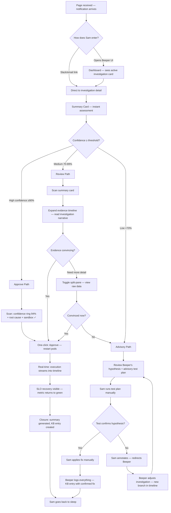
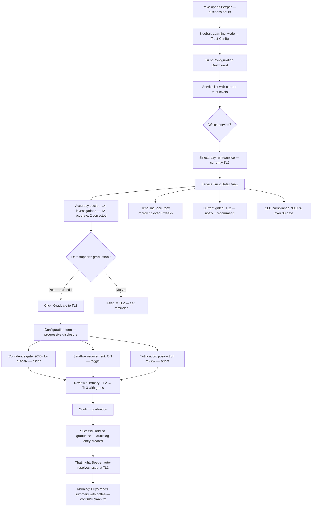
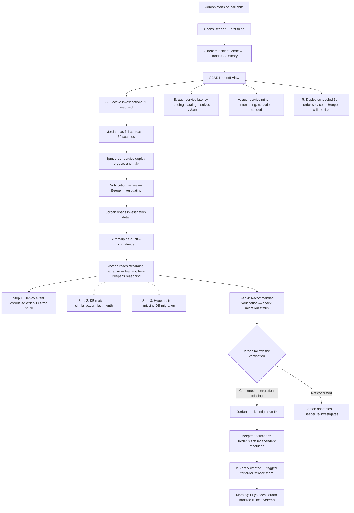
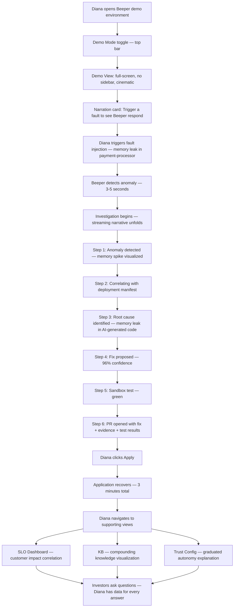
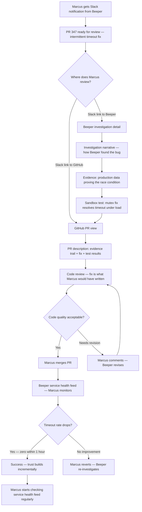

---
stepsCompleted:
  - step-01-init
  - step-02-discovery
  - step-03-core-experience
  - step-04-emotional-response
  - step-05-inspiration
  - step-06-design-system
  - step-07-defining-experience
  - step-08-visual-foundation
  - step-09-design-directions
  - step-10-user-journeys
  - step-11-component-strategy
  - step-12-ux-patterns
  - step-13-responsive-accessibility
  - step-14-complete
inputDocuments:
  - prd.md
  - product-brief-beeper-2026-03-09.md
  - product-brief-beeper-2026-01-27.md
  - project-overview.md
  - api-contracts.md
  - integration-architecture.md
  - source-tree-analysis.md
  - development-guide.md
  - deployment-guide.md
  - index.md
---

# UX Design Specification — Beeper v0.2.0

**Author:** eric
**Date:** 2026-03-11

---

## Executive Summary

### Project Vision

Beeper v0.2.0 transforms from an observe-and-report anomaly detection platform into a collaborative AI SRE agent. The UX must support two distinct modes — **Incident Mode** (high urgency, zero friction, evidence-dense) and **Learning Mode** (configuration, analysis, knowledge curation) — while maintaining a unified experience across 6 personas with varying technical depth and usage contexts.

The existing v0.1.0 UI is a Flask/HTMX server-rendered application with SSE for real-time updates. v0.2.0 extends this foundation with WebSocket-based collaboration, significantly expanded navigation surface, and a presentation-quality investor demo mode.

### Target Users

| User | Role | Tech Level | Primary UI Need | Peak Usage Context |
|---|---|---|---|---|
| Sam (On-Call SRE) | Primary | High | Investigation + evidence review + approval | 3am, laptop, high urgency |
| Priya (Team Lead) | Admin | High | Trust config + SLO dashboards + noise reports | Business hours, planned work |
| Marcus (Developer) | Primary | High | Auto-PR review + service health feed | Business hours, between sprints |
| Jordan (Junior SRE) | Secondary | Medium | Guided investigation + shift handoff | On-call shifts, learning context |
| Diana (VP Eng) | Evaluator | Low-medium | Dashboards + investor demo | Investor meetings, board prep |
| Alex (Reliability Eng) | Secondary | High | Analytics + test pattern mining | Deep analysis sessions |
| On-Call Rotation | Collective | Mixed | Handoff summaries + continuity | Shift transitions |

**Permission model:** 2-tier (Admin/User). Admins control the safety envelope (trust levels, confidence gates, ServiceLevel/Repository CRDs). Users control communications (NotificationChannel, notification rules) and operational interaction (investigations, approvals, KB).

### Key Design Challenges

1. **Incident-mode urgency** — Sam at 3am needs zero friction. Every click costs seconds. Investigation UI must present dense information in an instantly scannable layout. This is the make-or-break experience.

2. **Evidence presentation at scale** — Log lines, metric correlations, KB references, confidence scores, sandbox test results, advisory test plans — each investigation carries significant information weight. Must be navigable and confidence-building without overwhelming.

3. **Trust level visualization** — Graduated autonomy (TL1-5) is a novel concept with no established UX patterns. Users must intuitively understand what Beeper can and will do at each level, and the behavioral difference when trust is graduated.

4. **Dual-role UI** — Admin configuration (trust, SLOs, repositories) and User operation (investigations, notifications, approvals) must coexist in a unified experience, not feel like two separate applications.

5. **Real-time collaboration** — Annotating, redirecting, and approving during live investigations (WebSocket-based) must feel natural and responsive, not bolted onto a read-only view.

6. **Information architecture expansion** — v0.1.0 has ~6 routes. v0.2.0 triples the UI surface (SLO dashboard, trust config, notification config, topology, analytics, demo controls, shift handoffs, auto-PR views). Navigation must scale without losing clarity.

### Design Opportunities

1. **Keyboard-first command palette (Cmd+K)** — SREs live in terminals. A command palette makes Beeper feel native and enables power-user speed for navigation, actions, and search.

2. **Investigation as narrative** — The evidence timeline can be a standout experience — telling the investigation story chronologically with progressive detail, building confidence at each step. "Here's what I found → here's why I'm confident → here's how you can verify."

3. **Demo mode as first impression** — Diana's investor demo is the pitch. The demo experience should be cinematic — clean, guided, presentation-quality. A scripted walkthrough mode that highlights each capability as it unfolds.

4. **Progressive disclosure for configuration** — Trust levels, SLOs, notification rules are complex but configured infrequently. Surface simplicity at the top level, reveal depth on demand. Priya shouldn't need to navigate complexity to do routine adjustments.

## Core User Experience

### Defining Experience

**The core interaction:** Reviewing an active investigation and deciding what to do about it.

Every persona's primary workflow converges on the investigation detail view — Sam reviewing evidence at 3am, Jordan learning from Beeper's reasoning during their first shift, Diana watching the full lifecycle unfold for investors. The investigation experience is the product.

**The core loop:**
1. Beeper surfaces an investigation (notification or dashboard)
2. User scans evidence trail, confidence score, and proposed action
3. User acts: approve, redirect, annotate, or escalate
4. Beeper executes and documents the outcome
5. KB compounds, trust grows

This loop must be fast, clear, and confidence-building. If the evidence presentation doesn't earn trust in seconds, the entire product thesis — graduated autonomy — stalls.

### Platform Strategy

**v0.2.0:** Web application (Flask/HTMX + WebSocket). Keyboard and mouse primary. No offline requirements. Optimized for laptop use in low-light, high-stress environments (dark mode required, not optional).

**Future platform roadmap:**

| Platform | Timing | Rationale |
|---|---|---|
| **Public API** | v0.3.0+ | Teams will build custom integrations — ChatOps bots, CI/CD hooks, custom dashboards. API-first internal design in v0.2.0 makes this straightforward to expose. |
| **Mobile app** | Post web feature-complete | Table stakes for on-call. Sam at a bar at 3am needs one-click approve on his phone — Beeper is the hero if it's that simple. Web feature completeness informs the mobile feature set. |

**v0.2.0 design implication:** Build the web UI on clean API contracts so the mobile and public API stories are natural extensions, not rewrites.

### Effortless Interactions

| Interaction | Must Feel Like | Design Implication |
|---|---|---|
| Scanning investigation evidence | Reading a well-structured incident summary | Visual hierarchy: confidence score → root cause → evidence → action |
| Approving a proposed fix | One click, no second-guessing | Prominent approve button with confidence context visible inline |
| Getting shift state | Asking a colleague "what's going on?" | Handoff summary as a single scannable view, not a feed to scroll |
| Configuring a notification channel | Filling out a simple form | Progressive disclosure — basic setup in 3 fields, advanced options tucked away |
| Finding a past investigation | Searching Slack history | Cmd+K command palette with semantic search across investigations and KB |

### Critical Success Moments

| Moment | Persona | What Must Happen | If We Fail |
|---|---|---|---|
| **Evidence earns trust** | Sam | Sam reads the evidence trail and feels confident enough to approve without investigating independently | Sam ignores Beeper and investigates manually — product becomes noise |
| **Demo tells the story** | Diana | Investors watch the full lifecycle unfold and say "there's no other way" | Demo is confusing or unimpressive — funding conversation dies |
| **First independent resolution** | Jordan | Jordan handles an incident with Beeper's guidance and feels like a veteran | Jordan panics, escalates, loses confidence in Beeper |
| **Trust graduation feels earned** | Priya | Priya reviews accuracy data and feels the service has earned higher autonomy | Trust levels feel arbitrary — Priya keeps everything at TL1 |
| **Auto-PR is mergeable** | Marcus | Marcus reviews a PR that follows his team's standards with ironclad evidence | PR looks AI-generated, evidence is weak — Marcus stops checking |

### Experience Principles

1. **Evidence over assertion** — Never tell the user to trust Beeper. Show the logs, the metrics, the KB references, the test results. Confidence is earned through transparency, not claimed.

2. **Seconds, not minutes** — Every primary interaction (investigation review, approval, handoff scan) must be completable in under 30 seconds. If it takes longer, the design has failed.

3. **Dark-first, keyboard-native** — SREs work in terminals at 3am. The UI must feel native to that world — dark theme default, Cmd+K for everything, no mouse-required workflows.

4. **Progressive depth** — Surface the decision (approve/reject) immediately. Evidence one click deeper. Raw data one more click. Never force users through layers they don't need right now.

5. **The UI disappears during incidents** — During active incidents, the UI should feel like a conversation with a competent colleague, not an enterprise dashboard. Minimize chrome, maximize signal.

## Desired Emotional Response

### Primary Emotional Goals

| Emotional Goal | Context | Why It Matters |
|---|---|---|
| **Calm confidence** | Active incidents | Counter anxiety and urgency with steady, evidence-backed assurance. Sam shouldn't feel like he's gambling — he should feel like he's confirming a colleague's solid work. |
| **Relief and competence** | Post-incident | "That was handled cleanly." The feeling that both Beeper and the human performed well together. This is what drives return usage and trust progression. |
| **Earned authority** | Configuration / trust graduation | Priya should feel the data justifies her decision to grant more autonomy. Not a leap of faith — a measured conclusion. |
| **Inevitability** | Demo / evaluation | Diana and investors should feel "of course this is how it should work." The demo shouldn't impress through flash — it should feel obvious and necessary. |
| **Empowerment** | Learning / onboarding | Jordan handled the incident. Beeper guided, but Jordan made the call. The tool amplifies competence, not replaces it. |

### Emotional Journey Mapping

| Stage | Current Emotion | Beeper's Emotional Target | Design Lever |
|---|---|---|---|
| **Page received** | Anxiety, dread | "Beeper's already on it" → immediate relief | Investigation already in progress when user opens UI |
| **Evidence review** | Cognitive overload | Clarity, growing confidence | Visual hierarchy — conclusion first, evidence layered below |
| **Decision point** | Uncertainty, pressure | Informed confidence | Confidence score + sandbox verification = "safe to approve" |
| **Post-approval** | Lingering worry | Closure, relief | Real-time confirmation that fix is working + SLO recovery visible |
| **Morning review** | Retrospective concern | Satisfaction, pride | Clean summary: what happened, what was done, what was learned |
| **Trust graduation** | Hesitation | Data-backed conviction | Accuracy trends, zero false positives, improvement over time |
| **Shift handoff** | Anxiety about unknowns | Preparedness | Complete context in 30 seconds — nothing left to wonder about |
| **First use (onboarding)** | Skepticism | Curiosity → early trust | First investigation shows Beeper's reasoning transparently |

### Micro-Emotions

**Critical micro-emotions to design for:**

| Micro-Emotion | vs. Anti-Pattern | Where It Matters Most |
|---|---|---|
| **Confidence** | vs. Doubt | Evidence presentation — every finding must have a citation |
| **Trust** | vs. Skepticism | Confidence scores — must feel calibrated, not inflated |
| **Control** | vs. Helplessness | Approval flow — user always has final say, never railroaded |
| **Clarity** | vs. Confusion | Investigation timeline — chronological, cause-and-effect obvious |
| **Accomplishment** | vs. Inadequacy | Jordan's experience — Beeper helps, doesn't condescend |
| **Calm** | vs. Alarm | Notification design — urgency without panic, signal without noise |

### Design Implications

| Emotional Goal | UX Design Approach |
|---|---|
| Calm confidence | Muted, professional color palette. No red alerts unless truly critical. Information density without visual noise. Status indicators that reassure rather than alarm. |
| Relief and competence | Post-incident summaries that celebrate clean resolution. SLO recovery visualized as a return to green. "Incident closed" as a moment of closure. |
| Earned authority | Trust graduation backed by visible accuracy data. Trend lines showing improvement. The "graduate" action feels deliberate, not casual. |
| Inevitability | Demo mode strips away all chrome — just the investigation unfolding. Minimal UI, maximum narrative. Let the capability speak for itself. |
| Empowerment | Jordan sees Beeper's reasoning, not just its conclusions. "Here's what I checked and why" — like a mentor showing their work. |
| Control | Approve/reject always prominent. Override always available. Nothing happens without the user knowing. Autonomous actions show a clear audit trail after the fact. |

### Emotional Design Principles

1. **Calm is the default** — The UI baseline is quiet, professional, and steady. Urgency is reserved for genuine escalation. If everything looks urgent, nothing is.

2. **Show, don't claim** — Never say "Beeper is confident." Show the evidence that produces confidence. The user draws the conclusion — the UI provides the data.

3. **Closure is a feature** — Every incident should have a clear ending. Summary generated, KB entry created, SLO recovered. Open loops create anxiety. Close them.

4. **The human is the hero** — Beeper is the sidekick, not the protagonist. Sam resolved the incident. Priya made the trust decision. Jordan handled their first shift. Beeper helped.

5. **Doubt is a gift** — When Beeper isn't confident, that honesty builds more trust than false certainty. A 72% confidence score with transparent reasoning is worth more than a 99% score with no evidence.

## UX Pattern Analysis & Inspiration

### Inspiring Products Analysis

| Product | What It Does Well | What Beeper Takes |
|---|---|---|
| **Datadog** | Dark-first design, information density without clutter, consistent visual grammar across metric cards | Dark theme as default (not optional), muted palette with selective status color, consistent card layout rhythm — adapted for progressive disclosure in incident mode, full density in analytics mode |
| **Slack** | Cmd+K handling both instant (channels) and async (search) in unified UI, notification threading, presence indicators | Unified command palette architecture handling local commands and async Qdrant queries seamlessly, notification channel UX simplicity |
| **Observe** | Correlation visualization between signals, relationship mapping across metrics/logs/traces | Visual correlation presentation — sparklines next to log excerpts, metric graphs with anomaly windows highlighted, evidence relationships made visible |
| **PagerDuty** | Acknowledge/resolve button prominence, zero-ambiguity action flows, mobile-first alert design | One-click approve with inline confidence context ("Approve: restart pod — 94% confidence, sandbox-verified"), no modal confirmation hell |
| **VS Code** | Command palette (Cmd+K) as primary navigation, extension ecosystem, keyboard-first design | Action-first command palette — "approve investigation," "search KB for memory leak" — not just navigation, real actions |
| **Claude Code** | Streaming reasoning display, progressive output, transparent AI work-in-progress | **Core signature pattern**: real-time investigation narrative — "Checking metrics... found correlation... querying logs... identified pattern" — the investigation story unfolding live |
| **OpenLens** | Hierarchical resource tree navigation, collapsible sidebar with resource-type grouping | Scalable sidebar navigation for 18+ routes with grouping, complementing Cmd+K for browse-vs-search dual paths |
| **Medical SBAR Protocol** | Structured high-stakes handoff: Situation, Background, Assessment, Recommendation | Shift handoff format mapping directly to investigation narrative: what's happening → what Beeper found → confidence + evidence → proposed action |

### Transferable UX Patterns

**Navigation Patterns:**
- **Command palette (Cmd+K)** — Action-first, not just navigation. Handles instant local commands and async Qdrant vector search in one UI (VS Code + Slack hybrid)
- **Collapsible sidebar with grouping** — Scales from 6 to 18+ routes without losing clarity (OpenLens). Incident Mode / Learning Mode as top-level groups
- **Dual-path access** — Every destination reachable by browse (sidebar) and search (Cmd+K). Power users and newcomers both served

**Interaction Patterns:**
- **One-click approve with inline context** — Prominent action button carrying evidence summary, not just a verb (PagerDuty elevated with context principle)
- **Streaming investigation narrative** — Real-time reasoning display as the investigation unfolds. Core signature UX — no other SRE tool does this (Claude Code → Beeper's differentiator)
- **Progressive disclosure by mode** — Incident mode: conclusion first, evidence one click deeper. Analytics mode: full density, Datadog-style. Same data, different presentation

**Visual Patterns:**
- **Dark-first with selective color** — Muted professional baseline. Color reserved for status (green/amber/red) and confidence indicators. No gratuitous color (Datadog)
- **Consistent visual grammar** — Every investigation card, every metric tile, every KB entry follows the same layout rhythm. Scannable because predictable
- **Correlation visualization** — Sparklines inline with log excerpts, metric graphs with highlighted anomaly windows, visual evidence of signal relationships (Observe)

**AI Collaboration Patterns:**
- **Show the work, not just the answer** — Investigation timeline as chronological narrative with citations. Every finding has a reference (Claude Code streaming + Evidence-over-assertion principle)
- **Calibrated confidence display** — Confidence scores feel earned, not inflated. 72% with transparent reasoning beats 99% with no evidence (Beeper-native principle)
- **SBAR-structured handoffs** — Situation → Background → Assessment → Recommendation. Proven in medical high-stakes context, maps perfectly to investigation summaries

### Anti-Patterns to Avoid

| Anti-Pattern | Source | Why It Fails for Beeper |
|---|---|---|
| **Alert fatigue through visual noise** | Many monitoring tools | If everything is red and urgent, nothing is. Calm is the default — urgency reserved for genuine escalation |
| **Dashboard-only investigation** | Datadog, Grafana | Dashboards show state but don't tell stories. Beeper's investigation is a narrative, not a dashboard |
| **Configuration complexity up front** | Enterprise SRE tools | Trust levels and SLOs are configured infrequently. Progressive disclosure — 3 fields to start, depth on demand |
| **AI black box** | Most AI-assisted tools | "AI detected anomaly" with no reasoning. Evidence over assertion — show logs, metrics, KB refs, test results |
| **Modal confirmation cascades** | Enterprise patterns | "Are you sure?" → "Really sure?" → "Type CONFIRM." Sam at 3am needs one click, not three |
| **Mouse-required workflows** | Most web dashboards | SREs live in terminals. Every primary workflow must be completable via keyboard |
| **Flat information architecture** | Simple monitoring tools | Doesn't scale from 6 to 18+ routes. Need hierarchy (sidebar groups) + search (Cmd+K) |

### Design Inspiration Strategy

**Adopt (use directly):**
- Claude Code streaming reasoning → Investigation timeline as real-time narrative (signature UX)
- PagerDuty action prominence → One-click approve with inline confidence context
- VS Code command palette → Cmd+K as primary power-user interface
- Datadog dark-first palette → Professional, muted, status-color-only baseline
- Observe correlation visualization → Visual evidence of signal relationships
- Medical SBAR → Shift handoff structure (Situation/Background/Assessment/Recommendation)

**Adapt (modify for our context):**
- Datadog information density → Progressive disclosure in incident mode, full density in analytics mode
- Slack notification threading → Notification channel configuration with progressive complexity
- OpenLens resource tree → Sidebar navigation grouped by Incident Mode / Learning Mode contexts
- VS Code command palette → Action-first commands, not just navigation destinations

**Avoid (consciously reject):**
- Enterprise modal confirmation patterns → Conflicts with "seconds, not minutes" principle
- Dashboard-centric investigation → Conflicts with narrative-first evidence presentation
- AI confidence without evidence → Conflicts with "evidence over assertion" principle
- Visual noise as urgency signal → Conflicts with "calm is the default" emotional principle

## Design System Foundation

### Design System Choice

**Tailwind CSS** — Utility-first CSS framework configured for Beeper's dark-first, information-dense, keyboard-native design requirements.

Beeper's existing ~3,900 lines of custom CSS will be incrementally migrated to Tailwind utilities. No component library overlay (e.g., DaisyUI) — Beeper's components are too specialized (investigation timelines, evidence cards, trust visualizations, streaming narratives) for pre-built component opinions to help rather than hinder.

### Rationale for Selection

| Factor | Decision Driver |
|---|---|
| **Platform** | Flask/HTMX server-rendered HTML — Tailwind is the de facto standard for this stack. React-based systems (MUI, Chakra) are incompatible. |
| **Dark-first** | Tailwind's `dark:` variant prefix makes dark mode a first-class design concern, not an afterthought. Aligns with "dark mode required, not optional" principle. |
| **Scaling** | v0.2.0 triples UI surface from ~6 to 18+ routes. Utility-first CSS scales linearly — each new view composes from existing utilities rather than requiring new custom CSS. |
| **Design tokens** | Existing color palette (indigo primary, status green/amber/red), spacing (8/12/16/20px), and typography (system fonts) map directly to `tailwind.config.js`. Migration is configuration, not rewrite. |
| **Team & contributors** | Tailwind is the most widely-known CSS framework in the industry. Lower onboarding friction for open-source contributors. |
| **No component library** | Beeper's UI components are too domain-specific for generic component libraries. Investigation cards, evidence timelines, trust ladders, streaming narratives — these need custom composition from utilities, not pre-built abstractions. |

### Implementation Approach

**Migration strategy:** Incremental, not big-bang.

1. **Install Tailwind** alongside existing `main.css`. Both coexist during migration.
2. **Configure design tokens** — Map existing colors, spacing, typography, shadows to `tailwind.config.js`. The config file becomes the single source of truth for design decisions.
3. **New views in Tailwind** — All v0.2.0 views (SLO dashboard, trust config, notification config, analytics, demo mode, shift handoffs) built with Tailwind from day one.
4. **Migrate existing views** — Incrementally convert existing v0.1.0 templates as they're touched for v0.2.0 changes. No dedicated migration sprint needed.
5. **Retire `main.css`** — Once all templates are converted, remove the legacy stylesheet.

**Build integration:** Tailwind JIT compiler runs during development (watch mode) and produces a minimal CSS bundle for production. Integrates with Flask's static asset pipeline.

### Customization Strategy

**`tailwind.config.js` — Beeper design tokens:**

| Token Category | Customization |
|---|---|
| **Colors** | Indigo primary (#6366f1), dark surface palette (#1a1a2e base), status colors (green/amber/red), confidence gradient (red → amber → green mapped to 0-100%) |
| **Typography** | System font stack (-apple-system, BlinkMacSystemFont, Segoe UI, Roboto). Monospace for code/log content. |
| **Spacing** | 4px base unit (Tailwind default). Maps to existing 8/12/16/20px patterns. |
| **Dark mode** | `darkMode: 'class'` — Dark is default, light mode available but secondary. |
| **Breakpoints** | Laptop-first (1024px+). No mobile breakpoints in v0.2.0 — mobile is a future platform. |
| **Animation** | Minimal. Subtle transitions for state changes (investigation status, approval confirmation). No decorative animation — respects "calm is the default." |

**Custom component patterns (Tailwind @apply where warranted):**
- `.investigation-card` — Evidence density layout with status stripe, confidence badge, action buttons
- `.evidence-timeline` — Streaming narrative with chronological steps and citation links
- `.trust-ladder` — TL1-5 visualization with graduated indicators
- `.approval-action` — Prominent primary action with inline confidence context
- `.cmd-palette` — Command palette overlay with search input and action list

## Defining Core Experience

### Defining Experience

**In one sentence:** *"Watch Beeper investigate in real-time, trust the evidence, approve in one click."*

That's what Sam tells his SRE friends. That's what Diana shows investors. That's what Jordan experiences on their first shift. The investigation review is the product — every persona's primary workflow converges on this interaction.

### User Mental Model

**The mental model shift:** From *detective* to *reviewer*.

Today, SREs operate as detectives: get paged → open Grafana → manually correlate metrics and logs → form a hypothesis → test → fix → document in a postmortem. It's exhausting, error-prone, and lonely at 3am.

Beeper changes the model: the investigation has already happened. The evidence is assembled. The hypothesis is formed. The user's job shifts from "figure out what's wrong" to "verify this analysis is correct and approve the fix."

This is fundamentally different from every other SRE tool — they give you dashboards to investigate *yourself*. Beeper gives you an investigation to *review*.

The streaming investigation narrative is the bridge between these mental models. By watching the investigation unfold, the user transitions naturally from "I need to investigate" to "I'm watching the investigation" to "I trust this analysis." The streaming narrative is the trust-building mechanism.

### Success Criteria

| Criterion | Measure | Why It Matters |
|---|---|---|
| **30-second review** | User can scan evidence, assess confidence, and reach a decision within 30 seconds of opening an investigation | If it takes longer, the design has failed. Seconds, not minutes. |
| **One-click approve** | Primary action completable with a single click (or keystroke) with confidence context visible inline | Zero friction at the decision point. Sam at 3am cannot afford confirmation cascades. |
| **Evidence earns trust** | User approves based on Beeper's evidence without independently verifying in Grafana/Loki | If Sam opens Grafana to double-check, Beeper hasn't earned trust. The evidence presentation must be sufficient. |
| **Clean closure** | Every investigation has a clear end state — summary generated, KB entry created, SLO recovery visible | Open loops create anxiety. Closure is a feature. |
| **Keyboard completable** | Entire investigation review + approval flow completable without touching the mouse | SREs live in terminals. Keyboard-native is not optional. |

### Novel UX Patterns

| Pattern | Type | Rationale |
|---|---|---|
| **Streaming investigation narrative** | Novel | No SRE tool shows AI reasoning in real-time. Beeper's signature differentiator. Requires no user education — mirrors watching a colleague work through a problem. |
| **Trust ladder visualization (TL1-5)** | Novel | Graduated autonomy is a new concept with no established UX precedent. Must be self-explanatory through visual design — a ladder/gauge metaphor with clear behavioral descriptions at each level. |
| **One-click approve with inline evidence** | Adapted | PagerDuty's action prominence + evidence context. Familiar action pattern (big button) with novel information density (confidence + sandbox result inline). |
| **SBAR-structured handoffs** | Adapted | Proven in medical high-stakes context, novel in SRE tooling. Self-documenting structure (Situation/Background/Assessment/Recommendation). |
| **Command palette (Cmd+K)** | Established | VS Code, Slack, Linear — SREs already know this. Beeper's twist: action-first, not navigation-first. |
| **Dark-first dashboard** | Established | Datadog, Grafana — SREs expect this. Table stakes. |
| **Sidebar navigation with grouping** | Established | OpenLens, VS Code — familiar tree pattern for hierarchical navigation. |

### Experience Mechanics

**The Investigation Review Flow:**

**1. Initiation**
- **Trigger:** Notification arrives (Slack/email/webhook) with investigation summary and direct link, OR user sees active investigation on dashboard
- **Entry:** Click link → land directly on investigation detail view with streaming narrative already in progress
- **First impression:** Investigation is already running. Beeper started before the user opened the UI. Immediate emotional shift from "I need to investigate" to "Beeper's already on it"

**2. Interaction — The 30-Second Scan**
- **Header band:** Service name, severity, confidence score (prominent), investigation status (investigating/proposing/awaiting approval), elapsed time
- **Evidence timeline:** Streaming narrative showing investigation steps chronologically — each step has a finding, a citation (log line, metric query, KB reference), and a confidence contribution
- **Proposed action panel:** What Beeper recommends, why (linked evidence), sandbox test result (if available), confidence score with breakdown
- **Keyboard navigation:** `j/k` to scroll evidence, `a` to approve, `r` to reject, `e` to escalate, `n` for annotations

**3. Feedback — Trust Signals**
- **Confidence score** with breakdown — not a single number but a composition: "94% = metric correlation (high) + log pattern match (high) + KB precedent (medium) + sandbox pass"
- **Citation links** on every finding — click to see the raw log line, the PromQL query result, the KB entry
- **Sandbox verification badge** — "Tested in sandbox: pod restart resolved metric within 2m" with expandable detail
- **Correlation visualizations** — Sparkline next to log excerpt showing the metric anomaly window, visual evidence that signals are related

**4. Completion — Closure Loop**
- **Approve:** One click → real-time execution confirmation streams into timeline → SLO recovery visible as metric returns to green → "Incident resolved" status with timestamp
- **Post-resolution:** Summary generated automatically, KB entry created (user can edit), notification sent to team. Clean closure — no open loops
- **Reject/redirect:** User provides reason → Beeper adjusts approach or escalates → new investigation branch appears in timeline
- **Annotate:** User adds context during or after investigation → annotations persist in KB for future pattern matching

## Visual Design Foundation

### Color System

**Philosophy:** Calm is the default. Color is signal, not decoration. The palette is muted and professional at rest, with color reserved for status, confidence, and actionable elements.

**Dark Surface Hierarchy:**

| Token | Value | Usage |
|---|---|---|
| `surface-base` | #0f0f1a | Page background — deepest layer |
| `surface-raised` | #1a1a2e | Cards, panels, sidebar — content containers |
| `surface-elevated` | #252540 | Modals, command palette, dropdowns — overlay layer |
| `surface-hover` | #2d2d4a | Hover states on interactive surfaces |
| `border-subtle` | #333355 | Card borders, dividers — visible but quiet |
| `border-focus` | #6366f1 | Focus rings, active borders — indigo primary |

**Primary & Accent:**

| Token | Value | Usage |
|---|---|---|
| `primary` | #6366f1 | Primary actions, active states, focus rings, links |
| `primary-hover` | #818cf8 | Primary button hover, link hover |
| `primary-muted` | #6366f1/20% | Primary backgrounds (badges, highlights) |

**Status Colors — Reserved for Meaning:**

| Token | Value | Semantic Meaning |
|---|---|---|
| `status-healthy` | #22c55e | SLO met, investigation resolved, service healthy |
| `status-warning` | #f59e0b | SLO at risk, medium confidence, degraded |
| `status-critical` | #ef4444 | SLO breached, investigation failed, service down |
| `status-info` | #3b82f6 | Informational, in-progress, neutral status |
| `status-neutral` | #6b7280 | Inactive, unknown, no status |

**Confidence Gradient:**
- 0-40%: `status-critical` (red) — Low confidence, needs human investigation
- 41-70%: `status-warning` (amber) — Moderate confidence, review recommended
- 71-90%: `status-info` (blue) → `primary` (indigo) — High confidence, approve with review
- 91-100%: `status-healthy` (green) — Very high confidence, sandbox-verified

**Trust Level Colors (TL1-5):**
- TL1 (Advisory): `status-neutral` gray — Beeper observes only
- TL2 (Suggest): `status-info` blue — Beeper suggests actions
- TL3 (Act with approval): `primary` indigo — Beeper acts when approved
- TL4 (Act, notify): `status-warning` amber — Beeper acts autonomously, notifies
- TL5 (Full auto): `status-healthy` green — Full autonomous operation

**Text Colors:**

| Token | Value | Usage |
|---|---|---|
| `text-primary` | #f1f5f9 | Headings, primary content |
| `text-secondary` | #94a3b8 | Supporting text, labels, timestamps |
| `text-muted` | #64748b | Disabled text, placeholders |
| `text-inverse` | #0f172a | Text on light/colored backgrounds |

### Typography System

**Font Stack:**
- **Primary:** `-apple-system, BlinkMacSystemFont, 'Segoe UI', Roboto, 'Helvetica Neue', Arial, sans-serif` — System fonts for maximum readability and zero load time
- **Monospace:** `'JetBrains Mono', 'Fira Code', 'SF Mono', Monaco, 'Cascadia Code', monospace` — For log lines, code snippets, PromQL/LogQL queries, metric values

**Type Scale (Tailwind defaults, rem-based):**

| Level | Size | Weight | Usage |
|---|---|---|---|
| `text-2xl` | 1.5rem / 24px | 700 | Page titles (Investigation Detail, SLO Dashboard) |
| `text-xl` | 1.25rem / 20px | 600 | Section headers, card titles |
| `text-lg` | 1.125rem / 18px | 600 | Subsection headers, prominent labels |
| `text-base` | 1rem / 16px | 400 | Body text, form labels, descriptions |
| `text-sm` | 0.875rem / 14px | 400 | Secondary text, timestamps, metadata |
| `text-xs` | 0.75rem / 12px | 500 | Badges, tags, micro-labels |

**Special typographic patterns:**
- **Confidence scores:** `text-2xl font-bold font-mono` — Large, bold, monospace. The most prominent number on any investigation view.
- **Log lines:** `text-sm font-mono` on `surface-base` background — Distinct from UI text, clearly "data not interface"
- **Evidence citations:** `text-sm` with indigo underline — Clickable, visually linked to primary color
- **Status labels:** `text-xs font-semibold uppercase tracking-wider` — ALL CAPS, small, high contrast badge style

### Spacing & Layout Foundation

**Base unit:** 4px (Tailwind default). All spacing uses multiples: 4, 8, 12, 16, 20, 24, 32, 48, 64px.

**Layout structure:**

```
┌─────────────────────────────────────────────────────────┐
│  Top bar (48px) — breadcrumb + global actions + Cmd+K   │
├────────────┬────────────────────────────────────────────┤
│  Sidebar   │  Main content area                         │
│  (240px)   │                                            │
│  collapsed │  ┌──────────────────────────────────────┐  │
│  (64px)    │  │  Content header + actions             │  │
│            │  ├──────────────────────────────────────┤  │
│  Incident  │  │                                      │  │
│  Mode /    │  │  Primary content                     │  │
│  Learning  │  │  (investigation, dashboard, config)  │  │
│  Mode      │  │                                      │  │
│  groups    │  └──────────────────────────────────────┘  │
├────────────┴────────────────────────────────────────────┤
│  Status bar (24px) — connection status, active count    │
└─────────────────────────────────────────────────────────┘
```

**Density modes:**
- **Incident Mode:** Dense spacing (8-12px gaps), maximum information per viewport. Cards are compact, timelines are tight. Every pixel earns its place.
- **Learning Mode:** Comfortable spacing (16-24px gaps), room to breathe. Configuration forms, analytics charts, and documentation have generous whitespace.

**Component spacing:**

| Context | Gap | Padding | Rationale |
|---|---|---|---|
| Card grid | 16px | 16px internal | Scannable without crowding |
| Evidence timeline steps | 8px | 12px internal | Dense — many steps visible at once |
| Form fields | 16px | 12px internal | Comfortable for data entry |
| Sidebar nav items | 4px | 8px 12px | Compact, many items visible |
| Dashboard tiles | 16px | 16px internal | Consistent with card grid |
| Action button group | 8px | 12px 16px | Tight grouping, clear hit targets |

### Accessibility Considerations

**Contrast ratios (WCAG 2.1 AA minimum):**
- `text-primary` (#f1f5f9) on `surface-base` (#0f0f1a) — 15.4:1 (exceeds AAA)
- `text-secondary` (#94a3b8) on `surface-base` (#0f0f1a) — 7.2:1 (exceeds AA)
- `text-muted` (#64748b) on `surface-base` (#0f0f1a) — 4.6:1 (meets AA)
- Status colors on dark surfaces — All meet AA for large text; badges use high-contrast text overlays

**Keyboard accessibility:**
- All interactive elements focusable with visible focus rings (`border-focus` indigo)
- Tab order follows visual reading order (left-to-right, top-to-bottom)
- Skip-to-content link for screen readers
- Cmd+K palette accessible via keyboard only — no mouse required for any primary workflow

**Color-blind considerations:**
- Status colors never rely on hue alone — always paired with icons (checkmark, warning triangle, X, info circle) and text labels
- Confidence gradient uses shape (progress bar fill) in addition to color change
- Trust level indicators use numbered labels (TL1-TL5) alongside color

**Motion sensitivity:**
- `prefers-reduced-motion` respected — streaming narrative falls back to instant-appear steps
- No auto-playing animations, no parallax, no decorative motion
- Transitions limited to 150ms for state changes (opacity, background-color)

## Design Direction Decision

### Design Directions Explored

Six design directions were explored for the investigation detail view — Beeper's make-or-break screen. Each was mocked up as a full interactive HTML prototype (see `ux-design-directions.html`).

| Direction | Concept | Density | Best For |
|---|---|---|---|
| **1. Narrative Flow** | Investigation as vertical streaming story | Medium | Sam (reviewing), Jordan (learning), Diana (demo) |
| **2. Command Center** | Three-panel: list / detail / context | High | Alex (analysis), Priya (multi-investigation) |
| **3. Focused Incident** | Confidence-first, single column, max clarity | Low | Sam (3am approve), Diana (demo) |
| **4. Ops Dashboard** | Metrics-dense grid with sparklines | Very High | Alex (deep analysis), Priya (SLO monitoring) |
| **5. Split Evidence** | Narrative steps + raw evidence side by side | Medium-High | Sam (verification), Alex (raw data), Marcus (PR review) |
| **6. Progressive Context** | Summary card + expandable sections | Adaptive | All personas — adapts to depth needs |

### Chosen Direction

**Hybrid approach** combining the strongest elements from multiple directions:

**Primary base: Direction 1 (Narrative Flow)** — The streaming investigation timeline is Beeper's signature UX and the strongest trust-building mechanism. The investigation unfolds as a chronological story where each step has a finding, evidence citation, and confidence contribution.

**Incorporated elements:**

| Source | Element | Rationale |
|---|---|---|
| **From D6 (Progressive Context)** | Confidence ring summary card at top of investigation | Instant assessment — 94% in a ring with root cause summary, before scrolling |
| **From D6 (Progressive Context)** | Expandable sections for evidence depth | Progressive disclosure — Diana sees summary, Alex expands everything |
| **From D5 (Split Evidence)** | Optional split-pane toggle | Power users (Alex, Marcus) can view raw data alongside narrative without leaving the page |
| **From D3 (Focused Incident)** | Approve button with inline confidence + sandbox context | Always visible, always carrying evidence context — "Approve: restart pods (94%, sandbox-verified)" |
| **From D1/D6 (Navigation)** | Sidebar with Incident Mode / Learning Mode grouping | Scales to 18+ routes with clear hierarchy |

### Design Rationale

1. **Narrative Flow as base** — The streaming timeline directly implements our "investigation as narrative" design opportunity and Claude Code inspiration pattern. No other SRE tool shows the investigation unfolding in real-time. This is the differentiator.

2. **Progressive Context overlay** — The confidence ring summary card lets every persona get their answer in 5 seconds (confidence score + root cause + proposed action), then drill to their preferred depth. Diana never scrolls past the summary. Sam checks the timeline. Alex expands raw data.

3. **Split-pane as power feature** — Adding an optional split-pane toggle (keyboard shortcut) lets Alex and Marcus see raw PromQL results, log lines, and KB entries alongside the narrative without modal popups or page navigation. This is an expert feature, not the default.

4. **Approve button prominence** — Borrowing from PagerDuty's action prominence but adding evidence context inline. The button is never just "Approve" — it always carries the confidence score and sandbox status. This supports the "informed confidence" emotional goal.

### Implementation Approach

**View modes (same investigation detail page):**

| Mode | Default For | Layout |
|---|---|---|
| **Narrative view** | All users (default) | Summary card → streaming timeline → action panel |
| **Split view** | Toggle via `s` key or button | Left: narrative timeline, Right: selected step evidence detail |
| **Demo view** | Diana (via demo mode toggle) | Full-screen narrative, no sidebar, cinematic pacing |

**Component hierarchy:**
1. Summary card (confidence ring + root cause + proposed action + approve button)
2. Streaming investigation timeline (vertical, chronological, with citations)
3. Expandable evidence sections (confidence breakdown, KB matches, raw data)
4. Action panel (approve/reject/escalate/annotate)

**Responsive behavior (laptop breakpoints only):**
- 1440px+: Sidebar (240px) + main content — full experience
- 1024-1440px: Sidebar collapsed (64px icons) + main content — maximized content area
- Split-pane available at 1280px+ only

## User Journey Flows

### Journey 1: Sam — Investigation Review & Approval (The Core Loop)

**Covers:** Sam's 3am Page (success path) + Unknown Failure (advisory path). This is the defining flow.



**Key UX decisions:**
- Entry is always into the summary card — confidence score visible in <2 seconds
- High-confidence path: scan → approve → done (target: <30 seconds)
- Medium-confidence path adds evidence review but stays on same page
- Low-confidence path shifts to advisory mode — Beeper assists, Sam leads
- Keyboard shortcuts at every step: `a` approve, `r` reject, `e` escalate, `s` split-pane

### Journey 2: Priya — Trust Graduation

**Covers:** Reviewing accuracy data, graduating a service's trust level, configuring confidence gates.



**Key UX decisions:**
- Trust graduation feels deliberate, not casual — data must justify the decision
- Accuracy trends and SLO data visible on the same page — no navigation needed
- Configuration form uses progressive disclosure: basic gates visible immediately, advanced options tucked in expandable section
- Confirmation shows exactly what changes — "TL2 → TL3: auto-fix with 90%+ confidence, sandbox required, post-action review"

### Journey 3: Jordan — Guided First Shift

**Covers:** Shift handoff, first investigation encounter, guided resolution.



**Key UX decisions:**
- Handoff uses SBAR format — scannable in 30 seconds, nothing left to wonder about
- Jordan sees the *reasoning*, not just conclusions — "Here's what I checked and why"
- Investigation narrative serves as a learning experience — each step shows Beeper's logic
- Emotional design: Jordan made the call, Beeper guided — the human is the hero

### Journey 4: Diana — Investor Demo

**Covers:** Demo mode activation, fault injection, full lifecycle walkthrough.



**Key UX decisions:**
- Demo mode strips chrome — full-screen narrative, minimal UI, maximum impact
- Scripted pacing — investigation steps appear at readable intervals (not instant)
- Narration cards provide context between steps
- Post-demo navigation to SLO, KB, and Trust dashboards seamlessly exits demo mode
- Must work reliably every time — NFR18: 10 consecutive runs without failure

### Journey 5: Marcus — Auto-PR Review

**Covers:** Notification → PR review → merge → service health confirmation.



**Key UX decisions:**
- Marcus can review in GitHub (familiar) or Beeper (evidence-rich) — both paths work
- PR description includes evidence trail inline — not just a code diff
- Service health feed is the confirmation loop — Marcus sees the fix working in production
- This journey builds habitual usage — Marcus starts checking the health feed proactively

### Journey Patterns

| Pattern | Where It Appears | Implementation |
|---|---|---|
| **Notification → Direct Link** | Sam, Marcus, Jordan | Every notification includes a deep link to the specific investigation or PR. One click from notification to context. |
| **Summary → Depth** | All journeys | Every view starts with the conclusion/decision, then layers detail below. Never force users through evidence to reach the action. |
| **Action → Confirmation → Closure** | Sam (approve), Priya (graduate), Diana (apply) | Every action has immediate feedback (streaming confirmation), visible outcome (metric recovery), and explicit closure (summary + KB entry). |
| **SBAR Structure** | Jordan (handoff), Sam (investigation summary), Diana (post-demo) | Situation → Background → Assessment → Recommendation used consistently for any context-transfer moment. |
| **Keyboard-First Actions** | Sam, Alex, Marcus | Primary actions mapped to single keystrokes. `a` approve, `r` reject, `e` escalate, `s` split-pane, `n` annotate, `⌘K` command palette. |
| **Evidence Citations** | All investigation views | Every finding links to its source — Prometheus query, Loki log line, KB entry. Click to expand raw data. |

### Flow Optimization Principles

1. **Entry to decision < 30 seconds** — Every journey from notification click to informed decision point must be achievable in under 30 seconds.

2. **Zero dead ends** — Every state in every flow has a clear next action. No state leaves the user wondering "what now?"

3. **Parallel paths, single destination** — Sam enters from Slack, Jordan from the dashboard, Diana from demo mode — all converge on the same investigation detail view.

4. **Progressive complexity** — The same investigation detail view serves Jordan (reads the narrative, learns) and Alex (toggles split-pane, examines raw PromQL). Same page, different interaction depth.

5. **Trust builds through repetition** — Each journey ends with a moment that compounds: KB entry created, accuracy data updated, service health confirmed.

## Component Strategy

### Design System Components

**Tailwind CSS provides the foundation layer — utilities, not pre-built components:**

| Category | What Tailwind Gives Us | How We Use It |
|---|---|---|
| **Layout** | Flexbox, Grid, container, spacing utilities | Page structure, card grids, sidebar, split-pane |
| **Typography** | Font size/weight/family, line-height, tracking | Type scale, monospace for code/metrics |
| **Color** | Custom palette via `tailwind.config.js`, dark mode variants | All color tokens defined in Visual Foundation |
| **Borders/Shadows** | Border radius, ring (focus), shadow, divide | Card borders, focus rings, elevation |
| **Transitions** | Duration, easing, property targeting | 150ms state transitions |
| **Interactive** | Hover, focus, active, disabled pseudo-classes | Button states, nav item hover, focus rings |

Every UI element must be composed from utilities — full control, explicit specification required for each component.

### Custom Components

**Tier 1: Investigation Components (Core loop)**

| Component | Purpose | Key Anatomy |
|---|---|---|
| **InvestigationCard** | List item showing investigation at-a-glance | Status stripe + service + title + confidence badge + time + status pill |
| **SummaryCard** | Hero component — instant assessment in <2 seconds | Confidence ring + root cause + summary + meta + approve/reject buttons |
| **EvidenceTimeline** | Streaming vertical narrative of investigation steps | Vertical line + timestamped steps with dot indicators |
| **EvidenceStep** | Individual timeline entry — one finding | Dot + title + timestamp + finding + evidence block + citation |
| **ApprovalActionBar** | One-click approve with evidence context | Context text + Approve (green) + Reject + Escalate |
| **ConfidenceRing** | Circular progress showing confidence score | SVG circle arc + centered monospace score. Large (80px) / small (32px) |
| **ConfidenceBreakdown** | Score composition — builds trust through transparency | Factor list with High/Medium/Low/Pass ratings |

**Tier 2: Navigation Components**

| Component | Purpose | Key Anatomy |
|---|---|---|
| **CommandPalette** | Cmd+K overlay — action-first search/commands | Search input + grouped results (Actions, Investigations, KB, Nav) |
| **SidebarNav** | Primary browse navigation | Incident/Learning mode groups + nav items + badges. Expanded (240px) / collapsed (64px) |
| **TopBar** | Persistent header | Logo + breadcrumb + Cmd+K trigger + demo toggle. Fixed 48px |
| **StatusBar** | Connection status and keyboard hints | Connection dot + active count + WebSocket status + shortcuts. Fixed 24px |

**Tier 3: Data Display Components**

| Component | Purpose | Key Anatomy |
|---|---|---|
| **StatusPill** | Investigation/service status badges | Rounded pill with tint + text. Variants: Investigating, Awaiting, Resolved, Failed |
| **TrustLadder** | TL1-5 visualization | 5 steps with labels + colors + current level + behavioral descriptions |
| **Sparkline** | Inline metric visualization | SVG line chart (32-40px) with optional anomaly window highlight |
| **LogLine** | Formatted log entry | Monospace on surface-base background. Optional timestamp + severity color |
| **CitationLink** | Evidence reference link | Indigo link + source type icon. Variants: Prometheus, Loki, KB, Sandbox |

**Tier 4: Configuration & Handoff Components**

| Component | Purpose | Key Anatomy |
|---|---|---|
| **TrustConfigPanel** | Service trust detail + graduation form | Accuracy stats + trend chart + trust level + graduation form (progressive disclosure) |
| **SBARHandoffCard** | Structured shift handoff | Four collapsible sections: Situation, Background, Assessment, Recommendation |
| **NotificationChannelForm** | Notification channel config | Basic fields visible + advanced options in expandable section |
| **DemoControls** | Demo mode activation | Demo toggle + scenario selector + fault injection + narration toggle. Admin-only |

**Component specifications detail:**
- All interactive components keyboard-focusable with visible focus rings
- Screen reader support: appropriate ARIA roles (`role="feed"` for timeline, `role="meter"` for confidence ring, `role="combobox"` for command palette)
- States documented: default, hover, active, disabled, error, loading, streaming
- `prefers-reduced-motion` respected for streaming animations

### Component Implementation Strategy

**Approach:** Tailwind `@apply` for reusable component classes, composed from utility tokens. Each component is a Jinja2 partial template (Flask/HTMX architecture).

**File organization:**
```
ui/beeper_ui/templates/components/
  investigation/   card, summary, timeline, step, approval
  data/            confidence-ring, confidence-breakdown, status-pill, trust-ladder, sparkline, log-line, citation-link
  navigation/      sidebar, topbar, statusbar, command-palette
  config/          trust-config, notification-form, sbar-handoff
  demo/            demo-controls
```

### Implementation Roadmap

| Phase | Components | Aligns With |
|---|---|---|
| **Phase 1 — Core Loop** | SummaryCard, EvidenceTimeline, EvidenceStep, ApprovalActionBar, ConfidenceRing, SidebarNav, TopBar, StatusBar, InvestigationCard, StatusPill, CommandPalette (basic) | Wave 1: SLO + Notifications |
| **Phase 2 — Trust & Config** | TrustLadder, TrustConfigPanel, ConfidenceBreakdown, NotificationChannelForm, CommandPalette (extended) | Wave 2: Trust + Auto-Remediation |
| **Phase 3 — Collaboration** | SBARHandoffCard, CitationLink (enhanced), Sparkline, LogLine (correlation), Split-pane toggle | Wave 3: Collaboration + KB + Signals |
| **Phase 4 — Demo & Analytics** | DemoControls, narration cards, analytics charts, service health feed | Wave 4: DX + Analytics |

## UX Consistency Patterns

### Button Hierarchy

**Three-tier action model — consistent across all views:**

| Tier | Style | Usage | Examples |
|---|---|---|---|
| **Primary** | Solid fill, high contrast. Green for approve/positive, Indigo for general primary | The one action we want the user to take | Approve Fix, Graduate Trust Level, Save Config, Apply |
| **Secondary** | Outlined/ghost, `surface-elevated` background | Alternative actions, always available | Reject, Escalate, Annotate, Cancel, Edit |
| **Tertiary** | Text-only, `text-secondary` color | Low-priority or destructive actions | Delete, Reset, Skip, View Raw |

**Action button rules:**
- Primary buttons carry context in the approval bar: "Approve: restart pods — 94% confidence, sandbox-verified." In compact locations (summary card), use short label "Approve" with context visible in adjacent text
- Primary button context text: max-width 300px with ellipsis. Full text in `aria-label` and `title` attribute
- Maximum one primary button per view section
- Destructive actions (delete, reset) are tertiary with red text, never primary
- All buttons have keyboard shortcuts shown in StatusBar and tooltip on hover: "Approve (a)"
- Button groups use 8px gap, consistent ordering: Primary → Secondary → Tertiary (left to right)
- Disabled buttons show `text-muted` with `cursor-not-allowed`, include tooltip explaining why

### Feedback Patterns

**Real-time feedback is Beeper's signature — consistency here is critical:**

**Streaming feedback (investigation timeline):**
- New evidence steps append to timeline with subtle slide-in (150ms)
- Active step has pulsing blue dot — only one active step at a time
- Completed steps show green dot — no animation, instant state change
- `prefers-reduced-motion`: steps appear instantly without animation
- **Auto-scroll behavior:** If user is within 100px of timeline bottom, auto-scroll to new step. If user is scrolled up (reading earlier steps), show a floating "New evidence ↓" pill at the bottom of the visible area. Pill shows count of unseen steps ("2 new steps ↓"), uses `status-info` blue background. Click to smooth-scroll to latest. Auto-dismisses when user scrolls to bottom naturally.

**Action confirmation (optimistic UI — approve action only):**
- Approve → button shows spinner (200ms) → replaces with "Executing..." → streams execution into timeline → "Resolved" status pill appears
- Reject → inline text input appears for reason → submit → status changes to "Redirected"
- No modal confirmations for any primary action. Ever.
- All other interactions (forms, config, navigation) use standard HTMX round-trip (~100-200ms cluster-local). No optimistic update needed — the round-trip is fast enough.

**WebSocket disconnect during approval — specific recovery:**
- If connection drops after approve clicked: show "Connection lost — verifying approval status..." (not error, not success)
- On reconnect: query investigation status from server
- If approved: update to Resolved state normally
- If not approved (request never reached server): show "Approval may not have been sent. Retry?" with retry button
- Never show "Approved" if we can't confirm it actually happened

**Toast notifications:**
- Position: bottom-right, above StatusBar
- Success toasts: auto-dismiss after 5 seconds
- Error toasts: **manually dismissible only** — must click X. Never auto-dismiss errors.
- Max 3 visible simultaneously, stack vertically
- Types: Success (green left border), Error (red), Warning (amber), Info (blue)
- Include action link where applicable ("View investigation", "Undo")

**Status transitions:**
- Status pill color transitions use 150ms crossfade
- Optimistic update for approve only; all other status changes wait for server confirmation via HTMX swap

### Form Patterns

**Progressive disclosure — consistent across all configuration forms:**

**Basic fields (always visible):**
- 3-5 essential fields maximum in initial view
- Labels above inputs (not inline/placeholder-only)
- 16px gap between form groups
- Validation on blur, not on keypress
- Error messages below the field in `status-critical` text, 12px font

**Advanced options (expandable):**
- "Advanced options" expandable section, collapsed by default
- Chevron icon indicates expand/collapse state
- Opening preserves scroll position
- Settings within advanced section have sensible defaults

**Form submission:**
- Submit button is Primary tier, right-aligned
- Cancel is Secondary tier, left of submit
- Submit disabled until form is valid (with `cursor-not-allowed` + tooltip)
- On submit: button shows spinner → HTMX round-trip → success toast → navigate or refresh
- Standard HTMX pessimistic pattern — no optimistic form updates

**Specific form patterns:**
- **Sliders** (confidence gates): Show numeric value next to slider, allow direct keyboard input
- **Toggles** (sandbox requirement): Binary on/off with clear label describing ON state
- **Select/dropdown** (notification channel type): Custom dropdown styled to match dark theme, keyboard navigable

### Navigation Patterns

**Dual-path navigation — sidebar browse + Cmd+K search:**

**Sidebar behavior:**
- Active item: indigo background tint + white text
- Badge counts: only on items with actionable counts (active investigations). Never show zero.
- Group headers: uppercase, `text-muted`, 10px font, non-interactive
- Collapse at <1440px: icons only (64px width), tooltip on hover shows label
- Collapse toggle: button at bottom of sidebar or keyboard shortcut `[`

**Breadcrumbs:**
- Format: `Section / Subsection / Item Name`
- Separator: ` / ` (space-slash-space)
- All segments except the last are clickable links
- Current page (last segment) in `text-primary`, previous in `text-secondary`

**Deep links:**
- Every investigation, KB entry, and configuration page has a unique URL
- Notification links go directly to the relevant view with correct context loaded
- Back button always works — no broken history states

**Command palette — client-side + async split:**
- Opens centered, 600px wide, overlays content with backdrop blur
- Recent actions shown by default (before typing)
- Results grouped: Actions → Investigations → Knowledge Base → Navigation
- **Local commands** (navigation, actions): filtered client-side in JavaScript — instant results
- **KB/investigation search**: async HTMX request to search endpoint with 300ms debounce (`hx-trigger="keyup changed delay:300ms"`). Results stream in below instant results as they arrive, with inline loading indicator
- Keyboard: arrow keys to navigate, Enter to select, Escape to close

### Keyboard Shortcut Patterns

**Three-layer discoverability — from casual to power user:**

| Layer | Mechanism | Audience |
|---|---|---|
| **StatusBar hints** | Context-relevant shortcuts shown at bottom of screen for current view | Everyone — always visible |
| **Tooltip on hover** | Buttons show shortcut in tooltip: "Approve (a)" | Mouse users discovering shortcuts |
| **`?` overlay** | Full shortcut reference, context-sensitive to current view. Dismiss with Escape or any key press | Power users and learners (Jordan) |

**Shortcut overlay rules:**
- Only shows shortcuts available in current view context — if no investigation is open, don't show `a` for approve
- Grouped by category: Navigation, Actions, View, Search
- Static HTML partial, no API calls — toggles visibility on `?` keypress
- VS Code/GitHub pattern — well-established, immediately understood

**Global shortcuts:**
- `⌘K` — Command palette
- `?` — Keyboard shortcut overlay
- `[` — Toggle sidebar collapse
- `j/k` — Navigate lists/timeline steps
- `Escape` — Close overlay/modal/palette

**Context shortcuts (investigation detail):**
- `a` — Approve
- `r` — Reject
- `e` — Escalate
- `n` — Annotate
- `s` — Toggle split-pane

### Loading & Empty States

**Loading states:**

| Context | Pattern |
|---|---|
| **Page load** | Skeleton screens matching the layout shape (gray pulsing blocks on `surface-raised`) |
| **Investigation loading** | Summary card skeleton + timeline skeleton with 3 placeholder steps |
| **Search results** | Inline spinner in command palette results area (async path only) |
| **Data refresh** | No full-page loader. Data updates in-place via HTMX swap |

**Empty states:**

| Context | Content | Action |
|---|---|---|
| **No investigations** | "No active investigations. Beeper is monitoring your services." | Link to sources config if no sources configured |
| **No KB entries** | "Knowledge base is empty. It grows as Beeper investigates." | No action needed — KB populates automatically |
| **Search no results** | "No results for '[query]'. Try a different search term." | Suggest alternative queries |
| **New user** | "Welcome to Beeper. Configure your first source to get started." | "Add Source" primary button |

Empty states use `text-muted` color, centered in content area, with relevant icon (minimal, not decorative).

### Error Handling Patterns

**Error presentation — calm, not alarming:**

| Error Type | Pattern |
|---|---|
| **Field validation** | Red text below field, field border turns `status-critical`. Message is specific: "Confidence gate must be 50-100%" not "Invalid value" |
| **API error** | Toast notification (manually dismissible) with error message + retry link. Content remains visible |
| **Connection error** | StatusBar indicator only. Content remains usable (cached). Auto-reconnect with backoff |
| **Investigation failure** | Status pill shows "Failed" (red). Timeline shows last successful step + failure reason. Retry action available |
| **Permission denied** | Toast with message: "This action requires admin permissions." No page redirect |
| **Approval disconnect** | "Verifying approval status..." → query on reconnect → confirm or offer retry |

**Error recovery principle:** Never clear the user's work. If a form submission fails, the form stays filled. If navigation fails, the current page stays visible. Errors are informational, not destructive.

## Responsive Design & Accessibility

### Responsive Strategy

**Platform scope for v0.2.0:** Laptop and desktop web only. No tablet or mobile layouts.

| Context | Target | Rationale |
|---|---|---|
| **Primary** | Laptop (1024-1440px) | Sam at 3am, lid open on the nightstand. Most common SRE device. |
| **Secondary** | Desktop (1440px+) | Alex in deep analysis, Priya reviewing dashboards during business hours. |
| **Not in scope** | Mobile (<1024px) | Future platform — mobile app after web is feature-complete. |
| **Not in scope** | Tablet (768-1023px) | Not an SRE primary device. Revisit post-mobile. |

**Desktop advantage (1440px+):**
- Sidebar fully expanded (240px) with labels
- Split-pane view available for investigation detail
- Dashboard tiles in 4-column grid
- Full command palette width (600px)

**Laptop adaptation (1024-1440px):**
- Sidebar collapsed to icons (64px), expand on hover or `[` toggle
- Split-pane only available at 1280px+
- Dashboard tiles in 3-column grid
- Command palette width scales to 90% viewport max

### Breakpoint Strategy

**Desktop-first approach — design for full experience, gracefully adapt down:**

| Breakpoint | Width | Layout Change |
|---|---|---|
| `xl` | 1440px+ | Full layout — sidebar expanded, split-pane available, 4-column grids |
| `lg` | 1280-1439px | Sidebar collapsed by default, split-pane available, 3-column grids |
| `md` | 1024-1279px | Sidebar collapsed, no split-pane, 2-column grids, command palette narrows |
| Below `md` | <1024px | Not supported in v0.2.0 — show "Beeper is optimized for laptop and desktop" message |

**Implementation with Tailwind:**
```
screens: {
  'md': '1024px',
  'lg': '1280px',
  'xl': '1440px',
}
```

No mobile breakpoints. When the future mobile app ships, it will be a separate build optimized for touch, not a responsive web adaptation.

### Accessibility Strategy

**Target: WCAG 2.1 AA compliance** — industry standard, appropriate for a professional B2B tool.

**Accessibility is a 3am feature, not a checkbox:**
- Keyboard-first design serves power users AND users who need keyboard navigation
- High-contrast dark theme serves low-light environments AND visual impairments
- Status indicators with icons + text + color serve quick scanning AND colorblind users

**WCAG 2.1 AA compliance checklist:**

| Principle | Requirement | Beeper Implementation |
|---|---|---|
| **Perceivable** | 4.5:1 contrast ratio (normal text) | All text/surface combinations exceed AA (verified in Visual Foundation) |
| **Perceivable** | 3:1 contrast ratio (large text, UI components) | Status pills, buttons, badges all meet ratio |
| **Perceivable** | No information conveyed by color alone | Status colors always paired with icons + text labels |
| **Perceivable** | Text resizable to 200% without loss | Rem-based type scale, flex/grid layout |
| **Operable** | All functionality via keyboard | Every action has a keyboard shortcut, all elements focusable |
| **Operable** | Visible focus indicators | Indigo focus ring on all interactive elements |
| **Operable** | Skip navigation link | "Skip to main content" visible on focus |
| **Operable** | No keyboard traps | Escape closes all overlays |
| **Operable** | Sufficient time | No auto-advancing content. Errors persist until dismissed |
| **Understandable** | Consistent navigation | Sidebar + TopBar + StatusBar on every page |
| **Understandable** | Error identification | Validation errors specific and adjacent to field |
| **Understandable** | Labels and instructions | All form fields labeled, action buttons contextual |
| **Robust** | Valid HTML | Semantic HTML5 elements (nav, main, article, section, time) |
| **Robust** | ARIA where needed | Roles, labels, live regions on all custom interactive components |

**Screen reader support:**
- Investigation timeline: `role="feed"` with `aria-live="polite"` for new steps
- Confidence ring: `role="meter"` with `aria-valuenow`
- Command palette: `role="combobox"` with `aria-activedescendant`
- Status transitions: `aria-live="polite"` regions
- Toast notifications: `role="alert"` for errors, `role="status"` for success

**`prefers-reduced-motion` support:**
- Timeline steps appear instantly (no slide-in)
- Active step dot solid blue (no pulse)
- Status pill transitions instant (no crossfade)
- Confidence ring displays at final value (no fill animation)

### Testing Strategy

**Responsive testing:**

| Test | Tools | Frequency |
|---|---|---|
| Breakpoint behavior (1024/1280/1440) | Browser DevTools responsive mode | Every UI PR |
| Sidebar collapse/expand | Manual test at each breakpoint | Every sidebar change |
| Split-pane availability | Test at 1280px boundary | Every investigation detail change |
| Below-minimum message (<1024px) | Resize below breakpoint | Initial implementation + regression |

**Accessibility testing:**

| Test | Tools | Frequency |
|---|---|---|
| Automated scan | axe-core (browser extension + CI) | Every PR (CI gate) |
| Keyboard-only navigation | Manual — all flows without mouse | Weekly during active development |
| Screen reader | VoiceOver (macOS) | Per-component during implementation |
| Color contrast | axe-core automated | Every Visual Foundation change |
| Color blindness simulation | Chrome DevTools rendering emulation | Per-component during implementation |
| Focus management | Manual — tab through all elements | Every new component |

**CI integration:** axe-core runs on every PR against all primary views. Fail on any AA violation — no exceptions.

### Implementation Guidelines

**HTML structure:**
- Semantic elements: `<nav>` sidebar, `<main>` content, `<article>` investigation steps, `<section>` expandable panels, `<time>` timestamps
- Heading hierarchy: `<h1>` page title (one per page), `<h2>` sections, `<h3>` subsections — never skip levels
- Skip link as first element in `<body>`

**Focus management:**
- Command palette: focus to search input on open, return to trigger on close
- Investigation detail from notification: focus to summary card heading
- Toast: `role="alert"` announces without moving focus
- Tab order follows visual reading order — no `tabindex` > 0

**HTMX accessibility:**
- All HTMX-swapped content includes ARIA attributes in server response
- Loading states include `aria-busy="true"` on containers being updated
- WebSocket-injected timeline steps announced via `aria-live="polite"` feed container
