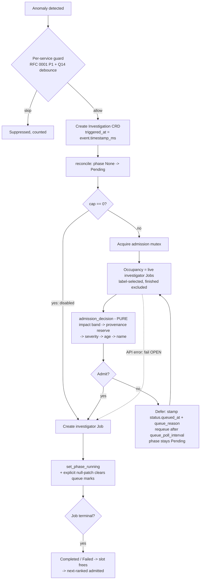

# RFC 0003 — Bounded investigator concurrency and restart-resilient detection (Q9 / Q11)

- **Status:** Draft — design for review (no code yet)
- **Date:** 2026-08-11
- **Authors:** Eng (with Claude) — synthesis of the operator-reliability design scope and the sequencing / feasibility / security reviews of 2026-08-11
- **Affects:** Operator (`controllers/investigation.rs`, `investigator_job.rs`, `detection/consumer.rs`, `crds/investigation.rs`, `api.rs`), Helm chart (`operator-deployment.yaml`, `values*.yaml`, CRD template, a new operator NetworkPolicy), `docs/deployment-guide.md`
- **Builds on:** RFC 0001 §10 (Q9, Q11) and its Phase 1 per-service guard (PR #17); Q14's durable post-terminal re-open debounce (PR #23), which narrows but does not close Q11
- **Resolves:** `docs/plans/main.md` Q9 and Q11
- **Numbering note:** this is the first of three RFCs filed on 2026-08-11; RFC numbers are assigned in recommended execution order (0003 → 0004 → 0005). See §12.

---

## 1. Summary

The operator spawns **one investigator Job per Investigation CRD with no global bound**. On a resource-constrained node — the demo, any single-node install, any local-LLM install — a wide burst of investigations collectively starves the host, saturates the LLM backend, and produces **zero completed investigations**. This was measured twice live: **0/48** and **0/23** completed, with host free memory at **~78 MB** and **~92 MB**.

The chart already ships `llm.maxConcurrentInvestigations: 2` and the deployment guide already documents it. `grep -rn "maxConcurrent\|MAX_CONCURRENT" operator/src` returns **nothing**. It is documentation for a mechanism that does not exist — and the guide's stated default (`5`) does not even match the values files (`2`).

Separately, EWMA detector baselines live only in process memory, so every rolling update, crash, or `helm upgrade` erases every baseline, re-enters a ~10-minute warmup, and produces a false-positive burst — which is precisely the input that triggers the failure above.

This RFC proposes:

- **Part A — an admission gate** in the Investigation controller that treats `Pending` Investigations as the queue and **defers, never drops** (FR11). Slot occupancy is derived from **live investigator Jobs**, not CRD phase, so it is self-healing across restarts and stale phases. Admission order is a **pure, unit-testable total order** banded on the operator-configured `impact_score` first — deliberately *not* on the attacker-settable `severity` (§8, F3).
- **Part B1 — a startup grace period** that suppresses detector *firing* until baselines are stable (default on, 600 s).
- **Part B2 — durable EWMA snapshots: designed here, deliberately deferred** (§6). Q14 shrank its marginal value to "avoid a 10-minute post-restart blind window," while it introduces the only genuinely new attack surface in this RFC.

The whole of Part A lands **default-off in code** (`0` = unlimited) and is turned on in the chart in a separate, `[H]`-gated task.

---

## 2. Product context

**The user problem.** Beeper's promise is "an anomaly appears → an evidence-backed investigation completes." Under a wide event the system today produces *nothing* — not "slow," but zero output at the moment of highest value. The one input we cannot design away is a **genuine wide outage**, and that is exactly when the failure fires.

**Who feels it.** The SRE running Beeper on their own cluster (a wide outage yields no root causes; a routine `helm upgrade` yields a noise burst plus a 10-minute blind spot). Whoever runs the demo — this is how the problem was found. End users of the investigation UI, indirectly: rows stuck in Pending/Running forever.

**Honest framing.** The user-visible value is **indirect**. No new screen, no new capability. This is operational robustness — the difference between a system that degrades gracefully and one that collapses. The single direct user-visible artifact is queue visibility ("2 running, 11 queued, oldest waiting 6 min"), which converts an inexplicable stall into an explained one.

**Success metrics**

| # | Metric | Measured baseline | Target |
|---|---|---|---|
| M1 | Terminal-phase completion ratio under a ≥20-service burst | **0/23** and **0/48** (`main.md` Q8/Q9) | ≥90 % reach `Completed`/`Failed` within `activeDeadlineSeconds` |
| M2 | Minimum host free memory during the burst | **~78–92 MB** | ≥1 GB free on the kind demo node throughout |
| M3 | Investigations created in the 15 min after an operator restart vs. a matched steady-state window | full re-warm burst (~1/service; post-Q13a live baseline **≈14**) | ≤2× the steady-state count |
| M4 | Queue drain fairness under a forged-anomaly burst | n/a (attack not previously modelled) | an SLO-registered Critical service is admitted within one drain cycle even when the queue is saturated by unregistered services |

M1/M2/M3/M4 are all `[O]` — each needs a live burst soak.

---

## 3. Problem statement

### 3.1 No global concurrency bound (Q9)

**The config is unwired.** `helm/beeper/values.yaml:229` and `values-dev.yaml:77` set `llm.maxConcurrentInvestigations: 2`. `docs/deployment-guide.md:332,341` documents it as "Maximum simultaneous investigator jobs" with a default of **`5`** — a third value that matches neither. It is not passed through `operator-deployment.yaml` (which *does* wire `BEEPER_INVESTIGATOR_CPU_LIMIT`, `..._MEMORY_LIMIT`, `..._ACTIVE_DEADLINE_SECONDS`, `..._BACKOFF_LIMIT`), and `InvestigatorConfig` has no corresponding field.

**The spawn path has no gate.** `controllers/investigation.rs`, `reconcile()`, `Some(InvestigationPhase::Pending)` arm: build the Job, `jobs_api.create(...)` unconditionally, `set_phase_running`. No counting, no queue, no admission decision anywhere in the file.

**Measured consequence** (`main.md` Q8/Q9, live profiling 2026-06-02/03): ~22–27 services trip at warmup → ~25+ investigator pods; host free RAM ~78 MB / ~92 MB; local qwen throttled ~37 → ~15 tok/s; Ollama overloaded; calls exceed the client window → `litellm.APIConnectionError` → `backoff_limit: 2` retries amplify → **0/48** and **0/23** completed. Isolated, the same model completes an RCA in ~70 s. The arithmetic: 25 concurrent × `memory_limit: 512Mi` promises 12.5 GiB of headroom on one kind node that also hosts Ollama, Prometheus, Loki, Qdrant, and the OTel demo.

**What already helps, and why it is not enough.** The Phase 1 per-service guard plus Q14's durable re-open debounce cap investigations at **1 per service**. They do not cap the *total*: 14–25 services still means 14–25 concurrent Jobs. RFC 0001 §10 states this explicitly.

**The constraint the plans already fixed.** FR11 and RFC 0001 §10 Q9 both require the bound to **defer, not drop**: a work-queue that processes N at a time and defers the rest, *not* a blind anomaly-dropper. Dropping an anomaly is silently losing a possibly-real incident.

### 3.2 EWMA state is in-memory (Q11)

`DetectionConsumer::run()` constructs `MetricDetector`/`LogDetector` fresh on every start; their state is `HashMap`s holding `EwmaDetector { ewma, ewma_var, samples }` plus Q12's `prev_value`/`prev_ts_ms` and a non-serializable `last_updated: Instant`. Nothing is written anywhere. `Makefile:253` codifies the cost: *"Detection needs ~10 minutes of baseline log data before anomalies can be detected (applies after demo-up **or operator restart**)."* Restarts are routine — `operator-deployment.yaml` uses `RollingUpdate`, and every dev image rebuild triggers one.

**Honest narrowing.** Q14's debounce closed Q11 *for the creation path*: after a restart, a service whose investigation went terminal recently is still suppressed, because the anchor is API state, not memory. The residual exposure is (a) services with **no** recent terminal investigation, and (b) the ~10-minute **blindness** window — which the debounce does nothing about and which is arguably the more serious half.

### 3.3 Three latent defects this work must not inherit

1. **`triggered_at` is not the anomaly onset.** `detection/consumer.rs:272` writes `triggered_at: Some(chrono::Utc::now().to_rfc3339())`, discarding `event.timestamp_ms` — which `metrics.rs` and `logs.rs` both populate. Under a deliberately-deferring queue this becomes actively misleading, and RFC 0005's causal-ordering gate keys on it. Fixed here (Task 7.4) because this RFC already owns that file. It is **not** a 2-line change: `triggered_at` flows to `metadata.triggered_at` in the BFF detail payload and into the React summary header, so it has UI-visible and fixture consequences.
2. **JSON-merge-patch cannot clear a field.** `update_investigation_status` uses `Patch::Merge`, and every `InvestigationStatus` field carries `skip_serializing_if = "Option::is_none"` — so `None` fields are *omitted* and merge-patch leaves them untouched. Any "cleared on admission" behavior must write explicit `null`s.
3. **The chart CRD is hand-written and prunes.** There is no `crdgen` and no `CustomResourceExt` use anywhere in `operator/src`; `helm/beeper/templates/crds/investigation-crd.yaml` enumerates every `status` property by hand and is a structural schema. New Rust status fields that are not hand-added to that YAML are **silently pruned by the API server** on every write. This is a shared prerequisite (Task 7.0a).

### 3.4 Out of scope

Detection *quality* (why anomalies fire at all) is RFC 0002 / Q13c. This RFC assumes detection quality stays where it is and asks: **when N investigations are legitimately requested at once, does the system survive?**

---

## 4. Proposed solution — overview

Two mechanisms, delivered separately, each config-gated, each default-off in code.



**Core idea: the queue is the API.** Investigation CRDs are already durably persisted and already have a phase (`Pending`) meaning "no Job yet." Rather than building a queue data structure, the controller makes an **admission decision** in the `Pending` arm. Durability, restart survival, `kubectl` inspectability, and zero new storage come for free.

**Slot accounting is derived from Jobs, not from CRD phase.** Counting `Running` Investigations leaks slots whenever a phase is stale (Job deleted, controller lagged, FR13 orphan). Instead, count live investigator Jobs via the labels `build_investigator_job` already sets:

```
app.kubernetes.io/managed-by=beeper-operator, app.kubernetes.io/component=investigator
```

A Job occupies a slot iff it is **not finished** — `succeeded == 0 && failed == 0` and no `Complete`/`Failed` condition. This matters: `ttl_seconds_after_finished: 3600` keeps finished Jobs for an hour, so naive counting would wedge the queue permanently. Slot accounting is therefore **self-healing** — it reflects reality, not bookkeeping.

**No new phase.** `InvestigationPhase` gains **no** variant. The React list grouping (`ui/frontend/src/lib/investigations/status-group.ts`, `row-view-model.ts`) and the BFF both key off today's five phases; adding `Queued` would silently reclassify rows and break e2e assertions in work RFC 0004 and Milestone 2.5 own. A queued investigation *is* genuinely Pending. Two additive optional `InvestigationStatus` fields carry the queue metadata instead.

> **Do not write queue state into `status.message`.** `error_policy` parses `status.message` for a `[retry:N]` prefix to derive backoff attempt count. Overwriting it silently resets backoff accounting.

---

## 5. Detailed design

### 5.1 The pure core (this is where the tests live)

There is **no kube-client test harness anywhere in `operator/`** — no `operator/tests/` directory, no `reflector`/`Store`, and `api.rs:2985` says it in the source: *"we can't easily create a real one in tests."* `docs/plans/main.md` AD-8 accepts this (*"Integration testing = manual verification"*). The house pattern for exactly this problem already exists in `detection/consumer.rs`: `service_guard_should_skip()` is impure and untested; `service_guard_skip_reason()` is pure over `&[Investigation]` and carries all the tests.

This RFC follows that pattern. **The reconcile arm is a thin, uncovered shell** (list → call → act); everything decidable is a pure function:

```rust
// operator/src/controllers/admission.rs (new)

/// A Job occupies a slot iff it is not finished.
pub fn slot_is_occupied(job: &Job) -> bool;

/// Explicit band function — NOT a derived `Ord` on `Severity`.
/// `Severity` derives no Ord/PartialOrd today, and deriving it would couple
/// band order to variant declaration order, which a later edit can silently
/// reorder. Pinned by a test over all four values.
pub fn severity_band(s: &Severity) -> u8;

pub enum Decision {
    Admit,
    Defer { reason: &'static str, rank: usize },
}

/// Pure. No K8s. Everything this RFC asserts is asserted here.
pub fn admission_decision(
    this: &Investigation,
    pending: &[Investigation],   // all Pending investigations, incl. `this`
    jobs: &[Job],                // all label-selected investigator Jobs
    known_services: &KnownServices, // SLO/registered-service set (provenance)
    cfg: &AdmissionConfig,
    now: DateTime<Utc>,
) -> Decision;

/// Serialized patch bodies, also pure — see §5.4.
pub fn queue_mark_patch(now: DateTime<Utc>, reason: &str) -> serde_json::Value;
pub fn clear_queue_marks_patch() -> serde_json::Value;
```

### 5.2 Admission order — banded on impact, not on severity

The naive design bands on `spec.severity`. **That is attacker-controlled.** `map_severity()` (`detection/consumer.rs:456–465`) is a pure function of `event.deviation`; `deviation` derives entirely from samples arriving on the **unauthenticated** ingestion listener at `:9090`; and `MetricDetector::extract_service()` takes the service identity straight from attacker-supplied labels with unbounded cardinality. With a chart default cap of `2`, an attacker needs **two forged >6σ series** to hold both slots forever. Every genuine incident then sits `Pending` — correctly, per FR11 never dropped — and therefore **never investigated**, while the system reports itself healthy. That is an amplification *introduced by the fix*, and the design must not have it.

The order is therefore, in priority:

1. **Impact band.** `spec.impact_score` is SLO-derived (`CustomerImpactScorer::score_service`) and therefore **operator-configured, not attacker-settable**. Band 0 = has an impact score at or above `impact_band_threshold`; band 1 = has any impact score; band 2 = no impact score (service is not SLO-registered). An anomaly on a service with no SLO entry **cannot reach band 0**.
2. **Provenance reservation.** At most `floor(cap / 2)` slots (and, when `cap == 1`, never the only slot) may be held by investigations whose `spec.service` is not in the known-service set. This is the same "fail-open but bounded" shape as the per-service guard.
3. **Guaranteed escalation share.** An item queued longer than `queue_escalate_after_secs` is escalated — and escalation **preempts**, it does not merely promote: every `escalation_share_every`-th admission (default 3rd) is given to the oldest queued item regardless of band. Pure promotion into band 0 changes nothing if band 0 is saturated.
4. **Severity**, then `impact_score` descending, then `queued_since` ascending, then `name` ascending as the final tiebreak — making the order a **strict total order**, so two concurrent reconciles cannot disagree.

`queued_since` reads `status.queued_at`, falling back to `metadata.creationTimestamp`.

### 5.3 Exactness, and what it costs

`operator.replicaCount: 1` (`values.yaml:10`). Occupancy-count and Job-create run under a `tokio::sync::Mutex` held in `InvestigationContext` **across count-then-create**, so within the single replica the cap is **exact**. Without it, kube-runtime reconciles distinct objects concurrently and a burst overshoots by the concurrency degree.

Two honest corrections to the naive version of this design:

- **The Jobs list is an API-server call, not a cache read.** `Api::namespaced(...).list(...)` in `kube` 0.95 issues HTTP; a cached read needs `kube::runtime::reflector` + `Store`, and this codebase has **no reflector anywhere**. With ~14–25 deferred investigations requeueing at 15 s, a naive design sustains ~1–1.7 Jobs-lists/s against the API server on the same single node this work exists to protect. **Mitigation:** the occupancy count is cached in `InvestigationContext` behind the admission mutex with a short TTL (default 2 s) and refreshed once per drain cycle rather than once per reconcile. `[O]` measures the API-server QPS delta in the soak.
- **Above one replica the cap degrades to per-replica, silently.** ADR 0002 §11 already names two process-local correctness invariants to revisit before `ui.replicaCount > 1`. This adds a **third, on the operator side**, and it must be recorded there rather than living only in a design doc — because the failure mode is silent overshoot of a safety cap, not an error. The chart must document it and `NOTES.txt` must warn.

### 5.4 Contract changes

`operator/src/crds/investigation.rs` — `InvestigationStatus`, purely additive:

```rust
/// When this investigation was first deferred by the concurrency gate (ISO 8601).
/// Absent = never queued. Set once; explicitly nulled when the Job is created.
#[serde(skip_serializing_if = "Option::is_none")]
pub queued_at: Option<String>,

/// Why it is deferred, e.g. "concurrency-cap" / "provenance-reserve". Absent when admitted.
#[serde(skip_serializing_if = "Option::is_none")]
pub queue_reason: Option<String>,
```

**Both fields must be hand-added to `helm/beeper/templates/crds/investigation-crd.yaml`** or they are pruned (§3.3). Task 7.0a adds the parity guard that makes this a CI failure rather than a cluster mystery.

**Clearing them requires an explicit null patch.** `set_phase_running` uses `Patch::Merge`; omitted fields are left untouched. A dedicated `clear_queue_marks()` writes `{"status":{"queued_at":null,"queue_reason":null}}`, and the `[T]` asserts on the **serialized patch body** returned by the pure `clear_queue_marks_patch()`.

*(Corollary worth recording: the same merge semantics mean RFC 0005's correlation reconciler will **not** have its `status.correlations` wiped by this controller's phase transitions. That is load-bearing and non-obvious; RFC 0005 carries a patch-body `[T]` for it.)*

`operator/src/investigator_job.rs` — `InvestigatorConfig` gains:

| Field | Env var | Code default | Chart value |
|---|---|---|---|
| `max_concurrent_investigations: usize` | `BEEPER_INVESTIGATOR_MAX_CONCURRENT` | `0` = unlimited | `llm.maxConcurrentInvestigations` (**2**) |
| `queue_poll_interval_secs: u64` | `BEEPER_INVESTIGATOR_QUEUE_POLL_SECS` | `15` | `investigator.queuePollSeconds` |
| `queue_escalate_after_secs: u64` | `BEEPER_INVESTIGATOR_QUEUE_ESCALATE_AFTER_SECS` | `900` | `investigator.queueEscalateAfterSeconds` |
| `queue_escalation_share_every: u32` | `BEEPER_INVESTIGATOR_QUEUE_ESCALATION_SHARE` | `3` | `investigator.queueEscalationShare` |
| `occupancy_cache_ttl_secs: u64` | `BEEPER_INVESTIGATOR_OCCUPANCY_TTL_SECS` | `2` | — |

**Code default `0` (off), chart default `2` (on).** This resolves a documented contradiction that must not be settled silently in a commit: **FR11** mandates a cap with a low default, while **RFC 0001 §10 Q9** says "config-gated, default off, recommended on for local/single-node." Off in code means unit tests, `cargo run`, and any raw-binary consumer see literally unchanged behavior. On in the chart means every Helm install — including `make demo-up`, exactly the resource-constrained single-node case — gets the bound that the witnessed 3/3 run already used (`maxConcurrentInvestigations: 2`, `main.md:376`). The chart flip is a **separate `[H]`-gated task** (7.3) from the mechanism (7.2), so the increment keeps its default-off property.

The deployment guide's `5` is corrected to `2` in the same task. The first thing that becomes real must not be a wrong number.

### 5.5 Fail-open on list error

A Jobs-list API error causes **admission**, with a warning logged — mirroring the S5 precedent resolved in RFC 0001 Phase 1 (PR #17): an incident-response system must not stall on a failed list call.

### 5.6 Observability

New operator route `GET /api/v1/scheduler/stats`:

```json
{ "max_concurrent": 2, "running": 2, "queued": 11,
  "oldest_queued_wait_secs": 372, "admitted_total": 46, "deferred_total": 118,
  "reserved_unregistered_slots_in_use": 1 }
```

A **new namespace on purpose**: `/api/v1/investigations/queue` would sit under the `:id` param route and burn `queue` as an investigation name; `/api/v1/health/components` is the data source for a route Milestone 2.5 is about to migrate. `/api/v1/scheduler/*` collides with neither, and the operator route table has no topology or scheduler route today.

It is served **from the in-process counters the controller already maintains**, never a live Jobs list per request — otherwise the endpoint is itself an availability surface on an unauthenticated port (§8).

`oldest_queued_wait_secs` breaching a threshold is an **alarm condition**, not just a display field: "the queue never drains" is the sole observable of the §8/F3 attack.

### 5.7 Part B1 — restart grace period

On startup, suppress *firing* (not tracking) until either `grace_secs` have elapsed since consumer start, **or** a per-detector stability condition holds (`samples > min_samples` and a non-degenerate variance estimate for `stability_samples` consecutive updates). Config `BEEPER_DETECTION_STARTUP_GRACE_SECS`, default `600` — matching the reality `Makefile:253` already documents.

**This is a blind window, and it is a trade, not a win.** A restart during a real incident means the incident is not detected for up to 10 minutes. It is the right trade only because the burst *also* disables the system (§3.1) whereas the blind window merely delays it, and because 10 minutes is what the system already effectively has. It is also **attacker-triggerable** — an attacker who can induce an operator OOM today gets blindness on demand — which is stated in §8 rather than buried.

**Instrumentation caveat (recorded in project memory, and load-bearing):** `ewma_warmup_samples` reads 0 even while detectors are firing. The grace gate must be driven off the detectors' own sample counts, and its `[T]` must assert on detector state, **never** on that API field.

### 5.8 Prerequisite: the detection consumer has no timer and no shutdown channel

`DetectionConsumer::run()` is a blocking `buffer.recv().await` loop with a `check_count % 100` stats tick. There is no interval and no `shutdown_rx` — `main.rs` creates the `watch` shutdown channel and passes clones to the SLO engine and outbox worker, but simply *aborts* the detection consumer after the grace period.

So a periodic action inside that loop would be **data-rate-driven, not time-driven** — the interval only fires if samples keep arriving, which is exactly not true during the quiet periods a snapshot most wants. Task 7.0c converts the loop to `tokio::select!` over `buffer.recv()`, a `tokio::time::interval` tick, and `shutdown_rx.changed()`, and threads `shutdown_rx` through `run()`. B1 and any future B2 both need this; doing it once avoids two discoveries.

---

## 6. Deferred: Part B2 — durable EWMA snapshot (designed, not scheduled)

Recorded here so the design is not re-derived, and so the reasons for deferral are on the record.

**Shape.** Persist EWMA scalars periodically to a Qdrant payload-only collection `detector_state`, reusing the exact pattern in `notifications/outbox.rs` (raw `reqwest` against `QDRANT_URL`; the chart already deploys Qdrant, so **no new infrastructure and no new crate**). Config `BEEPER_DETECTION_SNAPSHOT_ENABLED` (default `false`), `..._INTERVAL_SECS` (300), `..._MAX_AGE_SECS` (3600).

**Design points that are easy to get wrong.** `MetricState.last_updated` is a `std::time::Instant` — not serializable and not meaningful across processes; persist epoch-ms and rebuild as "now," adjusting only the staleness decision. `LogDetector`'s window is time-anchored buckets — **do not restore the buckets**; restoring 5-minute-old buckets as current corrupts the rate. Restore only EWMA scalars. Reject the whole snapshot on `config_fingerprint` mismatch (threshold, alpha, min_samples, denylist, floors) — baselines learned under different semantics are not reusable, and silent reuse is a subtle correctness bug. Worst case ~2–3 MB at `max_metrics: 10000`; chunk at ≤2000 entries per point.

**Why it is deferred.**

1. **Marginal value shrank.** Q14's durable debounce already closed the creation-path half of Q11. What remains is "avoid a 10-minute blind window after restart" — real, but B1 covers the noise half at a fraction of the cost.
2. **It introduces a genuinely new detection-integrity attack surface.** The same Qdrant instance holds the KB, the notification outbox, `collaboration_messages`, and — per FR62 — the **identity store including argon2id password hashes**, and it is unauthenticated. An attacker with write reach can set `ewma_var` enormous → **the detector goes silently blind**, or set means far from reality → an investigation flood that reproduces the very DoS Part A just fixed.
3. **The cheap poisoning path is not the one the obvious mitigations cover.** An attacker who can push metrics to the unauthenticated `:9090` listener can slowly inflate `ewma_var` for a target service — never tripping the threshold, because the detector is being *taught* that the variance is normal. Today this attack has a natural expiry: every restart rebuilds detectors from zero. **B2 removes that expiry**, turning a transient blinding into a durable one. Every proposed mitigation misses it: `config_fingerprint` matches, the staleness bound passes, the sanity validation passes. And per the memory note, `ewma_warmup_samples` reads 0 even while firing — so there is currently **no observable at all** for "this detector has gone blind."

**Conditions for promoting B2 out of deferral,** all of which must hold:

- the post-restart blind window is demonstrated to matter in practice (an `[O]` from a live run, not a hypothesis);
- **ingestion is authenticated**, or the detection path carries a distinct-service cardinality cap;
- the load path is hardened as *untrusted input*: schema-version check, fingerprint match, per-entry rejection of non-finite values / negative variance / implausible `samples`, staleness bound, and **fail-closed to cold-start** on any validation failure;
- restored authority is **bounded**: clamp restored `samples` to `2 × min_samples`, so the point of persistence is skipping the cold start, not inheriting months of history — and a poisoned baseline re-converges in minutes rather than never;
- **variance-drift rejection**: reject entries whose `ewma_var` exceeds a configured ratio of the collection-wide median for that metric name;
- **blindness is observable**: per-metric `ewma`/`ewma_var`/`samples` (or at minimum a count of series above a variance ceiling) exposed on `/api/v1/detection/stats`. This is worth doing **independent of B2** — today it is impossible to distinguish a healthy quiet detector from a blinded one.

Promoted, B2 becomes its own RFC. Until then it is not scheduled.

---

## 7. Alternatives considered

**A1 — Do nothing.** *Partly defensible.* The per-service guard + Q14 debounce collapsed the live baseline from 38k to ~14 and held it flat at 104 with 0 created; the witnessed 3/3 demo run passed on local qwen *without* a global cap. RFC 0001 §10 itself says *"on a real cluster + cloud LLM, per-service-only (no global cap) is correct."*
**Rejected** because the failure is not merely rare, it is **total and self-amplifying** (0/23, 0/48, retry spiral, 78 MB free), and it is triggered by the one input we cannot design away — a genuine wide outage, the product's highest-value moment. A safety net whose absence is only survivable when nothing bad happens is not a safety net. Doing nothing also leaves `maxConcurrentInvestigations` shipping as documented-but-fictional config with a documented default that matches nothing.

**A2 — Drop anomalies above the cap.** Trivial: at cap, don't create the CRD. Bounded etcd object count, no ordering question, no starvation question. **Rejected on stated program policy, which is correct policy:** it silently loses real incidents, and the cap is likeliest to be hit exactly when incidents are real. Forbidden by FR11 and RFC 0001 §10 Q9.

**A3 — In-process `tokio::Semaphore` held across the whole investigation.** Idiomatic, ~20 lines, natural back-pressure. **Rejected** on four counts: (a) permits are *memory* — an operator restart with 2 Jobs running releases both permits while the Jobs keep running, so real cluster load doubles at exactly the moment that already causes a burst; (b) a reconcile that errors and never returns leaks a permit permanently, wedging the queue with no self-heal; (c) it holds a permit across an await of up to `activeDeadlineSeconds` (30 min), so any bug in the release path is a 30-minute stall; (d) no ordering — kube-runtime's requeue order is arbitrary, so a Critical waits behind Lows. The proposed design holds a mutex only around the *decision* (microseconds) and derives occupancy from Jobs, so it is restart-correct and leak-proof.

**A4 — Kubernetes-native: `suspend: true` Jobs, or Kueue.** Job objects exist immediately (good `kubectl` visibility); unsuspension is one patch; Kueue is mature and purpose-built. **Rejected:** suspended Jobs still carry a `Running` semantic the UI would misread, forcing a real `Queued` phase and breaking the UI contract; and Kueue is a heavyweight third-party CRD the chart would have to install — a direct violation of NFR26 (`make demo-up` requires zero configuration).

**A5 — Leader-elected scheduler (`coordination.k8s.io/leases`).** The correct answer for a multi-replica operator: exact cap regardless of replica count. **Deferred, not rejected on merit.** `replicaCount: 1` is the shipped and only-tested topology; leases need new RBAC; and the whole HA story (which replica runs the detection consumer? all replicas are behind the ingestion Service and would all ingest) is unsolved and far larger than this scope. The design is forward-compatible — `admission_decision` is a pure function a future leader calls unchanged.

**A6 — Build a mock `kube::Client` test harness so reconcile-level behavior is `[T]`.** `tower` and `http-body-util` are already dev-deps, so it is possible. **Rejected for now, with reasoning:** it is net-new test infrastructure (recorded list/get/patch bodies per resource), it would be a first for this repo, AD-8 explicitly accepts manual integration verification, and it would have to be a shared dependency of both this RFC and RFC 0005 rather than a silent assumption inside each. The pure-core split (§5.1) buys the same test value at a fraction of the cost and follows a pattern the codebase already uses. If reconcile-level `[T]`s are later judged necessary, the harness becomes its own shared task — not a hidden cost inside a feature.

**B-alternatives.** *ConfigMap snapshot* — rejected: 1 MiB hard limit vs. a 2–3 MB worst case, plus multi-MB writes every 300 s through etcd with full revision history (a well-known anti-pattern). *A `DetectorState` CRD* — rejected: identical etcd churn plus a whole new CRD, schema, and RBAC for a private implementation detail with no API consumers. *Grace period only, never persist* — **adopted as B1.**

---

## 8. Security considerations

### 8.1 Denial-of-investigation: an amplification introduced by the fix

The `:9090` ingestion listener has **no authentication**. `map_severity()` is a pure function of `event.deviation`; `deviation` derives from ingested samples; service identity comes from attacker-supplied labels with unbounded cardinality. Under a naive severity-banded admission gate with a chart default of `2`, **two forged >6σ series occupy both slots indefinitely**, every genuine incident sits `Pending` forever, and nothing errors.

Today the same attacker gets a crude node-resource DoS (which this RFC fixes). After the fix, without §5.2's countermeasures, the attacker would get a *targeted, low-cost, low-noise denial of the product's core function*. That is a strictly worse trade on the availability axis, and it is the single most important security property of this design.

**Countermeasures, all in §5.2 and all with ACs:** band on operator-configured `impact_score` first (attacker-settable `severity` is only a within-band tiebreak); reserve at most `floor(cap/2)` slots for services absent from the SLO/registered set; make age escalation *preemptive* with a guaranteed admission share; and alarm on `oldest_queued_wait_secs`.

**Scoped-down from the review's recommendation, deliberately.** The security review additionally proposed a distinct-service **cardinality cap on the detection path**. I am adopting only the queue-side half — a bound on how many slots and queue positions unregistered services may hold — and *not* a detection-path cardinality cap. Reason: the detection path's admission semantics are RFC 0002 / Q13c territory, changing them here would couple two independently-reviewable mechanisms, and the queue-side bound already removes the amplification this RFC creates. The residual (an attacker inventing many distinct service names to inflate *etcd object count*, already bounded at ~1/service by the per-service guard) is recorded as an open question (§11 OQ4), not solved here.

**Ingestion authentication moves from "nice to have" to load-bearing:** admission *fairness* now depends on it. It is out of scope for this RFC and must be filed as its own requirement.

### 8.2 The operator API is unauthenticated, and this RFC adds an endpoint to it

`operator/src/api.rs` builds a bare `axum::Router` with **no auth layer and no middleware**, exposed as a ClusterIP Service on :8080, with no NetworkPolicy (the chart's only NetworkPolicy selects the UI pod). That router already serves unauthenticated **state mutations** — `POST /api/v1/investigations/:id/{confirm,reject,resolve,verify}` and `POST /api/v1/notifications/outbox`, the last of which reaches real Slack/PagerDuty/email. The entire ADR 0002 two-tier model is, at that layer, a BFF-local fiction.

`GET /api/v1/scheduler/stats` is low-sensitivity (counts and an aggregate wait time — no service names, no incident content, no secrets), but it is a new availability surface on that port, which is why §5.6 serves it from in-process counters.

**This RFC does not own the fix, but it does gate on the first step:** Task 7.0d ships `helm/beeper/templates/operator-networkpolicy.yaml`, modelled on `ui-networkpolicy.yaml` including its `{{ fail }}` guard against the empty-`from` allow-all footgun, restricting :8080 to the UI pod selector and :9090 to the collector. That is ~40 lines, chart-only, and it is the shared precondition this RFC and RFC 0005 both assume exists. Operator-API authentication (mTLS or a chart-minted shared bearer) is filed separately as NFR31's follow-on; `POST /api/v1/notifications/outbox` should be the first route to get a credential regardless, because it egresses to third parties.

### 8.3 Smaller items

- **No new RBAC.** `operator-role.yaml` already grants `batch/jobs: get,list,watch,create,update,patch,delete`. Verified; nothing is broadened.
- **New CRD status fields** contain no user data — already-derivable timing information.
- **Resource-exhaustion DoS is mitigated, not introduced,** on the compute axis: the cap converts an unbounded-compute, unbounded-LLM-cost attack (7+ LLM calls per investigation) into a bounded one.
- **B1's grace period is attacker-triggerable blindness.** An attacker who can induce an operator OOM gets a deterministic, complete 10-minute blind window on demand. Close to neutral versus today's noisy re-warmup, but it is a property, not just an availability trade, and it is stated as such.
- **B2's threat model is §6's central reason for deferral.**

---

## 9. Migration strategy

**Backward compatibility is total, by construction.**

- **Code default `0` = unlimited.** With the env var unset — every unit test, `cargo run`, any raw-binary consumer — the `Pending` arm takes today's path with **no Jobs-list call at all**. Behavior is unchanged.
- **CRD fields are additive `Option<>` with `skip_serializing_if`.** Existing Investigation objects deserialize unchanged. The chart CRD must be hand-edited in the same commit (§3.3) and the Task 7.0a parity guard makes an omission a CI failure.
- **Rollout ordering.** The CRD template lives in `templates/crds/`, so `helm upgrade` applies it. A **new operator image against a stale CRD** silently drops the new status fields (queue marks vanish, the gate still functions — degraded observability, not incorrect admission). An **old image against a new CRD** is a no-op. Neither is data-destructive; both are documented in the deployment guide.
- **CRD regeneration happens once.** RFC 0005 also adds `InvestigationStatus` fields. Whichever lands second edits the chart CRD template — not both.
- **Chart enablement is a separate task** (7.3) behind an `[H]`, so the mechanism can be reverted independently of the posture.
- **NFR26 is an explicit gate on the enablement task,** not an afterthought: `helm template` under demo values must render the expected env var, and `make demo-up` from a clean cluster must need zero configuration.

---

## 10. Risks and mitigations

| Risk | Likelihood | Impact | Mitigation |
|---|---|---|---|
| A low cap makes a genuine wide outage take hours (20 services × 12–15 min ≈ 4–5 h) — the bound trades collapse for latency | **H** | **H** | This is the deliberate trade (something completes vs. nothing completes). Impact-banded admission investigates the highest-impact services first; document that cloud-LLM installs should raise or disable the cap (`0` = unlimited); surface queue depth + oldest wait so the delay is *explained*. Cross-service correlation (RFC 0005) is the real long-term fix — it collapses N per-service investigations into one incident. |
| **Forged anomalies occupy every slot → denial of investigation** | M | **H** | §5.2 impact banding + provenance reservation + preemptive escalation share; `oldest_queued_wait_secs` alarm; §8.1 records the ingestion-auth dependency explicitly |
| Reconcile races overshoot the cap | M | M | Admission mutex across count-then-create → exact at one replica; degradation above one replica documented in the chart, `NOTES.txt`, and ADR 0002 §11 |
| Queue wedges: slots held by phantom occupants | M | H | Slots derived from **live Jobs**, not CRD phase; `activeDeadlineSeconds: 1800` bounds every Job; FR13 orphan reconciliation is a second backstop; `[T]` on finished-Job exclusion |
| Requeue polling loads the API server (**no reflector exists**) | M | M | Occupancy cached behind the mutex with a 2 s TTL, refreshed per drain cycle, not per reconcile; fixed 15 s poll with no exponential decay; `[O]` measures QPS delta in the soak |
| Queue marks never clear because merge-patch omits `None` | **H** if unaddressed | M | Explicit `null` patch via `clear_queue_marks_patch()`; `[T]` asserts on the serialized patch body |
| New status fields silently pruned by the hand-written CRD schema | **H** if unaddressed | **H** | Task 7.0a CRD-parity guard `[T]` — reflects Rust field names against the committed YAML in both directions |
| Deferred investigations accumulate as etcd objects during a long outage | M | L | Already bounded by the per-service guard at ~1/service, so max depth = service count. No expiry by default (FR11 forbids dropping); an optional `queueMaxAgeSecs` is designed but stays off |
| Grace period causes a missed real incident right after a restart | **H** (it will happen) | M | Named honestly as a trade. Default 600 s matches the already-documented reality. `GRACE_SECS=0` opts out. Attacker-triggerability stated in §8.3 |
| `triggered_at` semantic change surprises the UI / fixtures | M | M | Its own task (7.4) with a `[T]` on the pure event→spec mapping and a `[T]` that the BFF/React tolerate `triggered_at < started_at` |
| CRD schema change collides with RFC 0005's correlation fields | **H** | M | Both additive `Option<>`; explicit merge-order contract (§12); regenerate the chart CRD once |
| Live validation is slow (each soak needs ~8–10 min warmup before faults can be injected) | **H** | M | Budgeted in Task 7.6; 7.2/7.5 stay fully unit-testable so only the soak needs a cluster |

---

## 11. Acceptance criteria

Criteria are tagged `[T]` (automated test), `[H]` (human judgment), `[O]` (post-deployment observation). **Reconcile-level behavior is `[O]`, not `[T]`** — see §5.1 and §7 A6; the pure core carries the `[T]`s.

**Shared prerequisites (Tasks 7.0a–7.0d)**
- `[T]` a Rust test reflects the `#[serde]` field names of `InvestigationSpec`/`InvestigationStatus` against `helm/beeper/templates/crds/investigation-crd.yaml` **in both directions** — every Rust field appears in the YAML `properties` and vice versa — and fails when a field is added on one side only.
- `[T]` the `/api/v1/*` authorization guard enumerates `app.url_map`; every rule with a `POST|PUT|PATCH|DELETE` method has `required_role` set and matching a committed allowlist table; every `GET` rule has `required_role` set at all. Adding a route without adding a row fails CI.
- `[T]` `DetectionConsumer::run()` returns on `shutdown_rx.changed()` and its periodic tick fires on a wall-clock interval with an empty sample buffer (proving the tick is time-driven, not data-driven).
- `[T]` `helm template` renders `operator-networkpolicy.yaml` with a non-empty `from` selector under default and demo values, and `{{ fail }}`s on an empty selector (mirroring `ui-networkpolicy.yaml`).

**Task 7.2 — admission gate (mechanism, default-off)**
- `[T]` `admission_decision` is a strict total order over identical inputs — the same input set always yields the same permutation.
- `[T]` **impact banding:** an investigation with no `impact_score` never reaches band 0, even at `severity: Critical`; an SLO-registered Critical outranks an unregistered Critical.
- `[T]` **provenance reservation:** with `cap = 4` and 2 slots already held by unregistered services, a third unregistered investigation is deferred while a registered one is admitted; with `cap = 1`, an unregistered investigation never takes the only slot while a registered one is queued.
- `[T]` **preemptive escalation:** with band 0 permanently saturated, an item queued past `escalate_after` is admitted within `escalation_share_every` admissions.
- `[T]` `severity_band()` is pinned for all four `Severity` values by an explicit test (no derived `Ord`).
- `[T]` `slot_is_occupied` returns `false` for `succeeded == 1`, `false` for `failed >= 1`, `true` for `active >= 1` — proving `ttlSecondsAfterFinished` leftovers cannot wedge the queue.
- `[T]` `InvestigatorConfig::from_env` parses all five new vars and falls back to `0`/`15`/`900`/`3`/`2`; existing env tests unchanged.
- `[T]` `queue_mark_patch` sets `queued_at` only when absent; `clear_queue_marks_patch()` emits explicit JSON `null`s for both fields.
- `[T]` `cargo fmt`, `cargo clippy -- -D warnings`, full `cargo test` green.
- `[O]` with `max_concurrent = 0` on a live cluster, the `Pending` arm creates the Job with no Jobs-list call (verified from operator logs / API-server audit).
- `[O]` with `max_concurrent = 2` and 2 occupied slots, a Pending investigation gets no Job, stays `Pending`, and is admitted within one poll interval when occupancy drops.
- `[O]` a Jobs-list API error results in admission with a warning logged (fail-open).

**Task 7.3 — observability + chart enablement (`[H]`-gated behavior change)**
- `[T]` `GET /api/v1/scheduler/stats` returns the documented shape from in-process counters, issues no Jobs list, and with the gate disabled reports `max_concurrent: 0` without erroring.
- `[T]` `InvestigationPhase` gains no variant and no existing API response field changes shape — asserted by the existing UI/BFF suites (2859 pytest / 767 vitest / 99 e2e) passing **unmodified**.
- `[T]` Helm render test (following `demo/tests/test_slo_manifests.py`) asserts `BEEPER_INVESTIGATOR_MAX_CONCURRENT` appears in the rendered operator Deployment with the value from `llm.maxConcurrentInvestigations`, and that demo values render `2`.
- `[T]` `docs/deployment-guide.md` states `2` for `llm.maxConcurrentInvestigations`, matching both values files — guarded by a doc-vs-values consistency test.
- `[H]` an operator reviews and approves the FR11-vs-Q9 default reconciliation (code `0`, chart `2`) as the shipped posture.
- `[H]` **NFR26 program gate:** `make demo-up` from a clean cluster works with zero configuration under the new chart default.
- `[O]` on the demo cluster with the cap at 2, `kubectl get inv` during a burst shows exactly 2 with a Job and the rest `Pending` with `queued_at` set.

**Task 7.4 — `triggered_at` from anomaly onset**
- `[T]` the pure event→`InvestigationSpec` mapping derives `triggered_at` from `event.timestamp_ms`, not wall-clock now.
- `[T]` the BFF detail payload and the React summary header render correctly when `triggered_at < started_at` (the new normal), with fixtures updated.

**Task 7.5 — restart grace period**
- `[T]` within the grace window a detector that would otherwise emit an `AnomalySignal` emits none; after the window, identical input fires normally.
- `[T]` the grace decision is driven by detector-internal sample/stability state, **not** by `DetectionStats::ewma_warmup_samples` (known to read 0 while detectors fire).
- `[T]` `BEEPER_DETECTION_STARTUP_GRACE_SECS=0` restores exactly today's behavior.
- `[O]` restarting the operator on the demo cluster produces ≤2× the steady-state investigation count in the following 15 minutes (M3).

**Task 7.6 — burst soak and live validation**
- `[O]` synthetic ≥20-service burst with `maxConcurrentInvestigations: 2`: ≥90 % reach a terminal phase (M1) — versus the recorded 0/23 and 0/48.
- `[O]` minimum host free memory ≥1 GB throughout (M2) — versus the recorded 78–92 MB.
- `[O]` **no investigation is dropped:** total CRDs created equals what the per-service guard admits; the created-vs-completed difference is fully accounted for by the queue.
- `[O]` API-server QPS delta from admission polling, measured and recorded (§5.3).
- `[O]` **fairness under attack (M4):** with the queue saturated by synthetic anomalies on unregistered service names, an injected fault on an SLO-registered service is admitted within one drain cycle.
- `[H]` an operator confirms the queue behaves comprehensibly under the burst — depth visible, oldest wait visible, a high-impact service admitted ahead of queued low-impact ones.

---

## 12. Open questions

| # | Question | Impact | Status |
|---|---|---|---|
| OQ1 | Is a cap of `2` a good answer for a *real* wide outage? 20 correlated services × 12–15 min sequential ≈ 4–5 h to drain. | Whether bounded concurrency feels like a working system or a stuck one | Open — Task 7.6's `[H]` judges exactly this. Impact banding is the hedge; the honest position is that this **buys time for RFC 0005's correlation and faster models to be the real fix** |
| OQ2 | Should the operator API get real authentication (mTLS / chart-minted bearer), and if so, when? | §8.2 — the two-tier model is a BFF-local fiction at that layer | Open — NFR31 covers network containment as the first step; authentication is filed as a follow-on and is **not** owned by this RFC |
| OQ3 | Should ingestion (`:9090`) be authenticated? | §8.1 — admission fairness now depends on it | Open — out of scope here, but this RFC is the reason it is now load-bearing |
| OQ4 | Distinct-service cardinality cap on the detection path (an attacker inventing service names to inflate queue depth / etcd objects) | Bounds worst-case queue depth beyond the per-service guard | Open — deliberately scoped out (§8.1); belongs with RFC 0002 / Q13c |
| OQ5 | Promote Part B2 (durable snapshot) out of deferral? | Post-restart blind window | Deferred — §6 lists the six conditions that must hold; if met, B2 becomes its own RFC |
| OQ6 | Should HA (`operator.replicaCount > 1`) be pursued, requiring A5's leader election? | Cap exactness above one replica | Open — the whole HA story (detection consumer ownership, ingestion fan-in) is unsolved and much larger than this scope |

---

## 13. Related documents

- [RFC 0001 — Per-service-incident investigations](0001-per-service-incident-investigations.md) — §10 Q9/Q11 are what this RFC resolves; Phase 1's per-service guard and S5 fail-open precedent
- [RFC 0002 — Detection significance gating](0002-detection-significance-gating.md) — detection *quality*; its dwell gate composes with §5.7's grace period (whoever lands second adds a `[T]` proving the two gates compose)
- [RFC 0004 — Investigation evidence: persistence contract and exposure boundary](0004-investigation-evidence-exposure.md) — its per-step checkpointing default-on flip is gated on Task 7.6 proving the cap
- [RFC 0005 — Cross-service incident correlation](0005-cross-service-incident-correlation.md) — consumes Task 7.4's `triggered_at` contract; shares `InvestigationStatus` and the chart CRD template; must not add an `InvestigationPhase` variant
- [ADR 0002 — OIDC, SCIM and local-fallback identity](../decisions/0002-oidc-scim-and-local-fallback-identity.md) — §11's named-invariant list gains the operator-side single-replica admission invariant (§5.3)
- [docs/plans/main.md](../../plans/main.md) — Q8/Q9/Q11/Q13/Q14 history and the live measurements cited throughout
- [docs/reqs/main.md](../../reqs/main.md) — FR11, FR13, FR63, FR64, NFR26, NFR27, NFR30, NFR31
- [docs/plans/react-ui.md](../../plans/react-ui.md) — Milestone 2.4 (Phase 4, Milestone 4.1 in main.md carries the operator tasks)
