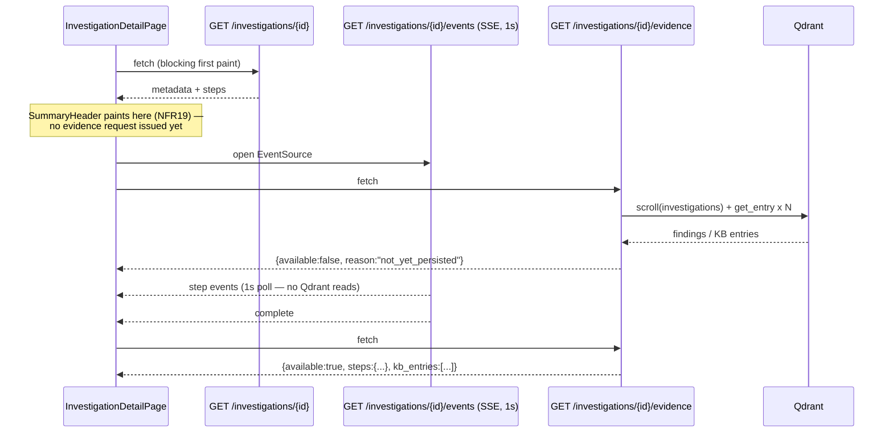

# RFC 0004 — Investigation evidence: persistence contract and exposure boundary (Q8)

- **Status:** Draft — design for review (no code yet)
- **Date:** 2026-08-11
- **Authors:** Eng (with Claude) — synthesis of the evidence/KB design scope and the sequencing / feasibility / security reviews of 2026-08-11
- **Affects:** Investigator (`agent.py` persistence contract, `steps/signal_correlation.py`), BFF (`ui/beeper_ui/routes/investigations.py`, `services/evidence_service.py`, a new redaction module, `services/investigation_service.py` read path), React (`InvestigationDetailPage`, `StepEvidence`, `RelatedKbPanel`)
- **Resolves:** `docs/plans/react-ui.md` Q8
- **Numbering note:** second of three RFCs filed on 2026-08-11; numbers are assigned in recommended execution order (0003 → 0004 → 0005). This RFC is numbered ahead of RFC 0005 because §5's exposure-boundary decision **gates the very first evidence task (Milestone 2.4 Task 9.1)**, which starts in the first execution wave, whereas RFC 0005's own precondition (a graph-density measurement) may return no-go.

---

## 1. Summary

An SRE opens `/app/investigations/<id>` during an incident and sees a summary header, a six-step timeline, and "0 Related KB Entries." They do **not** see *why* Beeper concluded anything — no PromQL query and its value, no log excerpt, no link to the prior incident the RCA cited. The product's proposition is "an agentic AI SRE that shows its work"; today the detail view is a progress bar.

Two of the four pieces of this are ordinary plan work — a read-only BFF endpoint and its React client, structurally identical to Tasks 1.6 and 5.1, which shipped with no RFC. They live in `docs/plans/react-ui.md` Milestone 2.4 as Tasks 9.1 and 9.2.

**This RFC covers the two pieces that are not ordinary**, because each has a wrong answer that is expensive to discover late:

- **The exposure boundary.** Serving evidence would be the **first** surface in the system to put **raw production log lines in a browser**. Log lines routinely carry bearer tokens, session identifiers, customer emails, order ids, and stack traces with internal hostnames. Nothing in the system redacts the persistence path, the BFF cannot import the investigator's scrubber, and — critically — `require_role("user")` is **not an authorization check** (§3.3). This decision must be settled *before* Task 9.1 is written, not retrofitted.
- **The persistence contract.** Making evidence exist for in-flight and failed investigations means per-step checkpointing — and the current writer appends a **fresh random UUID point per call** while the reader does an **unordered `scroll(limit=1)`**. Adding checkpoints on top of that is not an addition, it is a **regression**: the detail view can read a stale partial checkpoint instead of the final result, by UUID luck.

---

## 2. Product context

**Who feels it.** The on-call SRE using the migrated React detail view — the only detail view that exists, since Task 6.3 deleted the Jinja one. Secondarily the reviewer approving a resolution recommendation via the confirm/verify flow, who is being asked to accept a conclusion with no visible substantiation.

**Honest framing: this is a regression, not a feature.** FR49's parity bar names inline evidence (FR25) and Related KB (FR26) as capabilities that "must not regress." The Jinja detail page rendered both. Task 6.3 deleted the page that included them; the partials survive but **nothing renders them** — `_evidence_panel.html`/`_unified_timeline.html`/`_findings.html` are reachable only from `_generate_detail_sse_events`, whose consumer page no longer exists, and `_related_kb.html` only from `investigation_related_kb`, which no UI calls. The capability is dead in both worlds. The increment is "restore, and do it properly."

**Success metrics**

| # | Metric | Baseline | Target |
|---|---|---|---|
| M1 | Evidence presence rate: completed investigations rendering ≥1 inline evidence item (Prometheus/Loki configured) | **0 %** | ≥80 % |
| M2 | Related-KB fidelity: investigations whose `kb_query` step produced matches showing a non-zero count matching the **stored** results | **0 %** | 100 % |
| M3 | No latency regression: p95 time-to-summary-header (NFR19) unchanged; SSE step-render budget ≤2 s (NFR21) | current | unchanged |
| M4 | Zero secrets in served evidence, measured by a planted-secret corpus | n/a | 0 leaks across the corpus, with excerpts suppressed by default |

Note on M2: the surviving Jinja path (`KBSurfacingService.surface_entries`) actually **violates** FR26 today by running a fresh semantic search at display time. The correct behavior is to read stored `KBQueryStep` results.

---

## 3. Problem statement

### 3.1 The declared gap

`GET /api/v1/investigations/{id}` (`investigations.py:1403–1471`) returns `{id, status, service, message, metadata{…}, steps[{order,key,label,state,type}]}` from a single operator REST call. No evidence, no KB.

The frontend was deliberately built forward-compatible: `InvestigationStepDto.evidence?: StepEvidence[]` and `.kbEntries?: RelatedKbEntry[]`, a ready `StepEvidence` component, `RelatedKbPanel` wired to `kbStep?.kbEntries ?? []`, and **both merge helpers already preserve `evidence`/`kbEntries`** across live-SSE and reconnect-backfill merges. The client side is genuinely done. The gap is entirely backend.

### 3.2 The evidence data does not exist for a running investigation — at all

The investigator accumulates step outputs in an in-process dict (`agent.py:349`) and writes them to Qdrant **exactly once**, in `_finalize` → `_persist_result`. `INVESTIGATIONS_COLLECTION` is touched at exactly one line (`agent.py:432`). Therefore `InvestigationService.get_investigation_findings()` returns `{}` during an investigation, and no BFF change can make evidence appear live.

Worse, the `except Exception` arm of `Agent.run()` calls `set_failed()` and returns **without ever calling `_finalize`**. A run that dies in `_initialize` (KB/LLM health check, rate limit, spending cap), raises `LlmUnavailableError`, or is OOM-killed persists **zero** findings. `main.md` Q14 measured **85 of 104** investigations failing on the local-LLM demo. FR23's "Failed → completed steps + distinct failure notice" therefore renders permanently evidence-free.

### 3.3 The persisted evidence is a formatted text blob, not structured pairs

`signal_correlation.py` *does* execute real PromQL/LogQL and holds structured signals `{layer, source, query, data, error}`. But `StepResult.data` persists only `raw_signal_detail` — the output of `_format_signals`, a newline-joined prose string. The structured `signals` list is discarded at the step boundary.

So FR25's `{kind:'metric', query, value}` / `{kind:'log', query, excerpt}` shape can today only be produced by **regex-parsing that blob** — brittle, and lossy (Loki samples truncated at 120 chars, capped at 2 entries × 3 streams, `_MAX_SIGNALS_FOR_LLM = 50`). And `_format_signals` was written as an **LLM prompt input**, not a UI contract.

The existing `EvidenceService` does not read `raw_signal_detail` at all — `_extract_signal_references` emits one reference per *layer* carrying the LLM's prose as `content_preview`, with `source_ref` set to the literal string `"prometheus"`/`"loki"`. That is a narrative artifact, not a query and value. **`EvidenceService` as written cannot satisfy FR25 without new input data.**

### 3.4 The Qdrant write/read model makes checkpointing a regression

- `agent.py::_persist_result` writes `PointStruct(id=str(uuid.uuid4()), …)` — a **fresh random id every call**. It appends; it does not upsert by key.
- `investigation_service.get_investigation_findings` does `scroll(collection, filter=investigation_id==X, limit=1)` — **with no ordering**. It takes whatever point Qdrant yields first.

Add per-step checkpoints and you get N points per `investigation_id` and a detail view that can render a stale partial checkpoint instead of the final result, depending on UUID luck. Any checkpointing design must therefore also change the **id scheme** and the **read path**, and must have a story for the random-uuid points already sitting in every existing demo and dev Qdrant.

### 3.5 `require_role("user")` is not an authorization boundary

`require_role` (`permissions.py:296–345`) branches **only** on `if role == "admin" and user_role != "admin"`. For `require_role("user")` it is a literal pass-through — an introspection marker, not a gate. And `user` is what a principal is in three ways: mode `none` defaults every request to `"user"` (the demo posture NFR26 mandates — i.e. anyone who can reach the port); mode `oidc` + SCIM non-strict defaults an **unprovisioned** principal to `"user"` (ADR 0002 D2, deliberate); mode `local` gives it to every active account.

So `@require_role("user")` means "the `before_request` resolver did not 401 you." That is genuinely meaningful in `local` and `oidc` modes — it is not nothing — but it is **not** a content-sensitivity gate, and choosing it for raw log excerpts by analogy to endpoints that carry aggregates is the wrong inference. There is no parity to preserve: this data has never been rendered anywhere.

### 3.6 The scrubber does not cover this path, and cannot be imported

`PiiScrubber` (`investigator/beeper_investigator/llm/scrubber.py`) is invoked **only** on the LLM egress path (`client.py` `complete`, `complete_sync`, `embed_sync`). Nothing scrubs `agent._persist_result`. So what is stored is unscrubbed — and the BFF is a **separate Python package that cannot import `beeper_investigator`**, so it has no scrubber at all.

### 3.7 Constraints the design must respect

- **NFR19** — the summary header renders from `metadata` before any event arrives; anything added to `investigation_detail_json` is on that path.
- **NFR21** — the JSON stream polls the operator every **1 s** (Q5 decision). It makes exactly one operator HTTP call per tick per connected client. A Qdrant scroll plus N KB lookups in that loop multiplies per-tick I/O by an order of magnitude against a datastore that changes at most once per investigation.
- **Task 2.6b reconnect backfill** refetches `GET /api/v1/investigations/{id}` on *every* reconnect — the flaky-network path.
- **NFR26** — `make demo-up` with `BEEPER_AUTH_MODE=none` must keep working. A missing or empty Qdrant collection must degrade to "no evidence," never a 5xx.

---

## 4. Proposed solution — overview

Four pieces, two of which are plan tasks and two of which this RFC governs.

| Piece | Vehicle | What it does |
|---|---|---|
| **Side-channel endpoint + React client** | Plan Tasks 9.1 / 9.2 | `GET /api/v1/investigations/{id}/evidence`, fetched **after** first paint, never inside the 1 s SSE loop |
| **Exposure boundary** (§5) | **This RFC** | What is served, to whom, and how it is redacted |
| **Structured signals** (§6) | **This RFC** (design) / Task 9.3 (build) | `signal_correlation.py` emits `signals[]` so evidence stops being regex-parsed prose |
| **Persistence contract** (§7) | **This RFC** | Deterministic point ids, a corrected read path, per-step checkpointing, and persist-on-exception |

**Why a separate endpoint, stated plainly:** evidence is a *slow-changing, optional, expensive* projection of a *fast-changing, required, cheap* resource. Joining them couples the cost of the former to the latency budget of the latter, on both the first-paint path (NFR19) and the reconnect-backfill path. Separation also means a Qdrant outage degrades the evidence block, not the whole detail view. `investigation_detail_json` is **not touched** — its payload stays byte-identical, guarded by a golden fixture (§9).



Refetch triggers, exhaustively: once after first paint; on the SSE `complete` event; after a reconnect backfill *if* evidence was not yet available, debounced to ≥5 s. **Not** on every step event, **never** on a timer. Once `available:true` arrives for a `completed` investigation, no further fetches.

---

## 5. Detailed design — the exposure boundary

### 5.1 Response contract, and the content tier

```jsonc
// 200 OK whenever the investigation exists. Absence is data, not an error.
{
  "investigation_id": "inv-checkout-7f3a",
  "available": true,
  "reason": null,          // null | "not_yet_persisted" | "no_findings" | "store_unavailable"
  "steps": {
    "signal_correlation": {
      "evidence": [
        { "kind": "metric", "query": "rate(http_requests_total{job=\"checkout\"}[5m])",
          "value": "latest 0.42/s (min 0.10, max 9.80, 30 pts)" },
        { "kind": "log", "query": "{app=\"checkout\"} |= \"error\"",
          "excerpt_suppressed": true, "suppressed_reason": "raw-logs-disabled" }
      ]
    }
  },
  "kb_entries": [ { "id": "…", "entry_id": "KB-0042", "title": "…",
                    "entry_type": "proven_fix", "validation_status": "proven",
                    "relevance_score": 0.87, "snippet": "…", "link": "/app/knowledge/KB-0042" } ],
  "truncated": false,
  "redacted": true
}
```

**The content split is the central security decision of this RFC.**

| Content | Tier | Rationale |
|---|---|---|
| `kind: "metric"` — PromQL text + numeric value summary | `user` | Carries the bulk of the "shows its work" value at near-zero PII risk |
| `kind: "log"` **excerpt** | `admin` **and** `BEEPER_EVIDENCE_RAW_LOGS=true` (default **false**) | Raw production log content; §3.5 means `user` is not a meaningful gate |
| `kind: "log"` **query** (the LogQL selector) | `user` | Topology disclosure only — already visible in the KB and the investigations list |

Two independent switches, deliberately. The role gate handles "who," the env flag handles "whether at all" — so an operator can turn excerpts on for a demo cluster with synthetic logs, or off entirely in production regardless of roles, without touching the identity model. ADR 0002 §11 forbids a third role tier, so the split has to be by **content**, not by principal. `StepEvidence` already renders per-item, so this is a serializer decision, not a UI redesign.

**In mode `none` (the demo), log excerpts are suppressed** unless the flag is set explicitly. NFR26 requires the demo to *work* with zero configuration; it does not require raw log egress on an unauthenticated port.

Other contract decisions:

- **Keyed by step `key`, not `order`.** `order` is a render-time index; `key` (`signal_correlation`, `kb_query`, …) is the stable pipeline identity. Steps with a `null` key simply get no evidence.
- **404 only for a nonexistent investigation.** "Exists, evidence doesn't yet" is `200 {available:false}`. This is what lets React distinguish "still running" from "genuinely nothing," and what keeps NFR26 honest when Qdrant is empty.
- **`kb_entries` is a flat list**, because the client attaches it to whichever step has `type === 'kb'` and FR26 treats it as one panel. It is hydrated **only** from stored `exact_match_id`/`relevant_matches` — never a fresh semantic search at display time (FR26).
- **Hard server-side caps:** ≤8 evidence items per step, ≤40 total; `value` ≤200 chars; `excerpt` ≤1000 chars; ≤10 KB entries; total body ≤128 KB. `truncated: true` when any cap fires.

### 5.2 Redaction: necessary, insufficient, and permanent

Redaction is the **second** line, not the first. The first is not serving excerpts by default.

**Why redaction alone is not enough.** The failure mode is not an exception — it is **a secret the regex does not match**, producing a clean 200 with the secret in it. A test that plants three known shapes (Bearer, email, AWS key) proves the three known shapes are covered, not that coverage is adequate; log formats in a customer's cluster are unknown by definition. So the design pairs a pattern list with a **shape-agnostic backstop**: suppress long high-entropy tokens, and suppress any `key=value` whose key matches a secret-ish name — defaulting to suppression rather than emission.

**Do not maintain two drifting regex lists.** The obvious move is to copy `scrubber.py`'s rules into a new BFF module because the packages are separate. Instead, ship the rules as an actual installed distribution (a small `beeper-redaction` package that both `ui/pyproject.toml` and `investigator/pyproject.toml` depend on). If duplication is chosen for expedience anyway, a rule-set **parity test** is mandatory — but note it only detects drift *after* someone edits one copy.

**Fail-closed.** A redaction exception drops the evidence item rather than emitting it. `redacted: true` when any rule fired.

**Redaction at the read boundary is permanent, not transitional.** Even after §7 adds redaction at the persistence boundary, **every Qdrant record written before that** contains unredacted `raw_signal_detail`. The read-boundary redactor is load-bearing forever. This must be stated in the deployment guide's data inventory, not implied.

### 5.3 Other security properties of the endpoint

- **Authorization is fail-closed by test, not by convention.** A new route on `investigations_api_bp` inherits **no** authorization by default. The endpoint carries `@require_role("user")` for metric evidence and an explicit `admin` check for excerpts, and both are asserted structurally (`.required_role`) and behaviorally (403 for a user session) — plus the mechanical suite-level `/api/v1/*` guard (NFR30) that covers this and every route the concurrent workstreams add.
- **Injection.** Evidence text is attacker-influenceable — anyone who can write to application logs controls a Loki excerpt. It must render as **text, never HTML**: `StepEvidence` uses React text children in `<code>`/`<pre>`, and that must be preserved. **Do not** reuse the KB path's `content_html`/`render_markdown` treatment for evidence. It must also never be interpolated into a BFF log line, alert, or LLM prompt unescaped.
- **Denial of service.** The endpoint performs a Qdrant scroll plus up to 10 `KBService.get_entry()` calls, and any authenticated principal can loop it. Mitigations: the §5.1 caps; the client refetch discipline; and a short-TTL in-process cache keyed by `(investigation_id, status)` — safe because the record is immutable once `status == "completed"`. **The cache is an explicit AC, not an aspiration**, and it is **per-worker** under a multi-worker gunicorn, so the effective hit rate is 1/N — stated rather than implied.
- **Input validation.** `investigation_id` must pass `SERVICE_NAME_PATTERN.match()` before reaching any Qdrant `MatchValue` filter, exactly as `investigation_detail_json` does.
- **Unchanged:** authentication modes, session handling, SCIM/OIDC surfaces, operator RBAC. `/evidence` is a plain request re-authorized per call by `require_role`, so it needs no SSE-style reauth check.

---

## 6. Detailed design — structured signals

`signal_correlation.py` emits a `signals[]` list alongside `raw_signal_detail`:

```jsonc
{"layer": "application", "source": "prometheus",
 "query": "rate(http_requests_total{job=\"checkout\"}[5m])",
 "value_summary": "latest 0.42/s (min 0.10, max 9.80, 30 pts)",
 "excerpt": null, "error": null}
```

`to_step_evidence()` **prefers** `signals` when present and falls back to `parse_raw_signal_detail()` when absent, with identical output shape. Bounded at ≤50 signals, excerpt ≤1000 chars. Behind `BEEPER_STRUCTURED_SIGNALS`, **default off**.

**Treat the Phase-1 blob parser as scaffolding with a stated removal trigger.** It is pinned by a golden fixture generated from `_format_signals`'s exact output, plus a same-repo test that fails if `_format_signals` changes without the parser. Structured signals remove the dependency entirely.

**Recommended before committing to Task 9.1's full AC set:** a **half-day spike** running `to_step_evidence()` against a real captured findings payload from a demo run. The largest genuine unknown in this whole topic is not whether the plumbing works — it is *whether the Phase-1 path produces evidence an SRE reads as substantiation, or as mangled debug output*. `_format_signals` lossy-summarizes (3 series max, `%.2g` precision, 120-char truncation) in ways that were fine for a prompt and may not be fine for a human.

---

## 7. Detailed design — the persistence contract

This is where §3.4's regression lives, and the design must fix the read path, not only the write path.

**1. Deterministic point ids.** Both the checkpoint upsert and the final `_finalize` upsert use `uuid5(NAMESPACE_URL, investigation_id)`. N checkpoints leave exactly **one** point, not N. The final result overwrites the last checkpoint in place.

**2. Corrected read path.** `get_investigation_findings`'s unordered `scroll(limit=1)` is changed to either raise the limit and select the newest by `created_at`, or delete-by-filter before upsert. Given two points for one `investigation_id` — one partial checkpoint, one final — **the final must win**. This is a change to a BFF service, so it is not "investigator-only" work.

**3. Backward compatibility with existing random-uuid points.** Every existing demo and dev Qdrant already holds points written by the current writer. A newly-written deterministic point must not lose to a pre-existing random one. This needs its own test and its own decision (newest-wins by `created_at` is the simplest and is what §9 asserts).

**4. Persist on the exception path.** `Agent.run()`'s `except Exception` arm persists what it has before `set_failed()`, so a run that dies in `_initialize` or is OOM-killed still carries the steps it completed (FR23).

**5. Redact at the persistence boundary too.** Defense in depth — but see §5.2: this does not fix already-stored records.

Behind `BEEPER_CHECKPOINT_FINDINGS`, **default off**, and the default-on flip is `[H]`-gated on RFC 0003's Task 7.6 having proved the concurrency cap. Per-step checkpointing multiplies write volume by ~6–13× per investigation; against the measured ~25 concurrent investigators that is a materially different load profile on the host that previously starved to ~78 MB free. Shipping default-off is what makes that ordering **enforceable rather than aspirational**.

**Sizing correction.** With the read-path change and the data-compat story, this is no longer a 2–3 day investigator-only change. It touches the investigator's persistence contract, its exception path, and a BFF service, and it needs a migration test. Re-estimated as **L**.

---

## 8. Alternatives considered

**Alt A — extend `investigation_detail_json` with `steps[].evidence`/`.kbEntries`.** Zero frontend work (the forward-compatible types were built for exactly this), one request, no merge, no new endpoint to secure. **Rejected:** it puts a Qdrant scroll plus up to 10 KB lookups on (a) the request gating first paint (NFR19) and (b) the request Task 2.6b refetches on **every** reconnect — the flaky-network path — for data that changes at most once per investigation. It also couples detail-view availability to Qdrant availability: today a Qdrant outage leaves the detail view fully functional. **Kept as a legitimate future opt-in:** `?include=evidence` would give a future server-rendered-report consumer one round-trip without moving the default, so the serializer stays factored for it.

**Alt B — put evidence in the Investigation CRD status; the BFF passes it through.** Single source of truth on the resource, `kubectl`-visible, works for in-flight investigations without any Qdrant change (the status updater already writes per-step). **Rejected on this program's own measured history:** CRD status lives in etcd and in the operator's watch cache for **every** Investigation object. `main.md` documents unbounded concurrent investigations (Q8/Q9), an accumulation of **14 → 104 investigations in 2.5 hours** (Q14), and RAM starvation to ~78–92 MB free. Attaching ~15–30 KB to every one of those objects inflates etcd, API-server response sizes, and the operator cache in direct proportion — pushing on the exact resource that already broke. Each write is also an extra API-server write that re-triggers reconcile. **This rejection is recorded once, for RFC 0005 too**: per-investigation derived data belongs in a side channel or the findings payload, not CRD status. (RFC 0005's correlation fields are the deliberate exception and are justified separately there — they are a handful of scalars and a short name list, not a 30 KB payload.)

**Alt C — do nothing.** Genuinely defensible: the React view renders every "absent" state correctly and deliberately (FR26's "0 Related KB Entries without error" is satisfied; the FR48 placeholder was removed as noise by the density audit); the frontend types are forward-compatible so nothing is blocked; and the demo's dominant investigation outcome has historically been *failure* (85/104), which persists no findings at all. **Rejected** because FR25/FR26 are stated requirements and FR49 names them as non-regressing — but the honest conclusion from this analysis is a **sequencing** one, adopted in §10: without RFC 0003 and without §7, Tasks 9.1/9.2 deliver evidence for *completed* investigations only. That is a real, partial win and should be stated as such rather than oversold.

**Alt D — serve log excerpts at `user` for parity with the other `/api/v1` blueprints.** **Rejected** (§3.5): there is no parity to preserve, `require_role("user")` is not a content gate, and this would be the first raw-log surface in the system. Metric evidence at `user` retains most of the value.

---

## 9. Migration strategy

- **Tasks 9.1/9.2 are additive and read-only.** No schema change, no write path, no behavior change to `investigation_detail_json`. A **committed golden fixture** (`ui/tests/golden/investigation_detail.json`) is the regression guard for that endpoint's payload — "byte-identical to what it was" is not a test unless "what it was" is in the repo.
- **Structured signals and checkpointing ship default-off** behind env flags; with the flags off, `StepResult.data` and the write path are byte-identical to today.
- **The Qdrant data migration is a read-path change, not a data rewrite.** Existing random-uuid points remain readable; newest-wins by `created_at` makes a deterministic point written later authoritative. No backfill, no downtime, no destructive step.
- **`_RESERVED_KEYS` collision protection** continues to apply to checkpointed metadata.
- **The default-on flip for checkpointing is a separate `[H]` decision** gated on RFC 0003 Task 7.6.
- **NFR26 is an explicit AC on the checkpointing task**, not a risk-table mention.
- **Hard constraint handed to Milestone 2.5 Phase B:** do **not** delete `evidence_service.py` or `kb_surfacing_service.py`. After Phase B removes the HTML detail SSE, `get_timeline_events()` loses its last caller; deleting it before Task 9.1 would destroy the extraction logic 9.1 builds on. Two findings to pass along: `investigation_related_kb` **violates FR26** (live semantic search at display time) and must **not** be preserved as parity, and both it and `investigation_linked_kb` have no UI caller today.

---

## 10. Risks and mitigations

| Risk | Likelihood | Impact | Mitigation |
|---|---|---|---|
| **A secret the regex does not match is served in an excerpt** | M | **H** | Excerpts suppressed by default (§5.1) — the primary control; entropy/key-name backstop defaulting to suppression; shared installed rule package, not a copy; fail-closed on redaction error; planted-secret corpus `[T]` |
| Pre-existing Qdrant records are unredacted at rest, so the read-boundary redactor is permanent | **H** (certain) | M | Stated explicitly in the RFC and the deployment guide data inventory; persistence-boundary redaction is defense in depth, not a sunset for the read-boundary one |
| Checkpointing regresses the detail view (stale partial wins the unordered scroll) | **H** if unaddressed | **H** | §7's deterministic ids **plus** the corrected read path **plus** the pre-existing-point compat test — all three, not just the id change |
| `parse_raw_signal_detail()` is brittle; format drift silently empties the evidence block | H | M | Shipped explicitly as a fallback with a golden fixture pinned to `_format_signals`, plus a test that fails if `_format_signals` changes without the parser; structured signals remove the dependency |
| Evidence stays invisible for most investigations because runs fail before persisting (85/104 measured) | H | H | §7's persist-on-exception directly addresses it; RFC 0003 addresses the cause. Tasks 9.1+9.2 alone deliver evidence for *completed* investigations only — stated, not oversold |
| Checkpoint writes amplify Qdrant load under unbounded concurrency (6–13 steps × N pods) | M | H | Default-off flag; `[H]` flip gated on RFC 0003 Task 7.6; idempotent single-point upsert so volume is writes, not growth |
| Evidence endpoint DoS by loop | M | M | Hard caps; short-TTL cache as an explicit `[T]`; per-worker caveat stated; client refetch discipline |
| Payload bloat on investigations with many signals | M | M | Server-side caps + `truncated`; ≤128 KB body enforced in the serializer and tested |
| Lifting `_kb_entry_summary` out of `routes/knowledge.py` breaks Task 5.1's KB API | L | M | Pure move + re-export, no signature change; `ui/tests/test_api_v1_knowledge.py` must pass **unmodified** |
| NFR26 regression (endpoint requires config, or 500s on empty Qdrant) | L | H | `available:false` degradation is a `[T]`; demo smoke run in `BEEPER_AUTH_MODE=none` before merge |

---

## 11. Security considerations

Consolidated; the substance is in §5.2 and §5.3, which are design, not appendix.

**New data exposure — the headline.** `raw_signal_detail` is persisted today but rendered **nowhere**: `_evidence_panel.html` renders LLM-authored prose (`signals_gathered`, `hypotheses`, `supporting_evidence`). This endpoint would be the **first** surface serving raw Loki log lines to a browser. That is the reason for the content tier (§5.1), the default-off flag, and the fail-closed redactor (§5.2).

**Authorization is not inherited.** A new route on `investigations_api_bp` has no role gate by default, and `require_role("user")` is a pass-through (§3.5). Both axes are asserted per route, and NFR30's mechanical `app.url_map` guard is a shared prerequisite that lands **before** this or any concurrent workstream adds routes — three parallel streams are all touching `/api/v1/*`, and the repo already demonstrates the omission (`POST /investigations/<id>/{confirm,reject,resolve}` carry no `require_role`, while the sibling `/verify` does).

**Accountability gap worth fixing on migration.** `confirm_resolution` writes `"resolution_confirmed_by": "sre"` as a hardcoded literal. The identity stack has shipped and `g.user` is populated in `local`/`oidc` modes. The system currently produces **no accountability record for the one action class that mutates incident state**, which makes the identity investment unauditable exactly where it matters. Not owned by this RFC, but recorded and assigned to the Milestone 2.5 batch that migrates those routes.

**Query strings leak internal topology** — PromQL/LogQL selectors expose service names, namespaces, and label taxonomies. Low severity (already visible in the KB and the investigations list), but it means the endpoint is not safe to expose unauthenticated.

**No change to:** authentication modes, session handling, SCIM/OIDC surfaces, or the operator's RBAC.

---

## 12. Acceptance criteria

Tagged `[T]` / `[H]` / `[O]`. Tasks 9.1 and 9.2 are plan tasks whose ACs are carried in `docs/plans/react-ui.md`; the criteria this RFC *owns* are below.

**Exposure boundary (gates Task 9.1 — must be settled before it starts)**
- `[T]` a `user`-role request receives `kind:"metric"` evidence and receives `kind:"log"` items with `excerpt_suppressed: true` and no excerpt text.
- `[T]` an `admin`-role request with `BEEPER_EVIDENCE_RAW_LOGS=true` receives excerpts; with the flag unset it does **not**, regardless of role.
- `[T]` in `BEEPER_AUTH_MODE=none` with the flag unset, no excerpt text appears in any response.
- `[T]` a planted-secret corpus (`Authorization: Bearer …`, an email, an AWS-key-shaped token, a JWT, a long base64 run, and a `password=` k/v) planted in a log excerpt is absent from the response with the flag **on**, and `redacted: true` is set (`ui/tests/test_evidence_redaction.py`).
- `[T]` the entropy/key-name backstop suppresses a high-entropy token that matches **no** pattern rule — proving coverage does not depend solely on the pattern list.
- `[T]` a redaction exception drops the item rather than emitting it (fail-closed).
- `[T]` redaction rules resolve from a single source; if duplicated, a parity test asserts the two rule sets are identical.
- `[T]` structural **and** behavioral authorization: `.required_role` is set, and a `user` session receives 403 on the excerpt path (`ui/tests/test_json_api_rbac.py`).
- `[T]` `kb_entries` are hydrated **only** from stored `exact_match_id`/`relevant_matches` — a test asserts `EmbeddingService`/`search_semantic` is never called (FR26).
- `[T]` caps enforced: >8 items/step and >40 total truncate with `truncated: true`; body ≤128 KB.
- `[T]` a second request within the cache TTL for a `completed` investigation issues **zero** Qdrant calls.
- `[T]` Qdrant unreachable → `200 {available:false, reason:"store_unavailable"}`, never 5xx.
- `[T]` `investigation_detail_json`'s response equals the committed golden fixture (the 2.6b contract guard).
- `[H]` a reviewer who did not build it confirms the evidence block reads as substantiation, not debug output.
- `[O]` p95 endpoint latency measured on the demo and recorded.

**Structured signals (Task 9.3)**
- `[T]` with the flag on, `StepResult.data['signals']` contains one entry per executed query with `query` preserved **verbatim**; with the flag off, `StepResult.data` is unchanged.
- `[T]` `to_step_evidence()` prefers `signals` when present and falls back to `parse_raw_signal_detail()` when absent, with identical output shape.
- `[T]` the blob parser is pinned by a golden fixture generated from `_format_signals`, and a test fails if `_format_signals` changes without the parser.
- `[T]` added-field payload is bounded (≤50 signals, excerpt ≤1000 chars).
- `[O]` a demo run confirms real PromQL text and real log lines reach the endpoint.

**Persistence contract (Task 9.4)**
- `[T]` **idempotence:** N checkpoints for one `investigation_id` leave exactly **one** point in the collection, not N.
- `[T]` **read path:** given a partial checkpoint point and a final point for the same `investigation_id`, `get_investigation_findings` returns the **final** one — deterministically, not by scroll order.
- `[T]` **pre-existing-data compat:** given a legacy random-uuid point and a newer deterministic point for the same id, the newer one wins.
- `[T]` an exception in `_run_steps`/`_initialize` still leaves the steps completed so far persisted (FR23).
- `[T]` with the flag off, the write path is byte-identical to today (one upsert in `_finalize`).
- `[T]` `_RESERVED_KEYS` collision protection still applies to checkpointed metadata.
- `[T]` persistence-boundary redaction is applied before the upsert.
- `[H]` explicit approval to flip the default on, **contingent on RFC 0003 Task 7.6** having proved the concurrency cap.
- `[H]` **NFR26:** `make demo-up` from a clean cluster with zero configuration, with the flag at its shipped default.
- `[O]` Qdrant write rate and investigator pod memory measured before/after on a demo run, and recorded.

---

## 13. Open questions

| # | Question | Impact | Status |
|---|---|---|---|
| OQ1 | Does the Phase-1 blob parser produce evidence an SRE reads as substantiation, or as mangled debug output? | Whether Task 9.1 ships useful evidence before Task 9.3 lands | Open — resolved by the §6 half-day spike against a real captured findings payload, **before** committing to 9.1's full AC set |
| OQ2 | Should `BEEPER_EVIDENCE_RAW_LOGS` ever default to `true`? | Whether the flagship "shows its work" excerpt is on by default | Open — recommend staying `false` until redaction has been exercised against a real customer log corpus, not a synthetic one |
| OQ3 | Shared installed `beeper-redaction` distribution vs. a duplicated rule set with a parity test | Long-run drift between two regex lists | Open — the distribution is correct; duplication is acceptable only with the parity test, and the test only catches drift after the fact |
| OQ4 | Should the BFF `/api/v1/*` surface be added to `openapi/beeper-api.yaml`? | Doc consistency | Open — that file documents the **operator** API; the BFF's `/api/v1` endpoints from Tasks 1.6 and 5.1 are already absent. This RFC follows the precedent and **flags** the inconsistency rather than fixing it here |
| OQ5 | Does the demo, on its historical failure baseline, produce enough completed investigations to demonstrate any of this? | Whether M1 is measurable before RFC 0003 lands | Open — an argument for the §10 sequencing, not a blocker |

---

## 14. Related documents

- [RFC 0003 — Bounded investigator concurrency and restart-resilient detection](0003-bounded-investigator-concurrency.md) — Task 7.6 gates §7's default-on flip; its NFR30/NFR31 shared prerequisites land first
- [RFC 0005 — Cross-service incident correlation](0005-cross-service-incident-correlation.md) — §8 Alt B's CRD-status rejection is recorded here **once, for both**; RFC 0005's correlation fields are the justified exception
- [ADR 0002 — OIDC, SCIM and local-fallback identity](../decisions/0002-oidc-scim-and-local-fallback-identity.md) — §11 forbids a third role tier, which is why §5.1 splits by content rather than by principal
- [docs/plans/react-ui.md](../../plans/react-ui.md) — Q8; Milestone 2.4 (Tasks 9.1–9.4); Milestone 2.5's Phase B hand-off constraint (§9)
- [docs/reqs/main.md](../../reqs/main.md) — FR23, FR25, FR26, FR49, FR65, NFR19, NFR21, NFR26, NFR28, NFR30
- [docs/design/route-parity-targets.md](../../design/route-parity-targets.md) — §7's un-migrated routes; the surviving Jinja evidence/KB partials
