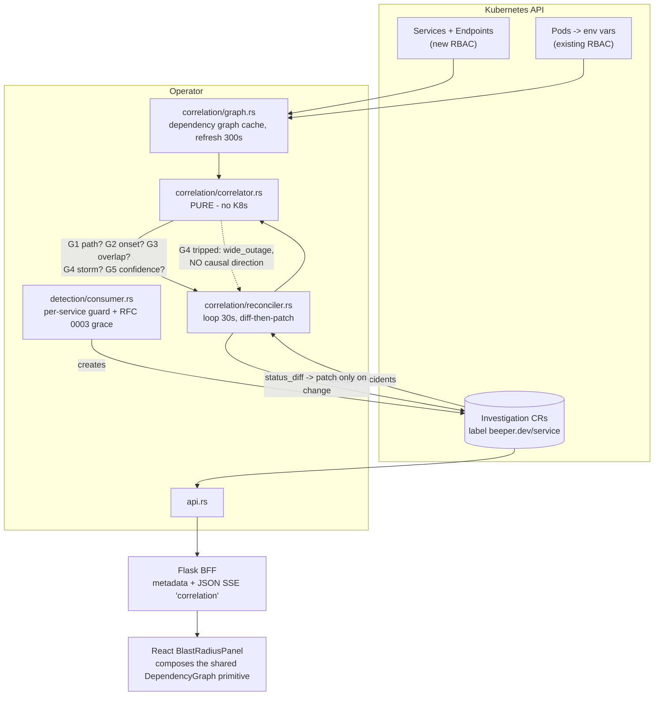

# RFC 0005 — Cross-service incident correlation (RFC 0001 Phase 3)

- **Status:** Draft — design for review (no code yet); **contingent on a Phase-0 go/no-go measurement (§6, Task 8.1)**
- **Date:** 2026-08-11
- **Authors:** Eng (with Claude) — synthesis of the correlation design scope and the sequencing / feasibility / security reviews of 2026-08-11
- **Affects:** Operator (a new `correlation/` module, `crds/investigation.rs`, `detection/consumer.rs`, `api.rs`), Helm chart (CRD template, operator ClusterRole, NetworkPolicy), BFF (`services/investigation_service.py`, `routes/investigations.py`), React (`InvestigationDetailPage`, a new `BlastRadiusPanel`)
- **Resolves:** RFC 0001 §9 S1 (representation) and S2 (heuristics), deferred there to "its own detailed RFC"; unblocks `docs/plans/react-ui.md` Task 7.1
- **Numbering note:** third of three RFCs filed on 2026-08-11; numbers are assigned in recommended execution order (0003 → 0004 → 0005). This one is last because its precondition (§6) may return **no-go**, in which case the RFC collapses to a paragraph and its value was the measurement it forced.

---

## 1. Summary

When an upstream service degrades, every downstream service degrades with it. Beeper today opens an independent, unrelated investigation per service — RFC 0001 Phase 1 gives exactly one per service, which is correct — and presents them as N orphans in a flat list. The SRE does the causal join in their head. RFC 0001 §1 names this the gap: *"a downstream service's errors are often caused by an upstream service's incident; that causal link is the most valuable output Beeper can produce."*

This RFC proposes computing correlation **in the operator**, continuously, over the already-heavily-filtered set of open Investigations, gated on a **dependency graph the operator discovers itself**, and writing it as **revocable edges on `Investigation.status`** — not a parent CRD, not investigator output.

The single most important design property is **not** the correlation. It is the **refusal to correlate**: direction comes from the dependency graph and **never from timing**, no path means no link ever, and during a wide event no causal direction is asserted at all. Wrongly merging unrelated incidents is worse than not correlating — a false causal link costs trust, and trust does not come back.

---

## 2. Product context

**Who feels it.** The on-call SRE during a multi-service event — the exact moment Beeper is supposed to earn its keep. Secondarily the incident commander, who needs a scope statement ("this is a payments-driven event affecting 4 services") within seconds.

**What success looks like.** Opening any member incident tells you (a) which incident is the probable origin, (b) which services are downstream and *actually* affected versus merely *potentially* affected, and (c) how confident that claim is.

**Honest framing.** Part of the value is conditional. Detection quality is the binding constraint (RFC 0001 §10: the warmup baseline was still ~11–14 investigations after four rounds of fixes), and correlation on top of false positives produces **false causal graphs**, which is worse than silence. What is unconditional is closing the last hole in RFC 0001's accepted model and unblocking the plan's only `blocked` task.

**Success metrics**

| # | Metric | Baseline | Target |
|---|---|---|---|
| M1 | Link precision on human-labelled candidate pairs from live runs | n/a | **≥0.9**. False links are the failure mode that destroys trust; recall is explicitly secondary (NFR29) |
| M2 | Time to name the origin service in a ≥2-service event | n/a | an `[H]` reviewer shown a member incident cold names the upstream service in ≤5 s (the NFR19 glance bar extended to scope) |
| M3 | Causal claims during wide events | n/a | **zero** — in a run where >50 % of services are incident-open, no causal direction is asserted at all |

---

## 3. Problem statement

### 3.1 The operator emits no correlation data of any kind

- `crds/investigation.rs` — `InvestigationSpec` is `{condition, service, severity, triggered_at, impact_score}`; `InvestigationStatus` is eight optional fields, none of them relational. The hand-written chart CRD mirrors this exactly.
- `api.rs` — `list_investigations`/`get_investigation` map those fields 1:1; there is nothing to expose. The route table has **no** topology route.
- `investigations.py::investigation_detail_json` builds `metadata` from thirteen fields, none of them correlation.
- `ui/frontend/src/api/investigation-detail.ts:109` **already declares** `correlated_services?: string[]` as forward-compatible, and `InvestigationDetailPage.tsx` suppresses the impact line entirely unless it is non-empty (Task 4.1 decision D1, regression-guarded at `InvestigationDetailPage.test.tsx:283`). **The frontend contract is pinned and the field name is chosen.** The gap is purely backend.

### 3.2 The dependency graph exists, but in the wrong place at the wrong time

`investigator/beeper_investigator/steps/service_topology.py` already computes `upstream`, `downstream`, `dependencies[]`, `blast_radius`, and per-service `health` — from K8s Services + Endpoints plus a pod-env-var hostname scan, BFS-classified to `MAX_DEPENDENCY_DEPTH = 2`. But it runs **inside** an investigation, ~5 steps into a 12–15 min LLM pipeline, so the graph does not exist when an incident opens; its output persists only to the Qdrant `investigations` collection, which `topology_service.py` then scrapes with `scroll(limit=100)` — a stale, investigation-derived snapshot; and the operator has **no Qdrant client at all**.

### 3.3 Trace-based correlation is not available

`demo/otel-demo-values.yaml` wires exactly two collector pipelines to Beeper: logs → `otlphttp/beeper`, metrics → `prometheusremotewrite/beeper`. There is **no traces pipeline**, no `/v1/traces` receiver in `operator/src/ingestion/` (only `otlp.rs` and `prometheus.rs`), and no span store anywhere.

### 3.4 Existing "related investigations" is not causal

`investigation_documentation.py::_collect_related_investigations` collects prior investigation ids from **KB similarity matches** and RCA citations. That is *historical* similarity ("we saw this before"), not *concurrent* causality. Reusing the name would be actively misleading.

### 3.5 Two prerequisites this design inherits

1. **`triggered_at` is CR-creation time, not anomaly onset.** `detection/consumer.rs:272` writes `Utc::now()`, discarding `event.timestamp_ms`. Any onset-ordering gate keyed on today's `triggered_at` measures *when the operator got around to creating the CR*. **This is fixed by RFC 0003 Task 7.4**, which already owns that file; this RFC consumes it as a contract and must not regress it. Note the fix is not cosmetic — `triggered_at` flows to the React summary header, so `triggered_at < started_at` becomes the new normal.
2. **RBAC.** `operator-role.yaml` grants `pods`, `secrets`, `configmaps`, `events`, `jobs`, and the CRDs — but **not `services` or `endpoints`**. Verified. The operator cannot build the graph today.

### 3.6 The false-correlation hazard, quantified from this repo's own numbers

RFC 0001 §10 records that on a clean-slate restart **23 of 25 services opened an investigation simultaneously**; `main.md` Q13's post-denylist baseline is **≈14 (≈1 per service)**. A naive "concurrent + connected" correlator run against that dataset produces a single 14–23-node causal graph asserting that some arbitrary root service caused a cluster-wide outage. **Storm suppression is therefore a first-class requirement, not a refinement.**

---

## 4. Proposed solution — overview

### 4.1 Shape, and the three claims that justify it

**Operator, not investigator.** The investigator *can* list Investigations (Q6 RBAC granted) and already builds the graph — but it runs once, ~12–15 min in, cannot retract a link, and cannot form one for an incident that opens later. The upstream incident, which by definition started *first*, would typically be finished before the downstream investigation reached its topology step. The operator already lists Investigations by `beeper.dev/service` label on every anomaly and owns the durable state.

**Edges, not a parent CRD (resolves S1).** A parent `Incident` CRD adds a second reconciled lifecycle whose merge/split semantics are genuinely hard (what happens when two groups discover a shared member four minutes in?), a second entity threaded through operator REST → BFF → SSE → React → permalinks, and N+1 writes on every membership change. RFC 0001 §5 explicitly valued keeping the SSE/UI entity model unchanged. Edges are additive, backward-compatible, individually retractable, and a group view is *derivable* over ≤ tens of nodes. A stable `correlation_group` id is written anyway, so a future parent CRD can adopt it without a data migration.

**`status`, not `spec`.** Correlation is observed, operator-derived, and mutable.

**This is the deliberate exception to RFC 0004 §8 Alt B's "no derived data in CRD status" rejection**, and the exception is justified on size: correlation is a handful of scalars plus a short name list per object (tens of bytes to low hundreds), not the ~15–30 KB evidence payload whose per-object cost is what that rejection was about. The distinction is quantitative and must stay that way — if correlation ever wants to carry evidence-sized payloads, it moves to a side channel.



### 4.2 CRD contract

New optional fields on `InvestigationStatus` (and the **hand-written** mirror in `helm/beeper/templates/crds/investigation-crd.yaml` — see §5.4):

```rust
#[derive(Deserialize, Serialize, Clone, Debug, JsonSchema, PartialEq)]
#[serde(rename_all = "snake_case")]
pub struct CorrelationLink {
    pub investigation: String,           // other incident's CR name
    pub service: String,                 // denormalised — UI needs no join
    pub direction: CorrelationDirection, // upstream | downstream, from THIS incident
    pub basis: CorrelationBasis,         // dependency_overlap (v1); trace_path reserved
    pub confidence: f64,                 // 0.0–1.0, ORDINAL not probabilistic
    pub hops: u32,                       // graph distance; 1 = direct dependency
    pub onset_delta_secs: i64,           // signed: other.onset - this.onset
    pub linked_at: String,               // RFC3339
}

// on InvestigationStatus, all Option + skip_serializing_if:
//   correlations: Option<Vec<CorrelationLink>>
//   correlation_group: Option<String>       // opaque random id, NOT derived
//   correlated_services: Option<Vec<String>>// denormalised for FR48
//   blast_radius: Option<BlastRadius>       // { downstream_total, downstream_affected }
```

`blast_radius.downstream_total` (from the graph) versus `downstream_affected` (downstream services *themselves* incident-open) is the distinction that makes the panel worth reading: "12 services depend on payments; 3 are currently degraded."

`InvestigationPhase` gains **no** variant — the same binding constraint RFC 0003 records. The correlation reconciler must never introduce a `Correlated` phase.

### 4.3 The correlation rule (resolves S2)

Link **A → B** (A upstream cause-candidate, B downstream effect-candidate) only when **all** of:

| # | Gate | Default | Rationale |
|---|---|---|---|
| G1 | A ∈ `upstream(B)` in the discovered graph, within `max_hops` | 2 | **Direction comes from the graph, never from timing.** No path ⇒ no link, ever |
| G2 | `onset(A) ≤ onset(B)` and `onset(B) − onset(A) ≤ max_onset_lag` | 600 s | Cause precedes effect; a 3-hour gap is not one event. Keyed on RFC 0003 Task 7.4's corrected `triggered_at` |
| G3 | Active intervals overlap (both non-terminal, or terminal within `overlap_grace`) | 300 s | Correlate *live* events |
| G4 | Group size ≤ `max_group_size` **and** incident-open services ≤ `max_affected_fraction` of known services | 6 / 0.5 | **Storm suppression.** Above either bound the group is tagged `wide_outage` and **all causal direction is dropped** — members show as "concurrent, scope unclear" |
| G5 | `confidence ≥ min_confidence` | 0.5 | Below the bar, no edge is written |

**Confidence is ordinal, additive, and capped** — presented as a band, never as a probability: `hops==1` +0.4 / `hops==2` +0.2; strict onset ordering +0.2 (simultaneous within one scrape interval: +0.0); B's `condition` matches a dependency-shaped symptom (timeout / connection / 5xx / latency) +0.2; `severity_band(A) ≤ severity_band(B)` +0.1; group size < 4 +0.1; cap 0.95.

> Note: severity comparison uses RFC 0003 §5.2's explicit `severity_band()` function, **not** a derived `Ord` on `Severity` — `Severity` derives no ordering today, and deriving it would couple band order to variant declaration order.

**Presentation hedging is part of the design, not the UI's problem.** Below `assert_threshold` (0.8) the link renders as *"possibly related — payment is 1 hop upstream and started 90 s earlier,"* with the basis always visible. It **never** renders as "caused by."

**Links are retracted, not appended:** each reconcile recomputes from scratch and patches only on change.

---

## 5. Detailed design

### 5.1 Where the tests live

There is **no kube-client test harness in `operator/`** — no `operator/tests/`, no reflector, and `api.rs` says so in the source. `main.md` AD-8 accepts manual integration verification. So, exactly as RFC 0003 §5.1 and the existing `service_guard_skip_reason` precedent:

- `correlator.rs` is a **pure function** — `correlate(&[IncidentView], &DependencyGraph, &CorrelationConfig, now) -> Vec<GroupAssignment>` — with no K8s. All correlation-logic value lives here and can be replayed offline.
- `status_diff(current: &InvestigationStatus, computed: &[CorrelationLink]) -> Option<serde_json::Value>` is **also pure**, and it is what carries the idempotence and retraction tests. "A second reconcile issues zero patches" is asserted as `status_diff` returning `None`, not as reconciler behavior.
- `reconciler.rs` is a thin uncovered shell (list → build views → call → patch). Its behavior is `[O]`.

**Merge-patch corollary (verified, and load-bearing):** because `update_investigation_status` uses `Patch::Merge` and all status fields are `skip_serializing_if`, the investigation controller's phase transitions will **not** wipe `status.correlations`. A `[T]` on the serialized patch bodies pins this, because a future switch to `Patch::Apply` or a full-status write would silently break it.

### 5.2 Components and files

**New — `operator/src/correlation/`**
- `graph.rs` — dependency-graph discovery + cache. Ports `service_topology.py`'s algorithm to Rust: `list_namespaced_service` + `list_namespaced_endpoints` + pod env-var hostname matching, BFS to depth 2. Refreshed every `graph_refresh_secs` (300); on failure, keeps the last-known graph and never blocks detection.
- `correlator.rs` — the pure function above.
- `reconciler.rs` — 30 s loop; idempotent diff-then-patch.
- `mod.rs` — `CorrelationConfig` from `BEEPER_CORRELATION_*`, mirroring `detection/mod.rs`'s style.

**Modified:** `crds/investigation.rs` (four status fields + types); the chart CRD template; `operator-role.yaml` (add `services`, `endpoints`: `get,list,watch`); `main.rs`/`lib.rs` (spawn the reconciler when enabled); `api.rs` (detail response gains the four fields; the list response gains only `correlation_group` + `correlated_service_count`, keeping rows light per FR46's no-horizontal-scroll bar; plus the gated topology endpoint of §5.5); `services/investigation_service.py`; `routes/investigations.py` (`metadata` block, plus a `correlation` SSE event); `api/investigation-detail.ts`; `InvestigationDetailPage.tsx` (replace the one-line impact `<p>` with `<BlastRadiusPanel>`, **preserving D1's render-nothing-when-absent rule**).

**New — `ui/frontend/src/lib/components/BlastRadiusPanel/`** with a Storybook story, design tokens only, `lint:terms` clean.

### 5.3 The dependency-graph visual is shared, not built twice

`BlastRadiusPanel` **composes** the `DependencyGraph` primitive that Milestone 2.5 Task 10.1 builds for the Topology view. It does not reimplement it. The contract, binding on both sides:

- `DependencyGraph` takes **data-source-agnostic** props — `{nodes: {id, status}[], edges: {from, to}[]}` — never a `topology_service`-shaped payload.
- It carries the sr-only tabular fallback (the `TrendChart` / Spending-SVG precedent, Task 5.5 finding 7). The a11y fallback is not optional.
- Milestone 2.5's `GET /api/v1/topology/` BFF endpoint is declared **provisional** in its docstring, noting that its data source swaps to the operator graph if Task 8.2 lands. If §6 returns no-go, that note is simply deleted and nothing is wasted.

Without this contract the graph gets built twice, in two languages, against two different data sources, with two contracts. It is the one place two workstreams would build the same artifact.

### 5.4 The chart CRD is hand-written and prunes

There is no `crdgen` and no `CustomResourceExt` use in `operator/src`; the CRD template enumerates every `status` property by hand as a structural schema. Status fields not hand-added there are **silently pruned by the API server** on every write — the operator logs success and the field vanishes.

This is materially heavier for this RFC than for RFC 0003: two strings versus **an array of objects with a nested enum plus a nested object** — roughly 60 lines of hand-written OpenAPI v3 schema, plus `x-kubernetes-list-type` decisions. The CRD-parity guard is a shared prerequisite (RFC 0003 Task 7.0a) and is a hard dependency of Task 8.3.

**Regenerate the chart CRD once.** RFC 0003 also adds `InvestigationStatus` fields; whichever lands second edits the template.

### 5.5 The topology endpoint is gated

`GET /api/v1/topology/graph` on the operator API returns the **complete cluster service-dependency graph** — reconnaissance-grade information on a port with **no authentication** (§7). It therefore ships behind `BEEPER_TOPOLOGY_API_ENABLED`, **default `false`**, and its enablement is gated on RFC 0003 Task 7.0d's operator NetworkPolicy having landed. A debug-only variant behind the same flag is what Task 8.2 uses.

---

## 6. Phase 0 — the go/no-go measurement (this RFC's precondition)

**The whole design hangs on G1, and G1's graph is built from a pod-env-var hostname heuristic.** It works in otel-demo because those services name their dependencies in `*_ADDR` env vars. It is **not** a general mechanism: in a service mesh, a config-map-driven deployment, or anything using service discovery, the graph will be sparse or empty. The failure mode is benign (no path ⇒ no link ⇒ silence, never a wrong claim), but "we built a subsystem that never fires outside the demo" is a real and likely outcome.

RFC 0001 §10 records the Q10 lesson explicitly: a plausible hypothesis predicted 23→handful and measured 23→21. **Do not ship correlation on a hypothesis about graph density.**

Phase 0 is therefore split into two measurements with **different prerequisites** — a split that pulls the decision weeks earlier at no cost:

- **Task 8.1a — graph density (run immediately).** Measure the edge count the env-var discovery finds across otel-demo, and characterize how many edges come from `*_ADDR`-style conventions versus anything else. This depends on **nothing** and is the actual go/no-go gate. **No-go ⇒ stop: FR48 stays suppressed, Task 7.1 closes as won't-do, and this RFC collapses to a plan note.**
- **Task 8.1b — candidate-pair labelling (after RFC 0003 Task 7.6).** Human ground-truth labels on ≥20 candidate pairs, producing the precision figure for NFR29. This wants a *calm* detection baseline; labelling pairs drawn from a warmup burst measures the wrong world.

**Corpus capture is an explicit deliverable, not an assumption.** There is no `operator/tests/` directory and no captured incident data in the repo — the 23/25 and ≈14 figures exist only as prose. Task 8.1 must **commit** a fixture set (`kubectl get investigations -o json` snapshots taken across a warmup burst, plus the labelled candidate-pair file) before the storm-suppression replay in Task 8.3 can legitimately be a `[T]`. That capture requires a live cluster plus the ~8–10 min warmup per run — the slowest kind of work in this program, and it must be budgeted rather than discovered.

---

## 7. Security considerations

**New RBAC.** The operator gains `services`, `endpoints` (get/list/watch). A small marginal increment over its existing cluster-wide `pods` + `secrets` read, but it must be **namespaced to the watched namespace(s) where the deployment shape allows**, and visible in a manifest test rather than buried in a template diff.

**Pod env-var scanning is the sharpest edge in this RFC.** `_get_pod_service_references` reads env var *values*, which routinely contain database URLs, tokens, and passwords. The Python implementation records only the matched **service name** and never the value. The Rust port must hold that line. A careless `debug!("env={}", value)` here is a **credential leak into operator logs** — and the operator's ClusterRole already has cluster-wide `secrets` read, so those logs are a high-value target. The explicit negative test that no env value is logged, persisted to CR status, or returned by the graph endpoint is **the single most important test in this RFC**.

**The operator API has no authentication.** `api.rs` builds a bare `axum::Router` with no auth layer, exposed as a ClusterIP Service, and it already serves unauthenticated state mutations (`POST /api/v1/investigations/:id/{confirm,reject,resolve,verify}`, `POST /api/v1/notifications/outbox`). A full dependency graph is a materially bigger prize than incident status. Hence §5.5's default-off flag and the hard gate on RFC 0003 Task 7.0d's NetworkPolicy. This RFC **does not** assume "not on a public ingress" is a mitigation.

**Two disclosure channels, only one of which is obvious.**

1. `correlated_services` on incident A discloses that service B is under investigation. Under today's two-tier model (ADR 0002, no per-service scoping) this crosses no boundary — **but it becomes a boundary crossing the moment per-service or per-team authorization is introduced**, and that is not obvious from the field name. Recorded now so a future authz design does not miss it.
2. **`blast_radius.downstream_total` is derived from the K8s dependency graph, not from any investigation** — so it discloses topology facts about services that have **no incident at all**. That is a genuine widening: it exports data from a source no BFF-facing surface has ever exposed. **Mitigation: `blast_radius` counts stay at `user`; the downstream service-name list and any topology-graph passthrough are `admin`.**

**Group ids leak co-occurrence.** `correlation_group` is shared across members, so anyone who can read one member learns the group's size. Use an **opaque random id, never a derived hash of member names** — a derived id would leak membership to a reader who can only see one member.

**`spec.service` is attacker-controlled.** It comes from ingestion labels on an unauthenticated listener, and this design denormalizes it into `correlated_services` specifically so the UI needs no join. React text children render it safely, but anything that builds an href, a log line, or an LLM prompt from a service name must encode it.

**Blast radius of a correlator bug is bounded** to wrong CR status fields — the correlator is a pure function over data the operator already reads plus the new graph, with no new external egress. **Correlation must never become an input to automated remediation or notification routing without its own review:** a false link that misleads a human is recoverable; one that routes an automated action is not.

---

## 8. Alternatives considered

**A — Do nothing; keep FR48 suppressed.** *Genuinely defensible.* Task 4.1's D1 already removed the placeholder cleanly; nothing is visibly broken; no user is blocked; and the largest risk in the whole topic — asserting a wrong causal link — drops to zero. The counter-argument is that RFC 0001 accepted cross-service causality as a first-class goal and named it Beeper's most valuable output, and `service_topology.py` *already computes* a `blast_radius` no incident view surfaces. **Not chosen — but it is the mandated fallback if §6 returns no-go, and that outcome must be recorded as a result, not treated as a failure.**

**B — Investigator-side (LLM) correlation.** Lowest new surface: the investigator can already list Investigations and already builds the graph, and an LLM could do genuinely richer semantic matching ("timeouts to host X" ↔ "X saturation") — the exact example RFC 0001 §9 S2 raises. **Rejected as the primary mechanism:** it runs once, ~12–15 min in, so links form far too late and never form at all for the upstream incident that finished first; it cannot retract a link when the hypothesis stops holding; it is non-deterministic, making the M1 precision bar unmeasurable; it spends LLM budget on the local-qwen profile that already fails at the final step (85 failures in one live run); and an LLM asserting causality is precisely the risk this design exists to avoid. **Kept as optional corroboration** — RCA text may *raise* an existing link's confidence to the assert threshold, but may **never** create one.

**C — Trace-based correlation (OTel spans / span links).** Highest-fidelity signal in principle — real request paths beat env-var-inferred edges. **Rejected for this RFC:** Beeper ingests no traces at all (§3.3). Adding OTLP trace ingest + retention + a query surface is a larger program than the correlation itself and needs its own RFC. The `basis` enum is designed so `trace_path` slots in beside `dependency_overlap` without a schema break.

**D — Parent `Incident` CRD grouping member investigations (S1's other branch).** A real first-class object, a natural "one page per event," a clean home for future notification de-duplication. **Rejected for v1** on the grounds in §4.1; `correlation_group` is written from day one so it can be adopted later without migration.

---

## 9. Migration strategy

- **Everything through Task 8.4 is default-off by construction.** Task 8.2 builds a graph nobody reads. Task 8.3 computes correlations nobody writes unless `BEEPER_CORRELATION_ENABLED` is on. Task 8.4's UI renders nothing when the backend sends nothing — which is exactly today's behavior, and is D1's existing regression-guarded rule. **The first behavior change any user sees is a deliberate flag flip in Task 8.5.**
- **CRD fields are additive `Option<>` with `skip_serializing_if`;** existing objects round-trip unchanged, asserted by a `[T]`. The hand-written chart schema must be edited in the same commit (§5.4), guarded by the shared CRD-parity test.
- **Chart CRD is regenerated once** across this RFC and RFC 0003.
- **RBAC change is a manifest test**, not a silent template edit.
- **`helm template` output must be byte-identical under default and demo values with the flag off**, asserted against a **committed golden manifest** (`demo/tests/` is the precedent) — "byte-identical to what it was" is not a test unless "what it was" is in the repo.
- **Rollback** is a flag flip plus, optionally, a one-shot patch clearing the four status fields; no data is destroyed and no other subsystem reads them.

---

## 10. Risks and mitigations

| Risk | L | I | Mitigation |
|---|---|---|---|
| **False causal link** — two unrelated incidents merged, SRE chases the wrong service | M | **H** | G1 requires a real graph path (direction never inferred from timing); G5 confidence floor; hedged copy below the assert threshold with the basis always shown; NFR29 precision bar measured in 8.1b and 8.5; links retractable, not append-only |
| **Storm merge** — the warmup burst produces one giant bogus causal graph | M | **H** | G4 storm suppression, replayed against the **committed** 23/25 burst fixture as a `[T]`; `wide_outage` drops all direction; RFC 0003 lands first so the burst is smaller |
| **Graph too sparse to gate on** — env-var discovery finds few real edges outside otel-demo | **M** | H | §6 Task 8.1a measures before building. Failure mode is silence, not wrongness — but "built and never fires" is a real waste, hence the explicit go/no-go |
| **Credential leak via env-var scanning in the Rust port** | L | **H** | Explicit negative `[T]` (no env value logged, persisted, or returned); named in §7 as the most important test in this RFC |
| **Two-language drift** — `graph.rs` and `service_topology.py` classify differently | M | M | **One** committed input fixture and **one** committed expected-output file at repo root, loaded by *both* `cargo test` and `pytest` — not two suites each asserting against their own copy, which cannot detect disagreement. Requires lifting `_classify_topology`/`_bfs` to module-level pure functions (budgeted in 8.2) |
| **Write amplification / SSE churn** — a 30 s reconcile patching N CRs floods the poll loop | M | M | Pure `status_diff`; patch only on change; stable group id; `[T]` asserts `status_diff` returns `None` on unchanged input |
| **Onset inversion** under RFC 0003's deferring queue | M | H | G2 keys on `spec.triggered_at` sourced from `event.timestamp_ms` — an explicit contract owned by RFC 0003 Task 7.4 |
| **CRD fields silently pruned** by the hand-written schema | **H** if unaddressed | **H** | RFC 0003 Task 7.0a's parity guard is a hard dependency; ~60 lines of hand-written schema here, not two strings |
| **Topology endpoint on an unauthenticated port** | M | H | Default-off flag; gated on the operator NetworkPolicy; name lists at `admin`, counts at `user` |
| **Demo regression (NFR26)** | L | **H** | Default-off through 8.4; committed golden `helm template` manifest under demo values as a `[T]` |
| **Task 8.2 under-sized** | M | M | Re-sized to **7–10 days** (§12): the Rust port, the refresh/degradation semantics, the RBAC, the debug endpoint, the negative env test, **and** the cross-language parity harness — that last item is itself a small project |

---

## 11. Acceptance criteria

Tagged `[T]` / `[H]` / `[O]`. Reconciler behavior is `[O]`; the pure core carries the `[T]`s (§5.1).

**Task 8.1 — Phase 0**
- `[O]` measured edge count of the discovered graph across otel-demo, with a breakdown of which edges come from `*_ADDR`-style conventions.
- `[T]` a **committed** fixture corpus exists: `kubectl get investigations -o json` snapshots across a warmup burst, plus a labelled candidate-pair file, both loadable by an offline replay harness.
- `[O]` human ground-truth labels on ≥20 candidate pairs yielding a precision figure (8.1b, after RFC 0003 Task 7.6).
- `[H]` **go/no-go recorded in this RFC. No-go ⇒ stop: FR48 stays suppressed and Task 7.1 closes as won't-do.**

**Task 8.2 — dependency graph in the operator**
- `[T]` **cross-language parity:** the Rust classifier and `service_topology.py` produce identical `upstream`/`downstream`/`blast_radius` from **one shared committed input fixture** against **one shared committed expected-output file**, loaded by both `cargo test` and `pytest`.
- `[T]` pod env-var scanning matches hostnames only and **never logs, persists, or returns env values** (explicit negative test).
- `[T]` a manifest test asserts the new `services`/`endpoints` verbs exist, namespaced where the deployment shape allows.
- `[T]` `GET /api/v1/topology/graph` is not registered at all when `BEEPER_TOPOLOGY_API_ENABLED` is unset.
- `[O]` a graph-refresh failure degrades to last-known and never blocks or panics the detection loop.
- `[O]` refresh cost and API-server QPS delta measured on the demo cluster.

**Task 8.3 — correlator + CRD fields + reconciler**
- `[T]` links B→A on a 1-hop ordered pair; **refuses when the graph direction is opposite**; refuses when onset lag exceeds the window; refuses when no path exists at any hop count.
- `[T]` **replayed against the committed 23/25 warmup-burst fixture, G4 trips: `wide_outage`, zero causal directions asserted.**
- `[T]` `status_diff` returns `None` on unchanged inputs (idempotence) and emits a retraction when the upstream goes terminal past `overlap_grace`.
- `[T]` the serialized status patch body preserves `correlations` across an investigation-controller phase transition (the merge-patch corollary, §5.1).
- `[T]` an Investigation object with no correlation fields round-trips unchanged (backward compat).
- `[T]` CRD-parity guard passes with the four new fields present in both the Rust struct and the chart YAML.
- `[T]` with the flag off: zero patches, and `helm template` matches the committed golden manifest under **default and demo** values (NFR26).
- `[O]` reconcile loop cost and patch rate on the demo cluster.

**Task 8.4 — surface through operator REST + BFF + SSE + React (this is Task 7.1)**
- `[T]` operator REST detail includes the four fields, omitted when empty; the list response gains only `correlation_group` + `correlated_service_count`.
- `[T]` BFF contract test: `metadata.correlated_services` populated end-to-end from a fixture CR.
- `[T]` `BlastRadiusPanel` **composes** the shared `DependencyGraph` primitive (asserted by import/structure, not reimplemented) and renders its sr-only tabular fallback.
- `[T]` React renders upstream/downstream with hedged copy and a visible basis; **absent correlation still renders nothing** (D1 preserved — the existing regression test at `InvestigationDetailPage.test.tsx:283` must pass unmodified).
- `[T]` an SSE `correlation` event updates an already-open detail page. *(Note: `_generate_json_sse_events` does not diff arbitrary metadata fields today — this diffing is net-new and is budgeted in 8.4.)*
- `[T]` `blast_radius` counts render for a `user` session; the downstream service-name list requires `admin` (structural + behavioral).
- `[T]` Storybook story present; `lint:terms` clean.
- `[H]` a reviewer shown a correlated pair cold names the upstream service in ≤5 s (M2).
- `[H]` copy review confirming no sub-threshold link reads as proven causality.

**Task 8.5 — live validation and the default-on decision**
- `[O]` the RFC 0001 §7 DB-pool→downstream scenario produces exactly two **linked** incidents with correct direction, not two orphans.
- `[O]` false-link rate over a full warmup cycle meets the NFR29 bar (M1).
- `[O]` zero causal directions asserted during a >50 %-affected event (M3).
- `[H]` default-on decision recorded.
- `[T]` demo (`BEEPER_AUTH_MODE=none`, `make demo-up`) unaffected under either default.

---

## 12. Open questions

| # | Question | Impact | Status |
|---|---|---|---|
| OQ1 | **Is the dependency graph dense and accurate enough to gate on?** | The whole RFC | Open — §6 Task 8.1a answers it in ~2–3 days rather than ~4–5 weeks. This is the riskiest unknown and it is stated plainly: the env-var heuristic works in otel-demo and is not a general mechanism |
| OQ2 | Should the Topology view's data source migrate from `topology_service.py`'s Qdrant scrape to the operator graph? | Removes a stale, investigation-derived snapshot and a BFF Qdrant dependency | Open — desirable if 8.2 lands; the §5.3 contract makes it a data-source swap, not a rewrite. Milestone 2.5's endpoint docstring records the provisional status |
| OQ3 | Should RCA text be allowed to raise link confidence (alternative B as corroboration)? | Richer semantic matching without LLM-created links | Open — deferred past v1; the rule "may raise, never create" is the constraint if pursued |
| OQ4 | Does `correlated_services` need per-service authorization once tenancy exists? | §7 disclosure channel 1 | Open — recorded now precisely so a future authz design does not miss it |
| OQ5 | Namespaced Role vs. ClusterRole for `services`/`endpoints` | Least privilege | Open — prefer namespaced where the deployment shape permits; decided in 8.2 |

---

## 13. Related documents

- [RFC 0001 — Per-service-incident investigations](0001-per-service-incident-investigations.md) — §9 S1/S2 deferred here; §8 lists Phase 3 as "own RFC"; §10's 23/25 measurement is §3.6's evidence
- [RFC 0003 — Bounded investigator concurrency and restart-resilient detection](0003-bounded-investigator-concurrency.md) — owns Task 7.4's `triggered_at` contract (G2 depends on it), Task 7.0a's CRD-parity guard, and Task 7.0d's operator NetworkPolicy (§5.5 gates on it); shares `InvestigationStatus` and the chart CRD template
- [RFC 0004 — Investigation evidence: persistence contract and exposure boundary](0004-investigation-evidence-exposure.md) — §8 Alt B settles the CRD-status question once for both; §4.1 records why correlation is the justified quantitative exception
- [ADR 0002 — OIDC, SCIM and local-fallback identity](../decisions/0002-oidc-scim-and-local-fallback-identity.md) — the two-tier model §7's disclosure analysis assumes
- [docs/plans/react-ui.md](../../plans/react-ui.md) — Task 7.1 (reconciled to depend on Task 8.4); Milestone 2.5 Task 10.1's shared `DependencyGraph` contract
- [docs/reqs/main.md](../../reqs/main.md) — FR46, FR48, NFR26, NFR29, NFR30, NFR31
- [docs/design/route-parity-targets.md](../../design/route-parity-targets.md) — the Topology route and its current data source
