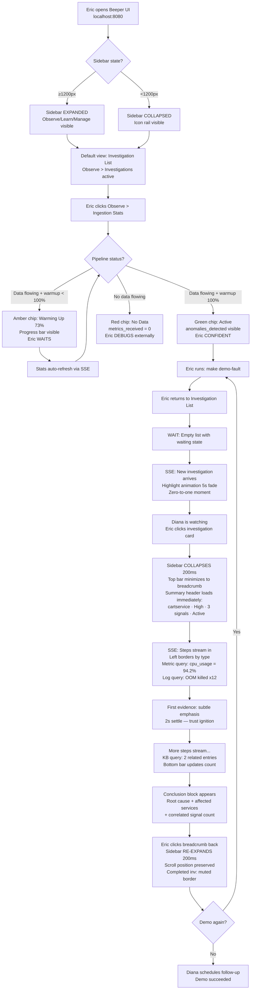
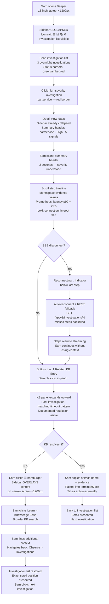
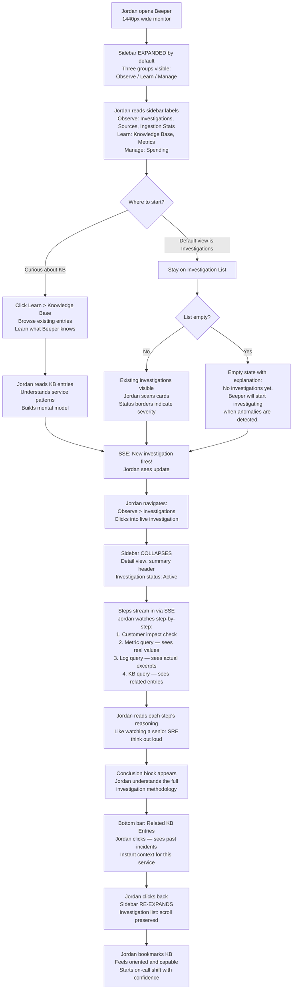
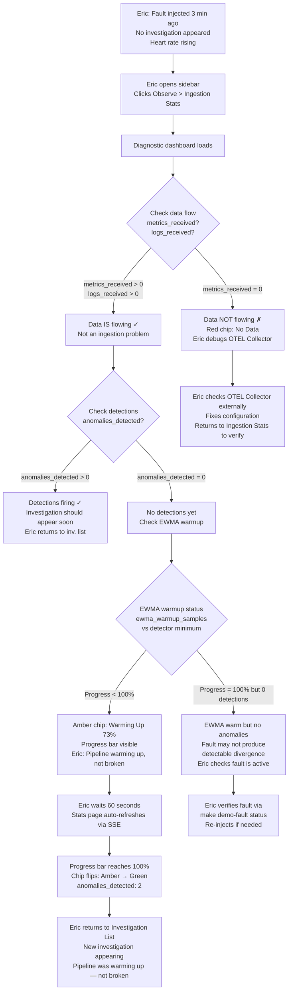

---
stepsCompleted:
  - step-01-init
  - step-02-discovery
  - step-03-core-experience
  - step-04-emotional-response
  - step-05-inspiration
  - step-06-design-system
  - step-07-defining-experience
  - step-08-visual-foundation
  - step-09-design-directions
  - step-10-user-journeys
  - step-11-component-strategy
  - step-12-ux-patterns
  - step-13-responsive-accessibility
  - step-14-complete
inputDocuments:
  - prd.md
  - product-brief-beeper-2026-03-09.md
  - ux-design-specification-v0.2.0.md
  - project-overview.md
  - api-contracts.md
  - index.md
---

# UX Design Specification — Beeper Pipeline Fix & UI Overhaul

**Author:** eric
**Date:** 2026-04-08

---

## Executive Summary

### Project Vision

Beeper is a brownfield Flask/HTMX application with SSE for real-time updates, currently serving ~12 routes with a fixed-width layout and flat top navigation. The v0.1.0 MVP is feature-complete but the end-to-end pipeline is broken. This UX design scopes the UI overhaul workstream: converting the layout to responsive (768px–1920px+), replacing top navigation with a collapsible left sidebar grouped into Observe/Learn/Manage, and adding two new UI capabilities — inline Related KB on investigation detail and detection stats in the Ingestion Stats view.

**v0.2.0 UX Spec Carry-Forward (explicit scope):**
- **Carry forward:** Dark-first color system (indigo #6366f1 primary, #0f0f1a surface base), typography (system font stack), Tailwind CSS migration strategy, emotional design principles (calm confidence, evidence over assertion, streaming investigation narrative)
- **Defer to post-MVP:** Command palette (Cmd+K), trust ladder visualization, one-click approve with confidence scores, WebSocket collaboration UX, SBAR shift handoffs

### Target Users

| Persona | Context | Primary UX Need | Low-Priority Features |
|---------|---------|-----------------|----------------------|
| **Diana** (Investor/Evaluator) | Watching demo on video call | Clean, distraction-free investigation view that tells its own story | Manage group, Knowledge Base browsing, Spending |
| **Eric** (Demo Operator) | Running demo pre-call, troubleshooting silent pipeline | Pipeline health verification via Ingestion Stats diagnostic dashboard, fault injection confidence | Knowledge Base editing, Metrics/MTTR |
| **Sam** (On-Call SRE) | Laptop 13", potentially under pressure | Maximized investigation view, quick KB access, zero clutter | Spending, source configuration |
| **Jordan** (Junior SRE) | First time using Beeper, wide monitor (1440px) | Discoverable navigation via expanded sidebar, learning through investigation observation | Spending, Ingestion Stats diagnostics |

**Sidebar priority implication:** Observe is always the first group, Investigations is always the first item — serves Diana (demo) and Sam (daily triage) first, which are the two highest-value use cases.

### Key Design Challenges

1. **Navigation architecture overhaul** — Converting 12+ flat top-nav links into a 3-group collapsible sidebar (Observe/Learn/Manage) without losing discoverability. Must work collapsed on narrow screens (768px) and expanded by default on wide screens (1200px+).

2. **Investigation detail as hero view** — Carries the most UX weight: real-time SSE streaming, step-by-step evidence, inline Related KB panel (new), auto-collapsing sidebar for maximum screen real estate. The view Diana watches, Sam triages from, and Jordan learns from.

3. **Multi-modal reading of investigation detail** — One view, three reading modes. Diana reads the **narrative arc** (watching the investigation unfold like a story). Sam reads for **evidence density** (scan, triage, move on). Jordan reads for **transparency** (seeing Beeper's reasoning step by step). The design must serve all three without mode-switching UI.

4. **Sidebar state management across navigation contexts** — Three collapse states: (a) expanded by default on 1200px+ viewports, (b) collapsed with hamburger on <1200px viewports, (c) auto-collapsed when investigation detail is the active route (FR44) regardless of viewport. Navigating back to investigation list must re-expand on wide screens. This is viewport + route-dependent state, not just responsive CSS.

5. **Responsive without mobile** — 768px–1920px+ targets tablet-to-ultrawide, not phone. Sidebar behavior adapts at 1200px breakpoint. CSS transitions must be smooth (NFR17 — 60fps, no layout jank).

6. **Existing template migration** — Jinja2 templates with ~3,900 lines of custom CSS. Layout model conversion must not break working views. Incremental Tailwind migration strategy from v0.2.0 spec applies.

### Design Opportunities

1. **Sidebar grouping as information architecture** — Observe/Learn/Manage maps to natural SRE mental models: "what's happening now" / "what do I know" / "how do I configure." Makes a 12-route app feel simple.

2. **Inline Related KB as trust accelerator** — Surfacing KB entries from KBQueryStep directly on investigation detail eliminates a navigation hop. Small addition, outsized UX impact for Sam's triage workflow.

3. **Ingestion Stats elevation to diagnostic dashboard** — Adding anomalies_detected, EWMA warmup status transforms this page from a data health readout into a pipeline diagnostic tool. This is Eric's primary troubleshooting surface (Journey 5) and deserves UX treatment as a diagnostic dashboard, not just a stats table.

4. **Reuse v0.2.0 visual foundations** — Dark-first color system, typography, and Tailwind config carry forward directly. No visual language redesign needed — only layout and navigation model.

## Core User Experience

### Defining Experience

**In one sentence:** *"Watch Beeper investigate in real-time, see the evidence, trust the result."*

The core interaction is reviewing an active or completed investigation and seeing real, specific evidence — Prometheus metric values, Loki log excerpts, service names, correlated signals. Every persona converges on the investigation detail view: Diana watches it unfold during demos, Sam triages from it at 3am, Jordan learns from Beeper's reasoning during their first shift.

The investigation detail view serves three reading modes simultaneously without mode-switching UI: **narrative** (Diana — the investigation unfolds like a story), **density** (Sam — scan evidence, triage, move on), and **transparency** (Jordan — see each reasoning step and what Beeper checked).

### Platform Strategy

**Platform:** Web application (Flask/HTMX server-rendered + SSE). Mouse and keyboard primary. Dark-first. No offline requirements. Optimized for laptop use (768px minimum) through conference screen (1920px+).

**Responsive target:** 768px–1920px+. Sidebar collapsed with hamburger below 1200px, expanded by default at 1200px+. True mobile (320px) deferred to post-MVP.

**Technology inheritance:** Existing Flask/Jinja2/HTMX stack. Incremental Tailwind CSS migration from v0.2.0 strategy — new layout components in Tailwind, existing templates migrated as touched.

**Layout shell prerequisite:** The responsive sidebar layout shell is implemented first as a new Tailwind-based wrapper. Existing Jinja2 page templates render their content inside this shell with minimal modification. This is the one non-incremental migration step — all routes must adopt the new shell simultaneously to avoid two navigation systems coexisting.

### Effortless Interactions

| Interaction | Must Feel Like | Design Implication |
|---|---|---|
| Investigation list → detail → back | Flipping pages in a book | Sidebar auto-manages itself; list scroll position preserved on back navigation |
| Watching investigation progress | Reading a live thread | SSE updates render incrementally; steps appear as they complete |
| Completed → new investigation cycle | A chapter ending, next beginning | Completed investigations visually settle (reduced opacity, muted); new detections stand out with brief highlight animation that fades after 5 seconds; active investigations at full opacity with status-colored left border |
| Checking pipeline health | Glancing at a dashboard | Ingestion Stats shows data flow + detection status in one scannable view |
| Finding related past incidents | Inline footnotes | Related KB panel anchored as bottom bar on wide screens (>1200px) — always visible showing entry count, expands upward on click; stacks inline below content on narrow screens |
| First-time navigation | Opening a well-organized toolbox | Sidebar groups with clear labels; Observe/Learn/Manage is self-explanatory |
| Demo presentation | Showing, not telling | Investigation view carries the story; sidebar stays out of the way |

### Critical Success Moments

| Moment | Persona | What Must Happen | If We Fail |
|---|---|---|---|
| **Evidence is specific** | Diana/Sam | Root cause references real service names, metric values, log patterns | Product is noise; credibility destroyed |
| **Demo tells itself** | Diana | Investigation unfolds visually with no narration needed | Eric has to explain instead of showing |
| **Pipeline health at a glance** | Eric | Ingestion Stats immediately answers "is data flowing? are detectors firing?" | Eric can't diagnose pre-demo |
| **Silence is diagnosable** | Eric | Ingestion Stats shows data flowing but anomalies_detected = 0 with EWMA warmup progress visible — "warming up" is visually distinct from "broken" | Eric panics, restarts cluster, loses demo time |
| **Navigation is obvious** | Jordan | Sidebar groups are self-explanatory on first open | Jordan asks a teammate for help |
| **Investigation owns the screen** | Sam | Detail view maximizes evidence real estate; sidebar out of the way | Sam scrolls horizontally or fights chrome |

### Investigation Detail Chrome Inventory

What stays visible on investigation detail (the hero view):

| Element | Visible? | Rationale |
|---------|----------|-----------|
| Sidebar | **Collapsed** (auto-collapse per FR44) | Maximize evidence real estate; hamburger icon stays for manual re-expand |
| Top bar / Beeper logo | **Minimal** — logo + current investigation ID as breadcrumb | Orientation context without taking vertical space; single-line height |
| Back to list link | **Yes** — in top bar breadcrumb | Escape hatch always visible |
| Page content area | **Full width minus collapsed sidebar rail** | Evidence, steps fill available space |
| Related KB panel | **Anchored bottom bar** (wide screens >1200px) showing "N Related KB Entries" — expands upward on click. Inline below content on narrow screens. | Always discoverable without scrolling; Sam sees it exists during scan-and-triage without reaching bottom of page |

### Experience Principles

1. **Evidence is the product** — The investigation detail view is not a page in the app. It IS the app. Every other view exists to get you here or to support what you learn here. If an investigation can't show specific evidence, it should show WHY it can't — not just say "insufficient data."

2. **The UI disappears during investigations** — Sidebar collapses, top bar minimizes to a single line, evidence fills the screen. During demos or triage, the interface should feel like looking through a window at Beeper's work.

3. **Navigation serves the SRE mental model** — Observe (what's happening), Learn (what do I know), Manage (how do I configure). Three words that make 12 routes intuitive.

4. **Pipeline health is a first-class view** — Ingestion Stats is the diagnostic dashboard that answers "why isn't anything happening?" — the most important pre-demo question. "Warming up" must be visually distinct from "broken."

5. **Progressive rendering, not loading states** — Investigation steps render as they complete. The page is never blank. The user watches progress, not a spinner.

6. **Visual consistency is learnability** — Cards, status indicators, and data tables follow the same visual grammar across all views. Jordan learns the pattern once, applies it everywhere.

## Desired Emotional Response

### Primary Emotional Goals

| Emotional Goal | Primary Persona | Context | Why It Matters |
|---|---|---|---|
| **Calm confidence** | Sam | Reviewing investigation at 3am | Evidence is specific and cited — Sam confirms Beeper's work, doesn't second-guess it. Counter anxiety with steady, evidence-backed assurance. |
| **Inevitability** | Diana | Watching demo on video call | Diana shifts from "show me" to "tell me about deployment." No narration needed means the product sells itself. The capability feels obvious and necessary. |
| **Diagnosable clarity** | Eric | Pre-demo pipeline check | Eric opens Ingestion Stats and within 5 seconds knows: data is flowing, detectors are warming up, nothing is broken. Silence has an explanation. |
| **Empowerment through transparency** | Jordan | First shift, learning from Beeper | Jordan sees Beeper's reasoning step by step — not just conclusions. Like watching a senior SRE think out loud. Jordan learns the craft, not just the tool. |
| **Competence from the first click** | Jordan | First time navigating UI | Three sidebar groups validate Jordan's existing SRE mental model — "I already think this way, this tool gets me." Jordan feels capable, not lost. |

### Emotional Journey Mapping

The user's emotional journey follows a three-act narrative arc:

**Act 1 — Arrival: "I know where I am"**

| Stage | Current Emotion | Beeper's Target | Design Lever | Primary Persona |
|---|---|---|---|---|
| **First open (new user)** | Uncertainty — "where do I start?" | Competence → "I already think this way" | Sidebar groups map to SRE mental model; Investigations is the obvious first click | Jordan |
| **Investigation list scan** | Scanning, triaging | Quick comprehension — "I see what's active" | Status-colored left borders, active at full opacity, completed settle visually | Sam |

**Act 2 — Immersion: "I'm inside the investigation"**

The sidebar collapsing when investigation detail opens is the curtain rising on Act 2 — the user crosses from navigation into evidence.

| Stage | Current Emotion | Beeper's Target | Design Lever | Primary Persona |
|---|---|---|---|---|
| **Investigation detail opens** | Focus narrowing | Immersion — "just me and the evidence" | Sidebar auto-collapses, top bar minimizes, evidence fills the screen | Diana, Sam |
| **Watching SSE stream** | Anticipation | Growing confidence — "Beeper's finding things" | Steps render as they complete; progressive, never blank | Diana, Jordan |
| **First specific evidence appears** | Cautious interest | Trust ignition — "Oh, this is real" | First evidence item (real service name, metric value) uses subtle emphasis that settles after 2 seconds — the thesis statement that gives weight to everything after it | Diana, Sam |
| **Evidence review** | Cognitive load | Clarity — "I see the specific proof" | Real service names, metric values, log patterns — citations, not claims | Sam |
| **Related KB surfaced** | Possible confusion — "has this happened before?" | Connection — "this ties to known patterns" | Anchored bottom bar shows count; one click to expand without leaving context | Sam |

**Act 3 — Resolution: "I understand what's happening"**

| Stage | Current Emotion | Beeper's Target | Design Lever | Primary Persona |
|---|---|---|---|---|
| **Pre-demo pipeline check** | Pre-performance anxiety | Relief — "everything's working" | Ingestion Stats: data flow confirmed, EWMA warmup visible, anomalies_detected count | Eric |
| **Pipeline silence** | Creeping dread — "is it broken?" | Understanding — "it's warming up, not broken" | EWMA warmup progress visually distinct from zero-data; "warming up" vs "no data" | Eric |
| **Return visit** | Familiarity | Efficiency — "I know exactly where to go" | Consistent navigation, same sidebar state as last time | All |

### Micro-Emotions

| Micro-Emotion | vs. Anti-Pattern | Where It Matters Most |
|---|---|---|
| **Confidence** | vs. Doubt | Evidence presentation — every finding has a real metric value or log excerpt, never "anomaly detected" with no citation |
| **Clarity** | vs. Confusion | Investigation timeline — steps appear chronologically, cause-and-effect obvious through progressive rendering |
| **Calm** | vs. Alarm | Visual baseline is quiet and dark. No red unless genuinely critical. Status uses muted colors that inform without shouting |
| **Comprehension** | vs. Overwhelm | Sidebar groups reduce 12 routes to 3 categories. Information architecture does the cognitive work, not the user |
| **Trust** | vs. Skepticism | When Beeper's EWMA is warming up, the UI says so honestly. When evidence is thin, the investigation shows what was checked and what wasn't found — not just silence |
| **Understanding** | vs. Dread | Ingestion Stats must never be a blank page with no explanation. "0 anomalies detected, EWMA warmup: 73%" is emotionally different from showing nothing. Absence of activity is never ambiguous. |
| **Control** | vs. Disorientation | Sidebar hamburger always available. Back-to-list always visible. The user is never trapped in a view without an obvious exit |

### Design Implications

| Emotional Goal | UX Design Approach |
|---|---|
| Calm confidence | Dark-first color palette (#0f0f1a base). Muted status indicators that inform without alarming. Information density through typography and spacing, not visual noise. |
| Inevitability | Investigation detail as hero view — sidebar collapses, chrome minimizes. The investigation narrative speaks for itself. During demos, the UI is invisible. |
| Diagnosable clarity | Ingestion Stats as diagnostic dashboard. Three visual states for pipeline: "healthy + detecting," "healthy + warming up," "unhealthy." Each immediately distinguishable. |
| Empowerment through transparency | Each investigation step shows what Beeper checked and what it found. Reasoning is visible, not hidden. Jordan reads the steps like a tutorial without them being one. |
| Competence from the first click | Observe/Learn/Manage sidebar groups validate the SRE mental model Jordan already has. The default path (Observe → Investigations) leads to the most important view. Capability is felt, not learned. |
| Control | Navigation state is predictable: wide screen = expanded sidebar, narrow = collapsed, investigation detail = auto-collapsed. User can always override. No "where did the sidebar go?" moments. |

### Emotional Design Principles

1. **Calm is the default** — The UI baseline is quiet, professional, and dark. Urgency is reserved for genuine escalation. If everything looks urgent, nothing is. The dark-first palette (#0f0f1a surface, indigo #6366f1 accent) sets a tone of professional confidence, not alarm.

2. **Show, don't claim** — Never say "Beeper is confident." Show the Prometheus metric value, the Loki log excerpt, the service name. The user draws the conclusion — the UI provides the data. This is the emotional foundation of trust.

3. **Silence is always explained** — When the pipeline produces no detections, the UI shows why: EWMA warming up (with progress), no anomalies in window, or data not flowing. The absence of activity is never ambiguous. This is Eric's emotional lifeline.

4. **The human is the hero; ambiguity is the villain** — Beeper is the sidekick. Sam triaged the investigation. Jordan learned from the evidence. Diana saw the future of SRE. The enemy is ambiguity — not knowing what's wrong, not knowing if the tool is working, not knowing where to click. Every design decision makes the user's world more legible.

5. **Doubt is a gift** — When evidence is thin, Beeper shows what it checked and what it didn't find. Honest uncertainty builds more trust than false confidence. An investigation that says "checked 3 data sources, correlated 1" is more trustworthy than one that claims certainty from sparse data.

6. **Predictability is comfort** — The user always knows what the sidebar will do, where the back button is, what the investigation states mean. Consistent behavior across contexts isn't boring — it's emotionally safe. When the interface is predictable, cognitive load drops and the user focuses on what matters: the evidence.

## UX Pattern Analysis & Inspiration

### Inspiring Products Analysis

| Product | What It Does Well | What Beeper Takes | Implementation Lever |
|---|---|---|---|
| **Datadog** | Dark-first design, information density without clutter, consistent visual grammar across metric cards, collapsible left sidebar with grouped navigation | Dark theme as default, muted palette with selective status color, consistent card layout rhythm. **Sidebar grouping pattern** — groups monitors/dashboards/infrastructure into a collapsible left sidebar. | Tailwind dark palette config + CSS card grid. Carry forward from v0.2.0 design system. |
| **Claude Code** | Streaming reasoning display, progressive output, transparent AI work-in-progress | **Core signature pattern**: real-time investigation narrative — "Checking metrics... found correlation... querying logs..." — the investigation story unfolding live via SSE. | Existing SSE infrastructure. Jinja2 partial templates rendered per step. |
| **OpenLens** | Hierarchical resource tree navigation, collapsible sidebar with resource-type grouping, sidebar remembers expand/collapse state per group | Scalable sidebar navigation for 12+ routes with grouping. **Sidebar state memory** — expand/collapse per group persists across navigation. | Tailwind sidebar component + `localStorage` for group expand/collapse state. |
| **Grafana** | Left sidebar with icon-only collapsed state, tooltip labels on hover in collapsed mode, smooth sidebar transition animation, dashboard diagnostic views | **Collapsed sidebar rail with icon + tooltip** pattern. Smooth CSS transition between expanded and collapsed states. Diagnostic dashboard layout for time-series + status. | Pure CSS: `transition: width 200ms ease-in-out` on sidebar, `transition: margin-left 200ms ease-in-out` on content area. Tooltip via CSS `:hover` pseudo-element. |
| **Observe** | Correlation visualization between signals, relationship mapping across metrics/logs/traces, bottom panel for related data | Visual correlation presentation — sparklines next to log excerpts, anomaly windows highlighted. **Bottom panel pattern** — related data anchored at viewport bottom, expands upward. | CSS `position: fixed; bottom: 0` + JS expand toggle. z-index management for panel overlay. |
| **GitHub** | Responsive layout that adapts sidebar at breakpoints, file tree collapses on narrow viewports, breadcrumb navigation on detail views | **Breakpoint-driven sidebar collapse** — file tree sidebar collapses to a hamburger on narrow viewports, re-expands on wide. Breadcrumb as orientation context on detail views. | Tailwind responsive classes (`lg:` prefix at 1200px). Breadcrumb is a Jinja2 template variable, no JS needed. |
| **Linear** | Issue list → detail transitions with scroll position preservation, list slides left / detail slides in from right, back returns to exact scroll position | **List-to-detail transition feel** — "flipping pages in a book." Preserve list scroll position in session state, restore on back navigation. The difference between functional navigation and "this feels right." | Session-stored scroll offset (`sessionStorage` or HTMX `hx-swap="innerHTML show:none"`). CSS transform for slide transition. |

### Transferable UX Patterns

**Navigation Patterns:**
- **Collapsible grouped sidebar** — Groups with expand/collapse per section (OpenLens, Datadog). Observe/Learn/Manage as top-level groups. Expanded by default on wide screens (≥1200px), collapsed to icon rail on narrow screens (<1200px). Each pattern proven at scale with 10+ navigation items.
- **Icon rail with tooltips** — Collapsed sidebar shows group icons with tooltip labels on hover (Grafana). Maintains orientation without taking horizontal space. Critical for Sam's 13" laptop.
- **Breadcrumb as minimal top bar** — Investigation detail shows "Investigations > INV-0042" as breadcrumb (GitHub pattern). Provides orientation + back-to-list escape hatch in a single line of chrome.
- **List-to-detail with scroll preservation** — Click into investigation detail, navigate back, list is exactly where you left it (Linear). HTMX apps lose scroll position by default — this must be explicitly handled.

**Interaction Patterns:**
- **Streaming investigation narrative** — Real-time reasoning display as the investigation unfolds (Claude Code). Steps render progressively via SSE. Core signature UX — no other SRE tool shows its work in real-time.
- **Bottom panel for related data** — Anchored bar at viewport bottom showing count ("3 Related KB Entries"), expands upward on click (Observe). Always discoverable without scrolling to bottom of page. Collapses to inline on narrow screens.
- **Route-driven layout adaptation** — Investigation detail auto-collapses sidebar regardless of viewport width. Navigating back to list restores viewport-appropriate state. This is a **Beeper-original pattern** — no reference product combines viewport + route-dependent sidebar state. Implemented via HTMX `hx-trigger="load"` on investigation detail template.

**Visual Patterns:**
- **Dark-first with selective color** — Muted professional baseline (#0f0f1a). Color reserved for status (green/amber/red) and the indigo primary (#6366f1). No gratuitous color. Carries forward from v0.2.0 design system.
- **Consistent visual grammar** — Every investigation card, every metric tile, every KB entry follows the same layout rhythm. Scannable because predictable (Datadog's card consistency principle).
- **Diagnostic dashboard density** — Ingestion Stats follows Grafana's pattern: key metrics as large numbers with trend indicators, status as color-coded chips, detail available on drill-down. Information-dense but scannable.

### Anti-Patterns to Avoid

| Anti-Pattern | Source | Why It Fails for Beeper |
|---|---|---|
| **Two navigation systems coexisting** | Brownfield migration mistake | Layout shell must be adopted by all routes in a **single atomic deployment** — one PR switches every route to the new sidebar shell. No feature flag, no gradual rollout. This is the one breaking change and the one non-incremental migration step. |
| **Sidebar that fights the content** | Enterprise dashboards | On investigation detail, the sidebar must get out of the way completely. Auto-collapse is non-negotiable — never force the user to manually collapse. |
| **Hamburger with no orientation** | Mobile-first responsive | Collapsed sidebar must show icon rail, not just a hamburger. Icons provide group-level orientation even when labels are hidden. |
| **Dashboard-only investigation** | Datadog, Grafana | Dashboards show state but don't tell stories. Beeper's investigation is a narrative, not a dashboard. Investigation detail follows Claude Code's streaming pattern, not Grafana's panel pattern. |
| **Alert fatigue through visual noise** | Many monitoring tools | If everything is red and urgent, nothing is. Calm is the default — urgency reserved for genuine escalation. Status colors inform, they don't shout. |
| **Blank diagnostic pages** | Many pipeline tools | Ingestion Stats must never show an empty table when pipeline is warming up. "0 anomalies, EWMA warmup: 73%" is content. Absence of data is not absence of UI. |
| **Layout jank on sidebar transition** | Poorly implemented responsive | Sidebar expand/collapse must be 60fps CSS transition (NFR17). Reference implementation: Grafana achieves this with `transition: width 200ms ease-in-out` on sidebar + `transition: margin-left 200ms ease-in-out` on content. |
| **Scroll position amnesia** | Common in HTMX apps | User scrolls investigation list to item #15, clicks detail, presses back — list resets to top. HTMX replaces innerHTML, destroying scroll position by default. Mitigation: `hx-swap="innerHTML show:none"` or session-stored scroll offset. Flag now to prevent bug report later. |

### Design Inspiration Strategy

**Adopt (proven pattern, implement as-is):**
- Claude Code streaming reasoning → Investigation timeline as real-time SSE narrative (signature UX)
- Grafana collapsed sidebar rail → Icon + tooltip collapsed state, CSS transition timing
- Datadog dark-first palette → Professional, muted, status-color-only baseline (carry forward from v0.2.0)
- GitHub breakpoint-driven sidebar → Responsive collapse at 1200px breakpoint via Tailwind responsive classes
- Observe bottom panel → Related KB anchored bar at viewport bottom, expands upward
- Linear scroll preservation → List-to-detail navigation with scroll position restore on back

**Adapt (proven pattern, scope to Beeper):**
- OpenLens hierarchical sidebar → Flatten to 3 groups (Observe/Learn/Manage) instead of deep tree. SRE mental model, not resource hierarchy
- Grafana diagnostic dashboard → Ingestion Stats adds EWMA warmup progress and anomalies_detected. Pipeline-specific, not generic time-series
- GitHub breadcrumb → Minimal top bar with logo + investigation ID. Single-line height, not multi-level breadcrumb

**Invent (Beeper-original):**
- **Route-driven sidebar collapse** — Sidebar auto-collapses when investigation detail is the active route, regardless of viewport width. Navigating back to list restores viewport-appropriate state. No reference product combines viewport + route-dependent sidebar state. This is Beeper's contribution to the pattern library.

**Constraint:**
- Layout shell migration is an **atomic deployment** — all routes adopt the new sidebar shell in a single PR. This is the prerequisite for every other pattern in this section.

## Design System Foundation

### Design System Choice

**Tailwind CSS** as the utility-first design system foundation, with custom Jinja2/HTMX components. No pre-built component library (MUI, Chakra, Ant Design are React-dependent and incompatible with the Flask/Jinja2/HTMX stack).

### Rationale for Selection

| Factor | Decision Driver |
|---|---|
| **Stack compatibility** | Flask/Jinja2/HTMX requires framework-agnostic CSS. Tailwind is pure utility classes — no JS framework dependency. Works with any templating engine. |
| **v0.2.0 continuity** | Tailwind config (color palette, spacing scale, typography) already designed in v0.2.0 UX spec. Carries forward directly — no redesign needed. |
| **Incremental migration** | ~3,900 lines of existing custom CSS. Tailwind allows coexistence — new components use Tailwind utilities while existing CSS remains untouched until templates are individually migrated. |
| **Dark-first support** | Tailwind's `dark:` variant and custom color config natively support the dark-first palette (#0f0f1a base, #6366f1 indigo primary). |
| **Responsive utilities** | Tailwind's responsive prefixes (`sm:`, `md:`, `lg:`, `xl:`) map directly to the 768px–1200px–1920px breakpoint strategy. Sidebar collapse at `lg:` (1200px) is a single class. |
| **Team velocity** | Solo developer (Eric) — Tailwind's utility-first approach eliminates context-switching between CSS files and templates. Styles are inline with markup, reducing cognitive overhead. |
| **Component reuse** | Jinja2 macros + Tailwind classes = reusable components without a JS component framework. Investigation cards, status badges, sidebar groups are Jinja2 macros with Tailwind styling. |

### Implementation Approach

**Migration Strategy (from v0.2.0 spec, carried forward):**

1. **Phase 0 — Tailwind installation:** Add Tailwind CSS standalone binary (no Node.js dependency) to the project. Tailwind CLI runs alongside Flask dev server (`tailwindcss --watch`), outputs to `static/css/tailwind.css`. In production, `tailwindcss --minify` runs as a Makefile target. Configure `tailwind.config.js` with the v0.2.0 color palette, spacing, and typography. `content` path: `['./templates/**/*.html', './static/js/**/*.js']` — critical for tree-shaking unused classes in production.

2. **Phase 1 — Layout shell (atomic deployment):** Build the responsive sidebar layout shell as a new Tailwind-based Jinja2 base template. All routes adopt this shell in a single PR. This is the one non-incremental migration step. Existing page content renders inside the shell with minimal modification.

3. **Phase 2 — New components in Tailwind:** Investigation detail Related KB panel, Ingestion Stats diagnostic dashboard additions, and sidebar navigation components are built entirely in Tailwind. No new custom CSS.

4. **Phase 3 — Incremental migration (as-touched):** When an existing template is modified for any reason, its custom CSS is migrated to Tailwind utilities. No dedicated migration sprint — migration happens organically as templates are touched.

**Coexistence rule:** When a template is migrated, it sheds all custom CSS classes entirely. No hybrid elements — never mix custom CSS classes and Tailwind utilities on the same element. That's where specificity bugs hide.

### Customization Strategy

**Design Tokens (Tailwind config):**

```
Colors:
  surface-base: #0f0f1a
  surface-raised: #1a1a2e
  surface-overlay: #252540
  primary: #6366f1 (indigo)
  primary-hover: #818cf8
  status-healthy: #22c55e (green-500)
  status-warning: #f59e0b (amber-500)
  status-critical: #ef4444 (red-500)
  status-muted: #6b7280 (gray-500)
  text-primary: #f8fafc (slate-50)
  text-secondary: #94a3b8 (slate-400)
  text-muted: #64748b (slate-500)

Spacing:
  sidebar-expanded: 256px (w-64)
  sidebar-collapsed: 64px (w-16)
  top-bar-height: 48px (h-12)
  content-padding: 24px (p-6)

Breakpoints:
  sm: 768px (tablet minimum)
  lg: 1200px (sidebar expand threshold)
  xl: 1920px (ultrawide)

Typography:
  font-family: system-ui, -apple-system, sans-serif
  font-mono: ui-monospace, 'SF Mono', monospace (evidence, metrics)

Motion:
  sidebar-transition: 200ms ease-in-out
  highlight-fade: 5s ease-out (new investigation list item)
  emphasis-settle: 2s ease-out (first evidence appearance)
  panel-expand: 150ms ease-out (Related KB bottom bar)
  opacity-settle: 300ms ease-in-out (completed investigation fade)

Borders:
  investigation-active: 3px solid status-healthy
  investigation-warning: 3px solid status-warning
  investigation-failed: 3px solid status-critical
  investigation-completed: 3px solid status-muted
```

**Component Patterns (Jinja2 macros):**

Macros live in `templates/components/` — one file per component category. Import via ``.

| Macro File | Macros | Used By |
|---|---|---|
| `templates/components/sidebar.html` | `sidebar_group(label, icon, items, expanded)` | Layout shell |
| `templates/components/cards.html` | `investigation_card(inv)` | Investigation list |
| `templates/components/status.html` | `status_badge(status)` | All views |
| `templates/components/diagnostic.html` | `metric_tile(label, value, trend)` | Ingestion Stats |
| `templates/components/kb.html` | `kb_panel(entries)` | Investigation detail |

## Defining Core Experience

### The One Interaction

**"Watch an investigation unfold, step by step, with real evidence."**

If Beeper nails this single interaction, everything else follows. The sidebar, the navigation, the diagnostic dashboard — they all exist to get the user to this moment and support what they learn here.

The closest analogy users already know: **watching Claude Code stream its reasoning** — you see each step as it happens, you see what it checked, you see what it found. The difference: Beeper's "reasoning" is citing real Prometheus metrics and Loki logs from your actual infrastructure, not generating text.

### User Mental Model

**How SREs currently solve this problem:**

| Current Approach | What Works | What Fails | Beeper's Improvement |
|---|---|---|---|
| PagerDuty alert → manual triage | Clear alert, human judgment | Hours of manual correlation across Grafana, Loki, Prometheus | Beeper does the correlation, presents evidence |
| Grafana dashboards | Visual signal, customizable | Dashboards show state, not causation. User must connect dots. | Beeper connects the dots and explains the connection |
| Runbooks / wiki | Institutional knowledge captured | Stale, not connected to live data, requires context switching | KB entries surfaced inline during investigation, connected to live evidence |
| Slack thread during incident | Real-time collaboration | Noisy, no structure, knowledge lost after incident | Investigation is the structured narrative, evidence is permanent |

**Mental model users bring:**
- SREs think in **signals** (metrics, logs, traces) and **correlations** (this metric spiked when that log pattern appeared)
- They expect to **verify** claims, not trust them blindly — "show me the metric, show me the log line"
- They read **chronologically** — what happened first, what happened next, what was the result
- They want an **exit** — is this resolved? what do I do next? can I stop worrying?

**Where users will get confused if we fail:**
- If evidence is vague ("anomaly detected" without specific values) — trust breaks immediately
- If investigation steps appear out of order — the narrative breaks
- If the sidebar state changes unpredictably — orientation breaks
- If Ingestion Stats doesn't explain silence — Eric assumes the system is broken

### Success Criteria

| Criterion | Measurable Target | Design Mechanism | Persona |
|---|---|---|---|
| **Evidence specificity** | Every investigation step cites at least one real data point (metric name + value, log excerpt, service name) | Monospace rendering for values; service names as styled labels | All |
| **Narrative coherence** | Investigation steps render in chronological order; cause-and-effect is visually obvious through step sequencing | Step timeline with progressive SSE rendering; conclusion block at end | Diana, Jordan |
| **Time to comprehension** | Sam determines severity within 30 seconds of opening detail view | **Summary header** renders immediately on load — service name, severity, signal count, status — before the step timeline. Sam reads the headline in 2 seconds; the timeline is the article body. | Sam |
| **Demo self-narration** | Diana watches a full investigation cycle without Eric needing to explain what's happening | Summary header + streaming steps + conclusion block = complete narrative arc with no gaps | Diana |
| **Pipeline diagnosis** | Eric determines pipeline state (healthy/warming/broken) within 5 seconds of opening Ingestion Stats | Three distinct visual states with status chips and EWMA progress | Eric |
| **Navigation zero-confusion** | Jordan finds Investigations on first click without exploring wrong sections | Observe is first sidebar group, Investigations is first item | Jordan |
| **Scroll preservation** | Returning from investigation detail to list restores exact scroll position | Session-stored scroll offset, restored on back navigation | All |
| **Sidebar predictability** | Sidebar state is always correct for the current context — user never manually adjusts unless they choose to | Route-driven collapse + viewport-responsive expand = automatic correct state | All |

### Novel vs. Established Patterns

**Established patterns (adopt directly):**
- Collapsible sidebar with grouped navigation — proven at scale (Datadog, Grafana, OpenLens)
- Breadcrumb navigation on detail views — universally understood (GitHub)
- Dark-first color palette with selective status color — SRE tool standard (Datadog, Grafana)
- Streaming progressive rendering — proven in AI tools (Claude Code)
- Bottom panel for supplementary data — common in IDEs and observability tools (Observe, VS Code)

**Beeper-original pattern (novel):**
- **Route-driven sidebar collapse** — No reference product combines viewport-responsive + route-aware sidebar state. Investigation detail auto-collapses regardless of viewport; navigating back restores viewport-appropriate state. Users don't need to learn this — it just works. The sidebar "knows" when to get out of the way.

**Teaching strategy for the novel pattern:** None needed. The pattern is invisible — users experience it as "the sidebar always does the right thing." If a user on a wide screen notices the sidebar collapsed when they opened an investigation, they see the hamburger icon and can re-expand. But most users will simply appreciate having more screen for evidence without consciously noticing the mechanism.

### Experience Mechanics

**1. Initiation — Getting to an investigation:**

| Entry Point | Trigger | What Happens |
|---|---|---|
| Investigation list | User clicks investigation card | Detail view loads; sidebar auto-collapses (Act 2 curtain rise); top bar minimizes to breadcrumb |
| Direct URL | Shared link or bookmark | Same as above — route-driven collapse works regardless of entry point. If investigation ID is invalid or expired, render "Investigation INV-0042 not found" in the layout shell with sidebar visible — not a generic 404. User is one click from the investigation list. |
| New detection (SSE) | Investigation list receives new item via SSE | New card appears with highlight animation (5s fade); user decides whether to click in |
| First detection (empty list) | First investigation arrives on an empty list | Empty state transforms into first investigation card with entrance animation. This is the demo's zero-to-one moment — the product comes alive. Diana sees the system activate without narration. |

**2. Interaction — Inside the investigation:**

| Phase | What the User Sees | System Behavior |
|---|---|---|
| **Summary header** | Immediately on load: service name, severity, signal count, status — the "headline" | Renders from investigation metadata; no SSE dependency. Sam reads this in 2 seconds. |
| **Initial steps** | Completed investigation steps below the summary header | Full page renders with available data; no loading spinner |
| **SSE streaming** | New steps appear at bottom of timeline as they complete | Each step is a Jinja2 partial rendered via SSE; page never refreshes |
| **Evidence display** | Each step shows: what Beeper checked, what it found, cited data | Monospace font for metric values and log excerpts; service names as styled labels |
| **First specific evidence** | Subtle emphasis on first evidence item (settles after 2s) | Trust ignition moment — the "thesis statement" per emotional journey |
| **Related KB** | Bottom bar shows "N Related KB Entries" (wide) or inline section (narrow) | Populated from KBQueryStep results; click to expand upward |
| **SSE disconnect** | Step timeline freezes; a subtle "Reconnecting..." indicator appears below the last step | Auto-reconnect with exponential backoff; on reconnect, fetch missed steps via REST fallback (`GET /api/v1/investigations/{id}`); new steps resume streaming seamlessly. Without this, a disconnection during Diana's demo is catastrophic. |
| **Conclusion block** | When investigation completes: distinct "Investigation Complete" block at bottom of timeline with root cause statement, affected services, correlated signals count | Visually distinct from regular steps — the Act 2 closing. Gives Diana her "aha" moment and Sam his "I can move on" signal. |

**3. Feedback — How users know it's working:**

| Signal | Design Expression |
|---|---|
| Investigation is active | Status-colored left border (green = healthy, amber = warning); steps still appearing |
| Investigation is complete | Border settles to muted; conclusion block visible; no new steps |
| Evidence is real | Monospace rendering of actual values; service names match user's known infrastructure |
| Related KB found matches | Bottom bar count updates as KBQueryStep completes |
| Pipeline is healthy | Ingestion Stats: green status chip, non-zero anomalies_detected, data flow metrics populated |
| Pipeline is warming up | Ingestion Stats: amber "Warming Up" chip with EWMA progress percentage — visually distinct from broken |
| SSE connection healthy | Steps appear progressively; no reconnection indicator |
| SSE reconnecting | Subtle "Reconnecting..." below last step; resolves automatically |

**4. Completion — What happens after:**

| Outcome | User Action | System Response |
|---|---|---|
| Investigation reviewed | User clicks back (breadcrumb or browser) | List view restores; sidebar re-expands on wide screens; scroll position preserved |
| New investigation arrives | User sees highlight on list | Can click into new investigation; previous investigation settles to completed state |
| Pipeline check done | Eric closes Ingestion Stats | No action needed — diagnostic information consumed, confidence established |
| Action taken externally | Sam has enough evidence to act | No in-app action flow (deferred to post-MVP). Investigation detail provides **copyable** service names, metric values, and log excerpts so Sam can paste into Slack/terminal without retyping. Beeper's job now is informing the human, not executing the fix. |

## Visual Design Foundation

### Color System

**Palette (carry forward from v0.2.0, implemented as Tailwind config):**

> **Task 6.0 update (WCAG AA color-contrast fix, Q10):** the table below
> previously listed contrast ratios computed only against `surface-base`,
> which overstated compliance — `primary`, `text-muted`, and
> `status-critical` all measured below the required 4.5:1 against
> `surface-raised`/`surface-overlay` (the lighter of the three surfaces, and
> where these tokens are actually used most: cards, panels, badges).
> `status-muted` had the same defect. All four were re-tuned (lightened,
> same hue) to clear 4.5:1 against **all three** surface tones, verified by
> `ui/frontend/src/test/contrast.test.ts`. `primary-hover`,
> `status-healthy`, `status-warning`, `text-primary`, and `text-secondary`
> were already compliant against every surface and are unchanged. A new
> `on-primary` token was added for the one case a single `primary` value
> can't satisfy: white text on a solid `primary`-filled button needs
> `primary` to stay dark, while `primary`-as-text-on-a-dark-surface needs it
> to be light — mutually exclusive, so on-primary-fill text uses this
> dedicated dark foreground instead.

| Token | Hex | Usage | WCAG Contrast vs. base / raised / overlay |
|---|---|---|---|
| `surface-base` | #0f0f1a | Page background, sidebar background | — |
| `surface-raised` | #1a1a2e | Cards, panels, investigation steps, sidebar active item | — |
| `surface-overlay` | #252540 | Expanded KB panel, tooltips, hamburger dropdown | — |
| `primary` | #8284f4 | Active navigation, links, interactive elements, focus rings | 5.9 / 5.3 / 4.6 :1 (AA) |
| `primary-hover` | #818cf8 | Hover state for primary elements | 6.4 / 5.7 / 5.0 :1 (AA) |
| `on-primary` | #0f0f1a | Text/icons on a solid `primary` fill (buttons) | 5.9:1 (AA, vs. `primary`) |
| `status-healthy` | #22c55e | Active investigation border, healthy pipeline chip | 8.4 / 7.5 / 6.5 :1 (AA) |
| `status-warning` | #f59e0b | Warning severity, EWMA warming up chip | 8.9 / 7.9 / 6.9 :1 (AA) |
| `status-critical` | #f37373 | Failed investigation, unhealthy pipeline | 6.8 / 6.1 / 5.3 :1 (AA) |
| `status-muted` | #989ea9 | Completed investigation border, disabled elements | 7.1 / 6.3 / 5.5 :1 (AA) |
| `text-primary` | #f8fafc | Headings, primary content, evidence values | 17.4:1 (AAA, vs. base) |
| `text-secondary` | #94a3b8 | Labels, timestamps, metadata | 7.4 / 6.7 / 5.8 :1 (AAA/AA) |
| `text-muted` | #8391a6 | Placeholder text, tertiary information | 6.0 / 5.3 / 4.6 :1 (AA) |

**Elevation system (depth through color, not shadow):**

| Level | Token | Hex | Elements |
|---|---|---|---|
| Ground | `surface-base` | #0f0f1a | Page background, sidebar background |
| Raised | `surface-raised` | #1a1a2e | Cards, investigation steps, sidebar active item |
| Floating | `surface-overlay` | #252540 | Expanded KB panel, tooltips, hamburger dropdown |

"Ground → Raised → Floating" communicates z-order through color alone — no box-shadow needed on dark backgrounds. This is how depth works without visual noise.

**Color usage principles:**
- **Dark-first, not dark-optional.** The dark palette is the only palette. No light mode toggle — this eliminates visual inconsistency and reduces design surface.
- **Color means status.** Outside of the indigo primary, color appears only to communicate state: green (healthy/active), amber (warning/warming), red (critical/failed), gray (completed/muted). No decorative color.
- **Calm is the baseline.** The surface colors (#0f0f1a → #1a1a2e → #252540) create subtle depth without contrast jumps. Cards lift from the page through shade, not shadow or border.

### Typography System

**Font stack (system fonts, no external dependencies):**

```
Primary:   system-ui, -apple-system, 'Segoe UI', Roboto, sans-serif
Monospace: ui-monospace, 'SF Mono', 'Cascadia Code', 'Fira Code',
           'Ubuntu Mono', 'DejaVu Sans Mono', monospace
```

**Type scale (based on 16px base, 1.25 ratio):**

| Token | Size | Weight | Line Height | Usage |
|---|---|---|---|---|
| `text-2xl` | 24px / 1.5rem | 600 | 1.3 | Page titles (Investigation detail, Ingestion Stats) |
| `text-xl` | 20px / 1.25rem | 600 | 1.3 | Section headings, sidebar group labels |
| `text-lg` | 18px / 1.125rem | 500 | 1.4 | Investigation summary header service name |
| `text-base` | 16px / 1rem | 400 | 1.5 | Body text, investigation step descriptions |
| `text-sm` | 14px / 0.875rem | 400 | 1.5 | Timestamps, metadata, sidebar nav items |
| `text-xs` | 12px / 0.75rem | 500 | 1.4 | Status badges, tooltip labels, icon rail tooltips |
| `text-mono` | 14px / 0.875rem | 400 | 1.6 | Metric values, log excerpts, service names in evidence |

**Typography principles:**
- **Monospace = evidence.** Whenever Beeper presents a real data value (metric name, metric value, log excerpt, service name), it renders in monospace. This is the visual signal that "this is real data from your infrastructure, not generated text."
- **Weight communicates hierarchy, not size alone.** Summary header (600 weight, text-lg) vs. step body (400 weight, text-base) — Sam scans by weight contrast, not by hunting for large text.
- **System fonts = zero latency.** No web font loading, no FOIT/FOUT. Page renders instantly with the user's native system font.

### Spacing & Layout Foundation

**Spacing scale (4px base unit):**

| Token | Value | Usage |
|---|---|---|
| `space-1` | 4px | Inline spacing, icon-to-label gaps |
| `space-2` | 8px | Tight element spacing, badge padding |
| `space-3` | 12px | Card internal padding (compact), list item gap |
| `space-4` | 16px | Standard element spacing, card internal padding |
| `space-6` | 24px | Content area padding, section gaps |
| `space-8` | 32px | Major section separation |
| `space-12` | 48px | Top bar height (h-12) |
| `space-16` | 64px | Sidebar collapsed width (w-16) |
| `space-64` | 256px | Sidebar expanded width (w-64) |

**Layout structure — Default (sidebar expanded):**

```
┌─────────────────────────────────────────────────┐
│ Top Bar (48px height, full width)                │
│ [☰/Logo] [Breadcrumb: Investigations]            │
├──────────┬──────────────────────────────────────┤
│ Sidebar  │ Content Area                          │
│ 256px    │ (flex-grow, padding: 24px)            │
│ expanded │                                       │
│          │                                       │
│ Observe  │                                       │
│  ├ Inv.  │                                       │
│  └ Stats │                                       │
│ Learn    │                                       │
│  ├ KB    │                                       │
│  └ ...   │                                       │
│ Manage   │                                       │
│  └ ...   │                                       │
└──────────┴──────────────────────────────────────┘
```

**Layout structure — Investigation Detail (Act 2, sidebar collapsed):**

```
┌─────────────────────────────────────────────────┐
│ [☰] [🔵 Beeper] Investigations > INV-0042       │ ← 48px, minimal
├────┬────────────────────────────────────────────┤
│ 64 │ Summary Header                              │
│ px │ cartservice · High · 3 signals · Active     │
│    ├────────────────────────────────────────────┤
│ ☰  │ Step Timeline (SSE streaming)               │
│ 📊 │  ├─ MetricQueryStep: cpu_usage = 94.2%     │
│ 📚 │  ├─ LogQueryStep: "OOM killed" × 12        │
│ ⚙️  │  └─ KBQueryStep: 2 related entries         │
│    ├────────────────────────────────────────────┤
│    │ ▸ 2 Related KB Entries          [expand ↑] │ ← fixed bottom
└────┴────────────────────────────────────────────┘
```

**Layout principles:**
- **Content area is the hero.** The layout serves the content, never competes with it. On investigation detail, content gets maximum available width (viewport minus collapsed sidebar rail).
- **Consistent padding.** Content area always has 24px padding (space-6). Cards have 16px internal padding (space-4). This creates a predictable visual rhythm.
- **No horizontal scroll.** Content reflows within its container. Tables become scrollable within their container on narrow viewports, but the page itself never scrolls horizontally.
- **Vertical rhythm.** Elements within a section are spaced by 12px (space-3). Sections are separated by 32px (space-8). This creates visual grouping without borders or dividers.

### Accessibility Considerations

**Contrast compliance:**
- All text-on-surface combinations meet WCAG 2.1 AA minimum (4.5:1 for normal text, 3:1 for large text), against **all three** surface tones (`surface-base`/`surface-raised`/`surface-overlay`) a token is actually used on — see the Task 6.0 note under §Color System above for the fix history and `ui/frontend/src/test/contrast.test.ts` for the automated proof.
- `text-primary` on `surface-base` exceeds AAA (17.4:1)
- Status colors on `surface-raised` all meet AA for the badge/chip context (large text equivalent at 12px bold)
- `text-muted` (#8391a6) meets AA at 4.5:1+ against all three surfaces — used only for tertiary information, never for actionable content
- Contrast ratios verified by an automated `axe-core` e2e sweep (`ui/frontend/e2e/a11y.spec.ts`, Task 5.5/6.0) plus a derived-WCAG-formula unit test (`ui/frontend/src/test/contrast.test.ts`, Task 6.0), both running in CI.

**Keyboard navigation:**
- All interactive elements are focusable with visible focus ring
- Focus ring token: `2px solid primary (#6366f1)`, offset `2px`, using `focus-visible` only (no ring on mouse click, ring on keyboard navigation). Tailwind: `focus-visible:ring-2 focus-visible:ring-primary focus-visible:ring-offset-2`
- Tab order follows visual layout: top bar → sidebar groups → content area
- Sidebar group expand/collapse: Enter/Space
- Investigation card: Enter to open detail
- Related KB panel: Enter to expand/collapse

**Motion sensitivity:**
- All animations respect `prefers-reduced-motion` media query
- Tailwind implementation: `motion-reduce:transition-none` applied to all animated elements. Alternatively, global override in CSS: `@media (prefers-reduced-motion: reduce) { *, *::before, *::after { transition-duration: 0ms !important; animation-duration: 0ms !important; } }`
- When reduced motion is preferred: sidebar transitions are instant, highlight fades are instant, panel expansions are instant
- No animation is required for comprehension — all states are distinguishable by color and layout alone

## Design Direction Decision

### Design Directions Explored

**Why one direction, not six:**

Traditional design direction exploration assumes brand ambiguity — "should we be playful or professional? warm or cool? dense or airy?" Beeper has already answered every one of these questions through the v0.2.0 UX spec carry-forward, the PRD constraints, and the preceding 8 steps of this workflow:

| Decision | Already Resolved In | Answer |
|---|---|---|
| Color temperature | v0.2.0 carry-forward | Cool-dark (indigo on near-black) |
| Visual tone | Emotional Design Principles | Calm confidence — professional, muted, status-color-only |
| Information density | Platform Strategy + Persona needs | Dense for evidence (Sam), scannable for triage (Diana), discoverable for learning (Jordan) |
| Layout model | Core Experience + Inspiration Analysis | Sidebar + content area, two states (expanded default, collapsed on investigation detail) |
| Navigation pattern | PRD FR35-FR44 | Collapsible grouped sidebar (Observe/Learn/Manage) |
| Component style | Design System Foundation | Tailwind utility classes, Jinja2 macros, no component library |
| Motion style | Motion tokens | Subtle, functional (200ms transitions), respects reduced-motion |

Generating alternative directions (e.g., "light theme variation" or "card-heavy layout") would contradict decisions already validated through party mode review across steps 2–8.

### Chosen Direction

**"Dark Calm" — Evidence-forward, chrome-minimal, sidebar-grouped**

A single visual direction that serves all four personas through layout adaptation rather than visual variation:

| Aspect | Direction |
|---|---|
| **Overall feel** | Professional monitoring tool crossed with AI reasoning transparency. Closer to Datadog's calm density than Grafana's dashboard playfulness. |
| **Color application** | Near-black surfaces (#0f0f1a) with indigo interactive elements (#6366f1). Status colors appear only on investigation borders, pipeline chips, and severity badges. The rest is grayscale text hierarchy. |
| **Layout philosophy** | Content-first. The layout shell (sidebar + top bar) is infrastructure — it exists to frame the content, never to compete with it. Investigation detail goes further: the infrastructure partially disappears (sidebar collapses, top bar minimizes). |
| **Evidence rendering** | Monospace for all real data values. Service names as subtle styled labels (surface-raised background, small text). Log excerpts in scrollable monospace blocks. Metric values inline with their metric names. |
| **Animation philosophy** | Functional only. Sidebar transitions (200ms) prevent layout jank. Highlight fades (5s) draw attention to new items. Evidence emphasis (2s) creates the trust ignition moment. No decorative animation. |
| **Empty states** | Never blank. Ingestion Stats shows EWMA progress even when anomalies_detected = 0. Investigation list shows a waiting state before first detection. Absence is always explained. |

### Design Decisions (Resolved)

**1. Investigation step rendering — Decided: Timeline with left border**

Each step is a card with a colored left border indicating step type. Color-coding reuses existing tokens — no new icon assets needed. Same pattern as investigation list cards — visual consistency is learnability (Principle 6).

Step type color mapping (added to design tokens):

```
Step Types:
  metric-query: primary (#6366f1)
  log-query: status-healthy (#22c55e)
  kb-query: status-warning (#f59e0b)
  correlation: primary-hover (#818cf8)
  summary: text-muted (#64748b)
```

**2. Related KB panel — Decided: Always-visible count bar**

Fixed bottom bar always showing "N Related KB Entries" even when N=0. "0 Related KB Entries" tells Sam this investigation has no historical precedent — that's information, not empty UI. Hiding the panel when N=0 would make it invisible to first-time users (Jordan) who wouldn't know the feature exists.

**3. EWMA warmup display — Decided: Progress bar with percentage**

Horizontal progress bar filling to 100% with "73% warmed up" label. A countdown timer promises precision that EWMA can't deliver (window size ≠ warmup time). A progress bar communicates "almost ready" without overpromising. At 100%, the chip flips from amber "Warming Up" to green "Active" — the emotional payoff for Eric.

### Visual Grammar Summary

Quick reference card for the complete design direction:

| Element | Treatment |
|---|---|
| **Cards** | `surface-raised` background, `space-4` padding, no border, no shadow |
| **Status** | Left border (3px) on cards, status chips on dashboards |
| **Evidence** | `text-mono` for all real data, `text-secondary` for labels |
| **Interactive** | `primary` for links/buttons, `primary-hover` on hover, `focus-visible` ring |
| **Empty states** | Always show explanatory content, never blank |
| **Hierarchy** | Weight (600 → 400) and size (text-lg → text-sm) together, not size alone |
| **Step types** | Left border color indicates type: metric=indigo, log=green, KB=amber, correlation=light indigo, summary=gray |
| **Depth** | Ground → Raised → Floating through surface color, not shadow |

### Demo Golden Path

The 60-second sequence that exercises the full visual direction — if this works, everything works:

1. **Beeper opens** → Investigation list with expanded sidebar. Observe group visible, Investigations active. Cards show status borders. *(Tests: sidebar expanded state, navigation grouping, card visual grammar)*
2. **New detection arrives via SSE** → First investigation card appears with entrance animation (zero-to-one moment). Highlight fades over 5 seconds. *(Tests: SSE on list, empty-to-content transition, highlight animation)*
3. **Click into investigation detail** → Sidebar collapses (200ms transition), top bar minimizes to breadcrumb, summary header loads immediately with service name + severity + signal count. *(Tests: route-driven collapse, breadcrumb, summary header)*
4. **Evidence streams in** → Steps appear progressively via SSE. Each step has colored left border by type. Monospace values for real data. First evidence item gets subtle emphasis (2s settle). *(Tests: SSE streaming, step type borders, evidence rendering, trust ignition)*
5. **Investigation completes** → Conclusion block appears at bottom of timeline. Root cause statement, affected services, correlated signal count. *(Tests: conclusion block, narrative closure)*
6. **Navigate back** → Sidebar re-expands on wide screens (200ms transition). Investigation list at exact scroll position. Completed investigation has muted border. *(Tests: sidebar re-expand, scroll preservation, completed state)*

**Visual reference:** See Layout Structure diagrams in Visual Design Foundation section for the two primary layout states (default expanded, investigation detail collapsed).

### Design Rationale

| Principle | How This Direction Embodies It |
|---|---|
| Calm is the default | Near-black palette, no decorative color, status colors only when needed |
| Evidence is the product | Monospace rendering, specific values, investigation detail as hero view |
| The UI disappears | Auto-collapsing sidebar, minimal top bar, content fills available space |
| Show, don't claim | Every investigation step shows what was checked and what was found |
| Silence is always explained | EWMA warmup visible, empty states have content, absence is never ambiguous |
| Predictability is comfort | One visual direction, consistent card patterns, predictable sidebar behavior |

### Implementation Approach

The design direction maps directly to the Tailwind migration phases from Step 6:

1. **Phase 1 (layout shell)** establishes the direction's structural DNA — sidebar widths, top bar height, content area padding, responsive breakpoints
2. **Phase 2 (new components)** implements the direction's micro-patterns — investigation steps with left borders, KB bottom panel, diagnostic tiles
3. **Phase 3 (incremental migration)** brings existing pages into alignment as they're touched — each migrated template adopts the same spacing, card patterns, and color application

No separate HTML design showcase generated — the design direction is fully specified through the design tokens (Step 6), layout diagrams (Step 8), visual grammar summary, and demo golden path above. Implementation can proceed directly from these specifications.

## User Journey Flows

### Journey Time Budgets

| Journey | Phase | Time Budget |
|---|---|---|
| Demo (Eric+Diana) | Setup → first investigation | 2-3 min (EWMA warmup) |
| Demo (Eric+Diana) | Investigation streams → conclusion | 1-2 min |
| Sam triage | Open → severity understood | <30 sec |
| Sam triage | Full evidence scan + KB check | 2-3 min |
| Jordan orient | Open → sidebar understood | <10 sec |
| Eric pipeline check | Open Stats → diagnosis | <5 sec |

### Journey 1+2: Demo Flow (Eric Setup → Diana Watches)

Eric's setup (Journey 2) leads directly into Diana's experience (Journey 1). This is a single continuous flow with two actors.



**Screen states traversed:** Investigation List (expanded sidebar) → Ingestion Stats → Investigation List → Investigation Detail (collapsed sidebar) → Investigation List (re-expanded)

**Critical UX moments:**
- E7: Eric's emotional fork — "warming up" vs "broken" must be instantly distinguishable
- E14: Zero-to-one moment — empty list transforms, Diana's attention captured
- D2: Act 2 curtain rise — sidebar collapses, evidence takes the stage
- D6: Narrative closure — conclusion block gives Diana her "aha"

### Journey 3: Sam Triages an Investigation (On-Call SRE)



**Sidebar expand behavior per breakpoint:**
- **<1200px (Sam's laptop): Overlay** — sidebar floats over content, content stays in place. Push would squish investigation detail to unreadable width.
- **≥1200px (Jordan's wide monitor): Push** — sidebar pushes content area, both fully visible. Content area has enough room.

**Screen states traversed:** Investigation List (collapsed, laptop) → Investigation Detail (collapsed) → [SSE disconnect/recovery if needed] → KB Panel expanded → [optional: Sidebar overlay → KB page → Investigation List] → Investigation List

**Critical UX moments:**
- S6: 30-second comprehension target — summary header is the mechanism
- S7a-S7d: SSE disconnect recovery — invisible to Sam if auto-reconnect succeeds, graceful indicator if it takes a moment
- S8: Related KB discovered without scrolling — bottom bar always visible
- S11: Copyable evidence — Beeper's job is informing, not executing
- S12: Sidebar overlays, doesn't push — Sam's 13" screen keeps investigation detail readable

### Journey 4: Jordan Orients (Junior SRE — First Time)



**Screen states traversed:** Investigation List (expanded sidebar, wide monitor) → [optional: KB page] → Investigation List → Investigation Detail (collapsed) → Investigation List (re-expanded)

**Critical UX moments:**
- J3: Orientation — sidebar labels validate Jordan's SRE mental model (<10 seconds)
- J6c: Empty list is educational, not confusing — Jordan understands it will populate automatically
- J11-J12: Learning through observation — transparency principle in action
- J14: Related KB as context accelerator — Jordan connects present to past

### Journey 5: Eric Diagnoses Silent Pipeline



**Ingestion Stats API → UI mapping:**

| Diagnostic Fork | API Field (`/api/v1/ingestion/stats`) | Visual Element |
|---|---|---|
| Data flowing? | `metrics_received`, `logs_received` | Metric tiles with numeric values |
| Detections firing? | `anomalies_detected` | Count badge on tile |
| EWMA warm? | `ewma_warmup_samples` vs detector minimum | Progress bar percentage |
| Faults suppressed? | `anomalies_suppressed` | Secondary count (visible on drill-down) |

**Screen states traversed:** Investigation List (no results) → Ingestion Stats (diagnostic dashboard) → [wait for warmup] → Investigation List (investigation appears)

**Critical UX moments:**
- P4: First diagnostic fork — "data flowing?" answered in <5 seconds by metric tiles
- P10: The critical emotional moment — "warming up" (amber + progress) vs "warm but no detections" (needs investigation)
- P14: Emotional payoff — amber → green transition, anomalies appear, Eric's anxiety resolves

### Journey Patterns

**Cross-journey patterns extracted:**

| Pattern | Journeys | Implementation |
|---|---|---|
| **Sidebar auto-management** | All | Sidebar state is always correct for context. User never manually manages it unless they choose to. Expanded on wide + list views, collapsed on investigation detail, hamburger always available. |
| **Sidebar overlay vs push** | 3, 4 | On <1200px: sidebar overlays content (float). On ≥1200px: sidebar pushes content (resize). Prevents squished content on narrow screens while maintaining side-by-side on wide. |
| **Summary-first, detail-on-scroll** | 1, 3 | Investigation detail always leads with summary header (2-second scan). Step timeline is the deep-read. Sam and Diana both get what they need without mode-switching. |
| **Bottom bar as ambient awareness** | 3, 4 | Related KB panel is always visible showing count. User doesn't need to scroll to discover it. One click to expand. Zero-click to know it exists. |
| **SSE as narrative engine** | 1, 4 | Investigation steps streaming via SSE create the "watching it happen" experience. Both Diana (demo) and Jordan (learning) benefit from progressive rendering. |
| **SSE disconnect resilience** | 3 | Auto-reconnect with exponential backoff + REST fallback for missed steps. Subtle indicator during reconnection. Sam never loses context from a wifi blip. |
| **Pipeline observability as demo confidence** | 2, 5 | Ingestion Stats diagnostic dashboard, EWMA warmup visibility, and repeatable fault injection are UX features that serve demo reliability. If Eric is confident, Diana sees confidence. |
| **Scroll preservation as trust** | All | Every return to a list view restores exact scroll position. This invisible pattern prevents the "where was I?" moment that breaks flow. |
| **Empty states as education** | 4 | Empty investigation list explains why it's empty and that it will populate automatically. Jordan isn't confused, just waiting. |
| **Copyable evidence as exit ramp** | 3 | Investigation detail provides copyable values for external action. Beeper informs; the human acts. No in-app action flow needed for MVP. |

### Flow Optimization Principles

1. **Zero-click orientation** — The default view (Investigation List) and default sidebar state (expanded on wide, collapsed on narrow) require no user action. The user is oriented before they do anything.

2. **One-click depth** — From any list view, one click reaches full detail. From investigation detail, one click expands Related KB. From sidebar, one click reaches any view. No multi-step navigation for primary tasks.

3. **Ambient information > explicit actions** — The Related KB count bar, SSE streaming steps, and Ingestion Stats auto-refresh all provide information without user action. The UI works even when the user is just watching.

4. **Emotional transitions match navigation transitions** — Sidebar collapsing = entering focus mode. Sidebar expanding = returning to overview. The layout transition IS the emotional transition (Act 1 → Act 2 → Act 1).

5. **Failure paths are diagnostic, not dead-ends** — No investigation? → Ingestion Stats. No data? → External debug. EWMA warming? → Wait with visible progress. Every "nothing is happening" state has a next step.

## Component Strategy

### Design System Components (Tailwind Utility Patterns)

These are standard Tailwind utility compositions, not custom components. Used directly in templates:

| Pattern | Tailwind Classes | Usage |
|---|---|---|
| **Text hierarchy** | `text-2xl font-semibold`, `text-base`, `text-sm text-secondary` | All pages |
| **Monospace evidence** | `font-mono text-sm` | Investigation steps, metric values |
| **Surface elevation** | `bg-surface-base`, `bg-surface-raised`, `bg-surface-overlay` | All pages |
| **Focus ring** | `focus-visible:ring-2 focus-visible:ring-primary focus-visible:ring-offset-2` | All interactive elements |
| **Responsive visibility** | `hidden lg:block`, `lg:hidden` | Sidebar expand/collapse |
| **Transitions** | `transition-all duration-200 ease-in-out motion-reduce:transition-none` | Sidebar, panels |

### Custom Components

#### 1. Layout Shell (`templates/components/layout.html`)

**Purpose:** Responsive wrapper providing sidebar + top bar + content area for all routes.

**Anatomy:**
```
┌─────────────────────────────────────────┐
│ Top Bar                                  │
│  ├─ Hamburger toggle (always visible)    │
│  ├─ Logo ("Beeper")                      │
│  └─ Breadcrumb slot (route-dependent)    │
├──────┬──────────────────────────────────┤
│Side  │ Content Slot                      │
│bar   │ ()             │
│      │                                   │
└──────┴──────────────────────────────────┘
```

**States:**

| State | Sidebar Width | Content Margin | Trigger |
|---|---|---|---|
| Expanded (default, ≥1200px) | 256px (w-64) | margin-left: 256px | Viewport ≥1200px AND sidebar_state = 'auto' |
| Collapsed (narrow, <1200px) | 64px (w-16) icon rail | margin-left: 64px | Viewport <1200px |
| Collapsed (route-driven) | 64px (w-16) icon rail | margin-left: 64px | sidebar_state = 'collapsed' (any viewport) |
| Overlay (manual expand on narrow) | 256px, overlays content | margin-left: 64px (unchanged) | User clicks hamburger when <1200px |

**Jinja2 interface:**
```jinja2

Investigations > INV-0042
collapsed  {# 'auto' | 'collapsed' | 'expanded' #}
...
```

`auto` is the default — sidebar responds to viewport width. `collapsed` is set by investigation detail template. `expanded` can be set by future routes that need it. Three-value enum scales better than a boolean.

**Accessibility:** Sidebar is `<nav aria-label="Main navigation">`. Hamburger is `<button aria-expanded="true/false" aria-controls="sidebar">`. Content area is `<main>`.

---

#### 2. Sidebar Group (`templates/components/sidebar.html`)

**Purpose:** Collapsible navigation group within the sidebar.

**Macro signature:**
```jinja2

```

**Anatomy:**
- Group header: icon + label + expand/collapse chevron
- Group items: list of nav links, one highlighted as active
- In collapsed sidebar: only icon visible, tooltip on hover showing label

**States:**

| State | Visual | Interaction |
|---|---|---|
| Expanded | Icon + label + chevron ▾ + visible items | Click header to collapse |
| Collapsed | Icon + label + chevron ▸ + items hidden | Click header to expand |
| Sidebar collapsed | Icon only, tooltip on hover | Click navigates to first item in group |
| Active item | `surface-raised` background + `primary` left border (2px) | — |

**Groups defined:**

| Group | Icon | Items |
|---|---|---|
| Observe | 📊 | Investigations, Sources, Ingestion Stats |
| Learn | 📚 | Knowledge Base, Metrics |
| Manage | ⚙️ | Spending |

**Accessibility:** Group is `<details>` element (native expand/collapse) or `role="group"` with `aria-expanded`. Items are `<a>` with `aria-current="page"` for active.

---

#### 3. Investigation Card (`templates/components/cards.html`)

**Purpose:** List item representing one investigation in the investigation list.

**Macro signature:**
```jinja2

```

**Anatomy:**
- Left border (3px, status-colored)
- Service name (text-base, font-semibold)
- Severity badge
- Signal count
- Timestamp (text-sm, text-secondary)
- Status indicator

**States:**

| State | Left Border | Opacity | Animation |
|---|---|---|---|
| Active (in progress) | `status-healthy` or `status-warning` | 100% | None |
| New (just arrived) | Status color | 100% | Highlight background fade, 5s ease-out |
| First detection (empty→one) | Status color | 100% | Entrance animation (fade-in + subtle slide) |
| Completed | `status-muted` | 70% | Opacity settles via 300ms transition |
| Failed | `status-critical` | 100% | None |
| Hover | Current border + `surface-overlay` background | 100% | Background transition 150ms, cursor: pointer |

**Content:** `{{ inv.service_name }}` · `{{ inv.severity }}` · `{{ inv.signal_count }} signals` · `{{ inv.created_at | timeago }}`

**Accessibility:** Each card is `<a>` (entire card clickable) with `aria-label="{{ inv.service_name }} investigation, {{ inv.severity }} severity, {{ inv.status }}"`.

---

#### 4. Investigation Summary Header (`templates/components/investigation.html`)

**Purpose:** The "headline" that renders immediately on investigation detail load. Sam reads this in 2 seconds.

**Macro signature:**
```jinja2

```

**Anatomy:**
- Service name (text-lg, font-semibold)
- Severity badge (status chip)
- Signal count ("3 signals correlated")
- Status ("Active" / "Complete")
- Timestamp

**Content:** `{{ inv.service_name }}` · `{{ severity_badge(inv.severity) }}` · `{{ inv.signal_count }} signals` · `{{ status_badge(inv.status) }}`

**No states** — renders from investigation metadata, no SSE dependency.

---

#### 5. Investigation Step (`templates/components/investigation.html`)

**Purpose:** Individual step in the investigation timeline. Rendered via SSE as each step completes.

**Macro signature:**
```jinja2

```

The `order` parameter is a sortable integer (step sequence number). When the SSE handler receives a step, it checks if the order is sequential — if not (e.g., REST fallback backfill after reconnection), it inserts at the correct position rather than appending. This prevents out-of-order rendering that would break narrative coherence.

**Anatomy:**
- Left border (3px, step-type colored)
- Step type label (text-xs, text-secondary)
- Step description (text-base)
- Evidence block: monospace values, log excerpts, service names

**States:**

| State | Visual | Trigger |
|---|---|---|
| Default | Type-colored left border, normal text | Step rendered |
| First evidence | Subtle background emphasis (`surface-overlay`), settles to `surface-raised` over 2s | `is_first_evidence=true` |
| Streaming (latest) | Normal rendering, appears at bottom of timeline | SSE append |

**Step type colors (from design tokens):**

| Type | Color | Label |
|---|---|---|
| MetricQueryStep | `primary` (#6366f1) | Metric Query |
| LogQueryStep | `status-healthy` (#22c55e) | Log Query |
| KBQueryStep | `status-warning` (#f59e0b) | KB Query |
| CorrelationStep | `primary-hover` (#818cf8) | Correlation |
| SummaryStep | `text-muted` (#64748b) | Summary |

**Evidence rendering:** All data values in `<code class="font-mono text-sm">`. Log excerpts in `<pre class="font-mono text-sm overflow-x-auto max-h-32">`. Service names as inline labels: `<span class="bg-surface-overlay px-2 py-0.5 rounded text-xs font-mono">`.

---

#### 6. Conclusion Block (`templates/components/investigation.html`)

**Purpose:** Visually distinct block at end of investigation timeline when investigation completes. The Act 2 closing.

**Macro signature:**
```jinja2

```

**Anatomy:**
- Distinct background (`surface-overlay` instead of `surface-raised`)
- "Investigation Complete" header with checkmark
- Root cause statement
- Affected services list
- Correlated signals count

**Data source mapping:**

| Field | CRD Source | Rendering |
|---|---|---|
| Root cause | `investigation.status.root_cause` | text-base, normal prose |
| Affected services | `investigation.status.affected_services[]` | Service name labels (`font-mono`, `surface-overlay` bg) |
| Signal count | `investigation.status.correlated_signals` | "N signals correlated" text |

**Single state** — appears when investigation status = complete.

---

#### 7. Status Badge (`templates/components/status.html`)

**Purpose:** Consistent status indicator used across all views.

**Macro signature:**
```jinja2

```

**Variants:**

| Status | Background | Text | Usage |
|---|---|---|---|
| Active | `status-healthy` bg, 10% opacity | `status-healthy` | Investigation running |
| Warning | `status-warning` bg, 10% opacity | `status-warning` | Warning severity |
| Critical | `status-critical` bg, 10% opacity | `status-critical` | Failed / critical |
| Complete | `status-muted` bg, 10% opacity | `status-muted` | Investigation done |
| Warming Up | `status-warning` bg, 10% opacity | `status-warning` | EWMA warmup |
| Healthy | `status-healthy` bg, 10% opacity | `status-healthy` | Pipeline active |
| No Data | `status-critical` bg, 10% opacity | `status-critical` | Pipeline broken |

**Rendering:** `<span class="px-2 py-0.5 rounded-full text-xs font-medium">{{ status }}</span>`

---

#### 8. Metric Tile (`templates/components/diagnostic.html`)

**Purpose:** Key metric display on Ingestion Stats diagnostic dashboard.

**Macro signature:**
```jinja2

```

**Anatomy:**
- Label (text-sm, text-secondary)
- Value (text-2xl, font-semibold, text-primary)
- Optional status badge
- Optional trend indicator (▲/▼ with color)

**Used for:** `metrics_received`, `logs_received`, `anomalies_detected`, `anomalies_suppressed`, `active_metric_detectors`

---

#### 9. EWMA Progress Bar (`templates/components/diagnostic.html`)

**Purpose:** EWMA warmup progress visualization. Eric's anxiety resolver.

**Macro signature:**
```jinja2

```

**States:**

| State | Bar Color | Chip | Label |
|---|---|---|---|
| Warming up (<100%) | `status-warning` | Amber "Warming Up" | "73% warmed up" |
| Active (100%) | `status-healthy` | Green "Active" | "Detectors active" |
| No data (0%) | `status-critical` | Red "No Data" | "Awaiting data" |

**Transition:** When percentage reaches 100%, chip flips from amber to green with 300ms color transition.

---

#### 10. Related KB Panel (`templates/components/kb.html`)

**Purpose:** Always-visible bottom bar showing related KB entries count. Expands upward on click.

**Macro signature:**
```jinja2

```

**States:**

| State | Visual | Breakpoint |
|---|---|---|
| Loading | "Checking knowledge base..." with subtle pulse animation | While KBQueryStep is in progress |
| Collapsed (wide, ≥1200px) | Fixed bottom bar: "N Related KB Entries ▸" | Position: fixed, bottom: 0 |
| Expanded (wide) | Panel expands upward, overlay on content | z-index above content, max-height: 50vh |
| Inline (narrow, <1200px) | Stacks below investigation content | Normal document flow |
| Zero entries | "0 Related KB Entries" (always shown) | Same as collapsed |

"Loading" vs "0 entries" is an important distinction: "Checking..." means "we're still looking" (Trust). "0 Related KB Entries" means "we checked and found nothing" (information). Different emotional message.

**Accessibility:** `<section aria-label="Related knowledge base entries">`. Expand trigger: `<button aria-expanded="true/false">`.

---

#### 11. Empty State (`templates/components/empty.html`)

**Purpose:** Explanatory content for empty lists. Educational, not confusing.

**Macro signature:**
```jinja2

```

**Content examples:**
- Investigation list: "No investigations yet. Beeper will start investigating when anomalies are detected."
- KB search: "No matching entries found. Try broadening your search."

---

#### 12. SSE Reconnecting Indicator

**Purpose:** Subtle inline element below the last investigation step when SSE connection drops.

**Implementation:** Static HTML snippet toggled by the SSE JavaScript handler. No Jinja2 macro needed.

**Visual:** "Reconnecting..." in `text-secondary` with pulse animation on ellipsis. Disappears when reconnection succeeds and backfilled steps render.

**HTML:**
```html
<div id="sse-reconnecting" class="hidden text-secondary text-sm py-2 animate-pulse">
  Reconnecting...
</div>
```

---

### Component Implementation Roadmap

| Phase | Components | Dependency | Journey Coverage |
|---|---|---|---|
| **Phase 1: Layout Shell** | Layout Shell, Sidebar Group, Breadcrumb, Empty State | None — must be first (atomic deployment) | All journeys (navigation infrastructure) |
| **Phase 2: Investigation Core** | Investigation Card, Summary Header, Investigation Step, Conclusion Block, SSE Reconnecting Indicator | Layout Shell | Journeys 1, 3, 4 (investigation viewing) |
| **Phase 3: Supplementary** | Related KB Panel, Status Badge | Layout Shell | Journeys 3, 4 (KB access, status consistency) |
| **Phase 4: Diagnostic** | Metric Tile, EWMA Progress Bar | Layout Shell | Journeys 2, 5 (pipeline health) |

Phase 1 is the atomic deployment — all routes adopt the layout shell simultaneously. Phases 2-4 can be incremental.

---

## UX Consistency Patterns

### Pattern Scope

Beeper is a read-only monitoring and investigation tool. Patterns are scoped to what actually exists:

| Category | In Scope | Out of Scope (No UI for This) |
|---|---|---|
| **Navigation** | Sidebar browse, breadcrumb, back navigation | Command palette, keyboard shortcuts overlay |
| **Real-Time Feedback** | SSE streaming steps, auto-refresh lists | Optimistic UI, approval actions, toast notifications |
| **Data Display** | Evidence rendering, copyable values, status communication | Charts, graphs, editable tables |
| **State Management** | Scroll preservation, sidebar state, KB panel state | Form state, undo/redo, draft saving |
| **Loading & Empty** | Skeleton screens, empty list explanations | Search-no-results, onboarding wizards |
| **Forms** | — | No user-editable forms in current scope |
| **Modals** | — | No modal dialogs in current scope |

### Navigation Patterns

**Sidebar — route-aware state:**

| Context | Sidebar State | Transition |
|---|---|---|
| Dashboard, list views | `auto` — expanded ≥1200px, collapsed icon rail <1200px | Viewport-driven, CSS media query |
| Investigation detail | `collapsed` — always icon rail regardless of viewport | Route-driven, set via `collapsed` |
| Manual toggle via `[` key | Overrides auto state until next route change | JavaScript toggle, persisted in `sessionStorage` |

**Breadcrumb — minimal top bar:**
- Format: `Section > Item Name` (single-level, not multi-segment)
- "Section" is a clickable link back to the list view
- "Item Name" is `text-primary`, non-clickable (current page)
- On list views: breadcrumb shows section name only, no separator

**Back navigation:**
- Browser back button always works — every view has a unique URL (`hx-push-url="true"`)
- Sidebar "back" is implicit: clicking any sidebar item navigates, breadcrumb link returns to list
- No explicit back button in the UI — the breadcrumb section link serves this role

**Focus management on route-driven collapse:**
- When sidebar collapses on investigation detail route: focus moves to the summary header `<h1>` of the investigation
- When sidebar re-expands on back navigation to list view: focus returns to the previously-active sidebar item
- Implementation: `autofocus` attribute on summary header in investigation detail template; JavaScript `focus()` call on sidebar item matching the return URL
- This defines "where am I?" after every layout shift — accessibility requirement and UX consistency rule

### Real-Time Feedback Patterns

**SSE streaming (investigation timeline):**
- New steps append to timeline bottom with 150ms slide-in animation
- Active step: pulsing indigo dot (only one at a time)
- Completed step: static dot in step-type color, no animation
- `prefers-reduced-motion`: steps appear instantly, no slide-in, no pulse
- **Auto-scroll:** If user is within 100px of timeline bottom, auto-scroll to new step. If user is scrolled up, do NOT auto-scroll — user is reading earlier evidence

**Auto-refresh (list views):**
- Investigation list polls via `hx-trigger="every 30s"` — not SSE (list view doesn't need sub-second updates)
- New investigations prepend to list with highlight fade (5s amber-to-transparent on `surface-raised`)
- Status changes on existing cards update in-place via `hx-swap="outerHTML"` on the individual card element
- No full-page refresh, no loading spinner — data updates are silent and incremental

### Data Display Patterns

**Evidence rendering (investigation steps):**
- Each step type has a consistent layout: step-type color bar (3px left border) → icon → label → content
- Log snippets: monospace font, `surface-base` background, max 10 lines with "Show more" expand
- Metric values: large number (24px) + unit label (14px) + trend indicator (↑/↓/→)
- Correlation results: plain text summary, no nested tables

**Copyable values:**
- Any value a user might paste into a terminal or ticket is copyable: investigation ID, metric names, log snippets, KB entry titles
- Click-to-copy with 2s "Copied" tooltip confirmation
- Implementation: `navigator.clipboard.writeText()` with `<button>` wrapping the value
- Visual: subtle clipboard icon on hover, no icon at rest (clean display)

**Status communication — triple-channel rule:**
- Every status uses **color + text + icon** — all three channels, never color alone
- `Healthy`: green circle + "Healthy" text + checkmark icon
- `Warning`: amber circle + "Warning" text + alert-triangle icon
- `Critical`: red circle + "Critical" text + x-circle icon
- `Investigating`: indigo circle + "Investigating" text + search icon
- `Completed`: green circle + "Completed" text + check-circle icon
- `Failed`: red circle + "Failed" text + x-octagon icon
- This is both WCAG compliance (no color-only meaning) and a pattern consistency rule — no exceptions

### State Management Patterns

**Scroll preservation:**
- Investigation list scroll position preserved on back navigation
- Implementation: `hx-history-elt` attribute on the scrollable container (`#investigation-list`) + `hx-push-url="true"` on all navigation links
- HTMX history cache handles state restoration automatically with these attributes
- Investigation detail timeline: scroll position NOT preserved (always starts at top on re-entry, since new steps may have appeared)

**Sidebar group expand/collapse:**
- Group state (Observe/Learn/Manage expanded or collapsed) persisted in `sessionStorage`
- Default: all groups expanded on first visit
- State keyed by group label: `sidebar-group-observe`, `sidebar-group-learn`, `sidebar-group-manage`

**KB panel state:**
- Expand/collapse state NOT persisted — always starts collapsed on investigation entry
- Rationale: KB results may differ between investigations, starting collapsed avoids stale-feeling state

### SSE Lifecycle State Pattern

The SSE connection is the most complex state machine in the UI. Formal lifecycle:

| State | Visual | Behavior |
|---|---|---|
| **Connected** | No indicator (default) | EventSource open, steps streaming normally |
| **Disconnected** | "Reconnecting..." pulse below last step | EventSource `onerror` fires, browser auto-retries with backoff |
| **Reconnected** | Indicator disappears, missed steps render | On `onopen` after disconnect: fetch `GET /api/v1/investigations/{id}`, diff steps, render missed ones with slide-in |
| **Failed** | "Live updates unavailable — refresh to sync" with refresh link | After 5 consecutive retry failures (EventSource gives up), show static message with manual `location.reload()` link |

**Implementation:** Single JavaScript module (`static/js/sse.js`) managing `EventSource` lifecycle. On reconnect, REST backfill ensures no gap in timeline. Failed state is rare (requires sustained network loss) but must be handled gracefully.

### Loading & Empty State Patterns

**Loading states:**

| Context | Pattern |
|---|---|
| **Page load** | Skeleton screens matching layout shape — gray pulsing blocks on `surface-raised` |
| **Investigation detail** | Summary header skeleton + timeline skeleton with 3 placeholder step blocks |
| **List refresh** | No loading indicator — data swaps silently via HTMX |
| **KB panel** | "Checking knowledge base..." with subtle pulse (distinct from "0 entries" result) |

**Empty states:**

| Context | Content |
|---|---|
| **No investigations** | "No investigations yet. Beeper will start investigating when anomalies are detected." |
| **No SLOs configured** | "No service levels defined. Configure SLOs to begin monitoring." |
| **KB panel zero entries** | "0 Related KB Entries" (factual, always shown — distinct from loading state) |

Empty states use `text-muted` color, centered in content area. No decorative illustrations — text only.

### HTMX Swap Strategy Table

Every UX pattern maps to a specific HTMX swap mode. Using the wrong swap breaks the pattern:

| Pattern | `hx-swap` | `hx-target` | Rationale |
|---|---|---|---|
| **Sidebar navigation** | `innerHTML` | `#content` | Replace content area, preserve layout shell |
| **SSE step append** | `beforeend` | `#timeline` | Add new steps to end, preserve existing |
| **List auto-refresh (full)** | `innerHTML` | `#investigation-list` | Replace entire list (handles additions + removals) |
| **Card status update** | `outerHTML` | self (individual card) | Replace single card, preserve list position |
| **KB panel expand** | `innerHTML` | `#kb-panel-content` | Replace panel body with full entries |
| **Breadcrumb update** | `innerHTML` | `#breadcrumb` | Update navigation context on route change |

### Pattern Decision Tree

When implementing a new UI interaction, use this decision tree:

1. **Who initiated it?**
   - Server-pushed (SSE) → append with slide-in animation (`beforeend`)
   - User-triggered (click/navigate) → HTMX swap, no animation

2. **Is it additive or replacement?**
   - Additive (new step, new list item) → `beforeend` or `afterbegin`
   - Replacement (status change, page navigation) → `innerHTML` or `outerHTML`

3. **Does it change layout?**
   - Yes (sidebar collapse, panel expand) → use CSS transition (200ms sidebar, 150ms panel)
   - No → swap instantly, no transition

4. **Does it need attention?**
   - Yes (new investigation, status change) → highlight fade (5s amber-to-transparent)
   - No (routine refresh, silent update) → no visual emphasis

### Anti-Pattern Enforcement

Patterns that Beeper must **never** use, regardless of future feature additions:

| Anti-Pattern | Why Not | Instead |
|---|---|---|
| Modal confirmations | Interrupts flow, SRE context-switch penalty | Inline actions with undo where needed |
| Color-only status | WCAG failure, unusable in bright ambient light | Triple-channel: color + text + icon always |
| Full-page loading spinners | Destroys spatial orientation | Skeleton screens matching layout shape |
| Auto-dismissing error messages | User may miss critical information | Errors persist until manually dismissed |
| Pagination (numbered pages) | Breaks scroll position, adds navigation cost | Infinite scroll with `hx-trigger="revealed"` or load-more button |
| Animated page transitions | Adds latency perception to HTMX swaps | Instant swap, highlight-fade for new content only |

---

## Responsive Design & Accessibility

### Responsive Strategy

**Platform scope:** Laptop and desktop web only. 768px minimum supported width.

| Context | Target | Rationale |
|---|---|---|
| **Primary** | Laptop (768px–1200px) | Sam at 3am, lid open. Most common SRE device. Eric demoing on a projector. |
| **Secondary** | Desktop (1200px–1920px+) | Jordan learning in a training room. Diana reviewing on a wide monitor. |
| **Not in scope** | Mobile (<768px) | Not an SRE primary device. Revisit only if mobile use case emerges. |
| **Not in scope** | Tablet (768px touch) | Same pixel range as laptop but touch interaction is different. Not designed for touch. |

**Desktop advantage (≥1200px):**
- Sidebar fully expanded (256px) with group labels and item text
- Content area: `calc(100vw - 256px)` with 24px padding
- Metric tiles in 4-column grid
- Investigation detail: full-width timeline with generous whitespace

**Laptop adaptation (<1200px, ≥768px):**
- Sidebar collapsed to icon rail (64px)
- Content area: `calc(100vw - 64px)` with 24px padding
- Metric tiles in 2-column grid
- Investigation detail: same layout, more compact horizontal spacing

**Below minimum (<768px) — CSS-only implementation:**
- Hide `<main>` and `<nav>`, show a centered unsupported message
- No JavaScript dependency — pure CSS media query
```css
@media (max-width: 767px) {
  #app-shell { display: none; }
  #below-min-message { display: flex; }
}
```
```html
<div id="below-min-message" class="hidden fixed inset-0 items-center justify-center bg-surface-base text-text-secondary text-center p-8">
  <p>Beeper is designed for laptop and desktop browsers.<br>Please use a screen 768px or wider.</p>
</div>
```
- No functional UI rendered — prevents broken layouts from degrading trust

### Breakpoint Strategy

**Tailwind mobile-first convention — base styles are narrow, `lg:` layers on wide:**

Tailwind's responsive prefixes (`sm:`, `lg:`, `xl:`) mean "at this width AND above." Our design is conceptually desktop-first (full layout is the ideal), but implementation follows Tailwind's mobile-first convention:

- **Base styles** (no prefix) = the narrow/collapsed layout (sidebar icon rail, 2-column grid)
- **`lg:` prefix** = the expanded layout (sidebar open, 4-column grid)
- **`xl:` prefix** = ultra-wide breathing room (optional wider max-widths)

**Example pattern:**
```html
<!-- Sidebar: collapsed by default, expanded at lg -->
<nav class="w-16 lg:w-64 transition-all duration-200">

<!-- Grid: 2 columns by default, 4 at lg -->
<div class="grid grid-cols-2 lg:grid-cols-4 gap-4">
```

**Developers: never write `sm:` to mean "small screens only."** Write the base style for the narrow case and use `lg:` to add the wide case. This prevents `sm:hidden lg:block` confusion.

| Breakpoint | Tailwind Token | Width | Layout Change |
|---|---|---|---|
| `xl` | `xl:` | ≥1920px | Ultra-wide: same as lg, additional horizontal breathing room |
| `lg` | `lg:` | ≥1200px | Full layout — sidebar expanded, 4-column grids, maximum content density |
| `sm` | `sm:` | ≥768px | Base functional layout — sidebar collapsed (icon rail), 2-column grids |
| Below `sm` | — | <768px | Unsupported message (CSS-only), no functional layout |

**Tailwind config:**
```javascript
screens: {
  'sm': '768px',
  'lg': '1200px',
  'xl': '1920px',
}
```

**Route-driven override (independent of breakpoint):**
- Investigation detail forces sidebar to collapsed state regardless of viewport width
- Set via Jinja2 block (`collapsed`), not CSS media query
- Sidebar can still be manually expanded via `[` key — the override sets the default, not a lock

### Responsive Layout Behavior

| Element | ≥1200px (lg) | 768px–1199px (base) | <768px |
|---|---|---|---|
| **Sidebar** | Expanded (256px), labels visible | Collapsed icon rail (64px), tooltip on hover | Not rendered |
| **Top bar** | 48px height, breadcrumb + minimal controls | Same | Not rendered |
| **Content padding** | 24px all sides | 16px all sides | Not rendered |
| **Metric tile grid** | 4 columns | 2 columns | Not rendered |
| **Investigation list** | Cards with full metadata | Cards with condensed metadata (hide timestamps) | Not rendered |
| **Investigation detail** | Full timeline width, sidebar collapsed | Same — sidebar already collapsed | Not rendered |
| **KB panel (≥1200px)** | Fixed bottom bar, expands upward as overlay | Inline below investigation content (normal flow) | Not rendered |

**Sidebar collapsed tooltip behavior:**
- Hover delay: 300ms before tooltip appears (prevents flash while scanning)
- Tooltip group: if another tooltip was shown in the last 200ms, show next one immediately (0ms delay)
- Implementation: CSS `transition-delay` or lightweight JS tooltip controller
- Tooltip position: right of icon, vertically centered, 8px gap from rail edge

**Sidebar collapse/expand on breakpoint cross:**
- Expanding browser from <1200px to ≥1200px: sidebar expands automatically (CSS media query via `lg:w-64`)
- Shrinking browser from ≥1200px to <1200px: sidebar collapses automatically
- Manual `[` toggle overrides auto state — stored in `sessionStorage`, resets on next route navigation

### Accessibility Strategy

**Target: WCAG 2.1 AA compliance** — industry standard for professional B2B tools.

**Accessibility is a 3am feature, not a checkbox:**
- Keyboard navigation serves power users AND assistive technology users
- High-contrast dark theme serves low-light environments AND visual impairments
- Triple-channel status (color + text + icon) serves quick scanning AND colorblind users

**WCAG 2.1 AA compliance matrix:**

| Principle | Requirement | Beeper Implementation |
|---|---|---|
| **Perceivable** | 4.5:1 contrast ratio (normal text) | All text/surface combinations verified in Step 8 Visual Foundation |
| **Perceivable** | 3:1 contrast ratio (large text, UI components) | Status badges, sidebar items, breadcrumb links all meet ratio |
| **Perceivable** | No information conveyed by color alone | Triple-channel rule: every status uses color + text + icon |
| **Perceivable** | Text resizable to 200% without loss | Rem-based type scale, flex/grid layout, no fixed-pixel text sizing |
| **Operable** | All functionality via keyboard | Tab navigation through all interactive elements, `[` for sidebar toggle |
| **Operable** | Visible focus indicators | 2px solid indigo focus ring, `focus-visible` only (no focus on mouse click) |
| **Operable** | Skip navigation link | "Skip to main content" as first focusable element, visible on focus |
| **Operable** | No keyboard traps | Tab cycles through page; no overlays trap focus (KB panel is expandable section, not modal) |
| **Operable** | Sufficient time | No auto-advancing content. SSE steps persist. Errors persist until dismissed |
| **Understandable** | Consistent navigation | Sidebar + top bar present on every page. Same structure, same position |
| **Understandable** | Predictable behavior | All navigation is link-based. No surprise state changes on focus or hover |
| **Robust** | Valid HTML | Semantic HTML5: `<nav>`, `<main>`, `<article>`, `<section>`, `<time>` |
| **Robust** | ARIA where needed | Roles and labels on all custom components (see component specs in Step 11) |

**Screen reader support — single `aria-live` region strategy:**

Rather than multiple `aria-live` regions competing for screen reader attention, use one `aria-live="polite"` container wrapping the main content area. All dynamic updates — new timeline steps, status changes, reconnection notices — announce through this single channel in DOM order (which matches visual order).

```html
<main id="main-content" aria-live="polite" aria-atomic="false">
  <!-- All dynamic content updates announce through this single region -->
</main>
```

**Component-specific ARIA:**

| Component | ARIA Implementation |
|---|---|
| **Sidebar** | `<nav aria-label="Main navigation">`, groups as `<details>` with `<summary>` |
| **Investigation timeline** | `role="feed"` — steps are `<article>` elements within the feed |
| **EWMA progress** | `role="meter"` with `aria-valuenow`, `aria-valuemin="0"`, `aria-valuemax="100"` |
| **Status badges** | `aria-label` with full status text (e.g., "Status: Critical") |
| **KB panel** | `<section aria-label="Related knowledge base entries">`, expand trigger: `aria-expanded` |
| **Empty states** | `role="status"` |

**`prefers-reduced-motion` support (Tailwind `motion-safe:` / `motion-reduce:`):**
- Timeline step slide-in → instant appear
- Active step pulsing dot → solid indigo dot
- Highlight fade (5s) → instant background, no animation
- Sidebar collapse/expand → instant width change
- EWMA progress bar → displays at current value, no fill animation

### Testing Strategy

**Canonical test viewports (DevTools presets):**

| Name | Dimensions | Represents |
|---|---|---|
| **Small laptop** | 768 × 1024 | Minimum supported — boundary condition |
| **Standard laptop** | 1200 × 800 | lg breakpoint boundary — sidebar expand/collapse threshold |
| **MacBook Pro** | 1440 × 900 | Most common developer/SRE laptop |
| **Desktop** | 1920 × 1080 | xl breakpoint — full desktop experience |

Every UI PR must be visually verified at all four viewports.

**Responsive testing:**

| Test | Method | Frequency |
|---|---|---|
| Breakpoint behavior (768/1200/1920) | Browser DevTools at canonical viewports | Every UI PR |
| Sidebar collapse/expand at boundary | Manual resize across 1200px | Every sidebar change |
| Route-driven sidebar collapse | Navigate to investigation detail at each viewport | Every investigation detail change |
| Below-minimum message (<768px) | Resize below 768px | Initial implementation + regression |
| `[` toggle override and sessionStorage | Manual toggle, navigate, verify reset | Every sidebar change |
| Sidebar tooltip timing | Hover icons in collapsed state, verify 300ms delay | Every sidebar change |

**Accessibility testing:**

| Test | Tool | Frequency |
|---|---|---|
| Automated WCAG scan | axe-core (browser extension) | Every UI PR (manual) |
| Keyboard-only navigation | Manual — all flows without mouse | Weekly during active UI development |
| Screen reader | VoiceOver (macOS) | Per-component during implementation |
| Color contrast verification | Browser DevTools contrast checker | Every Visual Foundation change |
| Color blindness simulation | Chrome DevTools rendering emulation | Per-component during implementation |
| Focus management | Manual — tab through all elements, verify focus ring | Every new component |
| `prefers-reduced-motion` | Chrome DevTools → Rendering → Emulate | Every animated component |
| Click target size audit | Measure all interactive elements ≥ 36px | Per-component during implementation |

**CI integration (future):** axe-core automated scan as CI gate is a future enhancement. For initial development, manual axe-core checks per PR.

### Implementation Guidelines

**HTML structure:**
- Semantic elements: `<nav>` for sidebar, `<main>` for content area, `<article>` for investigation steps, `<section>` for expandable panels (KB), `<time>` for timestamps
- Heading hierarchy: `<h1>` page title (one per page), `<h2>` sections, `<h3>` subsections — never skip levels
- Skip link: `<a href="#main-content" class="sr-only focus:not-sr-only">Skip to main content</a>` as first element in `<body>`

**Minimum interactive element size: 36px.**
- All clickable/tappable elements must be at least 36×36px
- Rationale: laptop trackpads are imprecise, especially at 3am. Not the 44px mobile spec, but substantially larger than bare icon buttons
- Sidebar icon rail items: 64px wide × 40px tall (exceeds minimum)
- Investigation card: full-width block (exceeds minimum)
- Small targets (copy button, expand toggle): pad to 36px with `p-2` or invisible hit area

**Focus management:**
- Investigation detail from list: focus moves to summary header `<h1>`
- Back to list: focus returns to previously-active sidebar item
- KB panel expand: focus moves to first KB entry
- Tab order follows visual reading order — no `tabindex` > 0 ever

**HTMX accessibility:**
- All HTMX-swapped content includes ARIA attributes in the server-rendered partial
- Loading states: `aria-busy="true"` on containers being updated
- SSE-injected timeline steps: announced via the single `aria-live="polite"` on `<main>`
- `hx-swap` operations preserve focus when replacing content in-place

**Tailwind utility patterns for accessibility:**
- `sr-only` for screen-reader-only text
- `focus:not-sr-only` for skip links that appear on focus
- `focus-visible:ring-2 focus-visible:ring-primary focus-visible:ring-offset-2` for focus indicators
- `motion-safe:animate-pulse` / `motion-reduce:animate-none` for motion preferences

**Tailwind responsive convention (critical):**
- Base styles (no prefix) = narrow/collapsed layout
- `lg:` prefix = expanded/wide layout
- Never use `sm:` to mean "only on small screens" — that's not how Tailwind works
- Example: `class="w-16 lg:w-64"` not `class="sm:w-16 lg:w-64"`
